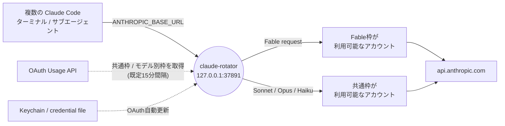
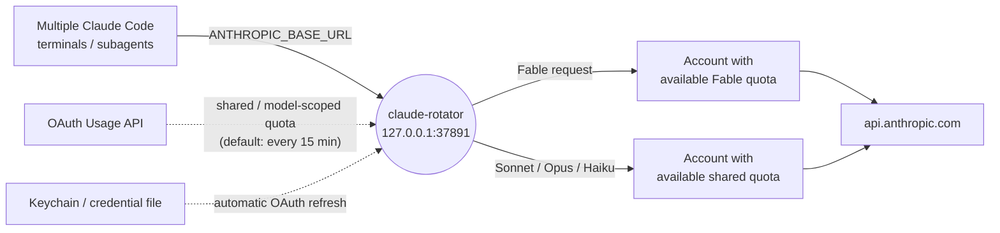

# claude-rotator

[](https://github.com/taskbrain/claude-rotator/actions/workflows/ci.yml)
[](./LICENSE)


Claude Code の複数アカウントを、リクエストのモデルと利用枠に応じてローカルで自動的に使い分ける非公式プロキシツールです。macOS と Linux で動作します。

`claude-rotator` は `127.0.0.1` だけで待ち受ける Anthropic 互換の HTTP プロキシを起動し、Claude Code の `~/.claude/settings.json` の `ANTHROPIC_BASE_URL` をこのプロキシへ向けます。インストール後も、Claude Code は通常どおり `claude` コマンドで起動できます。

**依存パッケージはゼロです**（[package.json](./package.json) に `dependencies` はなく、Node.js 標準ライブラリのみで実装されています）。外部パッケージ経由のサプライチェーンリスクが無いため、コードを読んで監査するコストが低く抑えられています。

npm レジストリでは配布していません（`package.json` は `"private": true`）。使うにはこのリポジトリを clone して `npm install -g .` でローカルインストールします。

## 目次

- [v0.3.0 の主な更新](#v030-の主な更新)
- [v0.2.2 の主な更新](#v022-の主な更新)
- [v0.2.1 の主な更新](#v021-の主な更新)
- [v0.2.0 の主な更新](#v020-の主な更新)
- [なぜ作ったか](#なぜ作ったか)
- [できること](#できること)
- [しくみ](#しくみ)
- [利用上の注意](#利用上の注意)
- [動作環境](#動作環境)
- [セットアップ](#セットアップ)
- [アカウント登録](#アカウント登録)
- [モニター](#モニター)
- [OAuth認証情報の自動更新](#oauth認証情報の自動更新)
- [設定ファイルと環境変数](#設定ファイルと環境変数)
  - [セッション単位のアカウント固定（sessionAffinity）](#セッション単位のアカウント固定sessionaffinity)
- [ログと切り替え診断](#ログと切り替え診断)
  - [キャッシュ観測（`observability`）](#キャッシュ観測observability)
- [主なコマンド](#主なコマンド)
- [アップデート](#アップデート)
- [アンインストール](#アンインストール)
- [トラブルシュート](#トラブルシュート)
- [安全設計](#安全設計)
- [開発](#開発)
- [English](#english)

## v0.3.0 の主な更新

- **各リクエストのキャッシュ観測**（#42）: 既存の proxy ログ行の末尾へ `enc=`（上流応答の content-encoding）・`usageParse=`（usage を数えられなかったときだけ、その理由）・`sid=`（セッションIDの12桁ハッシュ）などを追記します。あわせて、圧縮された上流応答を解凍せずに読んでいたため全アカウントで 0 のままだった usage 集計を修正しました（解析用の写しだけを解凍し、転送するバイト列と応答ヘッダには触れません）。
- **セッション単位のアカウント固定**（#43）: 同じセッションのリクエストを同じアカウントへ送り続け、会話の途中でアカウントが変わることによる prompt cache の喪失を抑えます。`sessionAffinity.mode` は `off` / `observe` / `on` の3値で、**既定は `off`**（書かなければ従来どおりの動作）です。
- **全アカウント枯渇時の終端応答が 503 から 529 へ**（#43）: `degradeMapping.enabled: true` のとき、全アカウントが使えずに終端する要求は、現在アカウントの資格情報の状態に関わらず必ず写像経路を通るようになりました。従来は資格情報の分岐が先にあり 503 を返していたため、529 を退避の合図にしている `fallbackModel` が働きませんでした（`degradeMapping` が無効なときは従来どおり 503 です）。

## v0.2.2 の主な更新

- **Fable 5.1 (`claude-fable-5-1`) を正規Fableモデルとして認識**（#40）: 曖昧な429に対する「Usage API再確認→別口座への再送」という回復経路のゲートが、正確なモデルID `claude-fable-5` の完全一致だけを見ており、`claude-fable-5-1` のリクエストはこの回復経路を丸ごと通れず、上流の429がそのまま返っていました。Fable 5 と 5.1 は同一の週次サブキャップを共有するため、正規IDを `{claude-fable-5, claude-fable-5-1}` の完全一致集合に拡張しました（日付付きID・trim違い・小文字化違いは引き続き非該当）。

## v0.2.1 の主な更新

- **uninstall --purge-secrets の警告追加**（Issue #31 / PR #36）: macOS で `config.json` が破損・読み取り不能のとき、Keychain の削除対象が `current` アカウントだけに縮小されるにもかかわらず、無警告で成功表示になっていた問題を修正しました。config 読み取りが例外になった場合は stderr へ警告を1行出力します（uninstall 自体は継続し exit code は 0 のまま。ENOENT・Linux・config が正常なときは警告を出しません。元の例外内容や秘密情報は出力しません）。
- **login --json の Usage 案内を安全な形式優先に**（Issue #32 / PR #37）: 引数不足時に表示される Usage が、ps 出力やシェル履歴に露出しうる `--json <token-json>` 形式のみを案内していたのを、安全な標準入力形式 `--json -` を第一選択として案内するよう修正しました（literal 形式にも露出リスクの注記を追加。実行ロジック自体は変更していません）。

## v0.2.0 の主な更新

- **モデル別ルーティング**: Fable リクエストは Fable 枠が利用可能なアカウントへ、Sonnet / Opus / Haiku は共通枠が利用可能なアカウントへ、HTTP リクエストごとに振り分けます。
- **並列利用に対応**: 複数ターミナルやサブエージェントが異なるモデルを同時に使っても、それぞれのリクエストを独立して判定します。
- **復帰順が見える status / monitor**: モデル系列ごとに、今使えるアカウントと、次に復帰するアカウント・時刻・その後の順番を表示します。十分に広い端末ではアカウント詳細を2列にします。
- **OAuth更新の安定化**: 保存済みの Keychain / credential file を使い、通常の Claude Code ログインを切り替えずに OAuth token を更新します。競合や結果不明時は誤った認証情報を使わず停止します。

既存環境から更新する場合は [アップデート](#アップデート) を参照してください。

## なぜ作ったか

Claude Code は、5時間ごとにリセットされる短期の利用枠（以下「5時間枠」）と、7日ごとにリセットされる長期の利用枠（以下「7日枠」）の2種類の上限で使用量を管理しています。どちらかが100%に達すると、そのアカウントでは応答が返らなくなります。

複数の Claude アカウントを契約していれば、枠に達したアカウントから別のアカウントへ切り替えることで作業を継続できます。しかし手作業での切り替えには次のような問題があります。

- 枠に達したことに気づかず、そのまま `claude` を実行し続けてエラーに遭遇する
- 気づいた後も、別アカウントで `claude auth login` をやり直す手間がかかる
- どのアカウントがいつリセットされるか、都度 Anthropic 側の情報を確認する必要がある

`claude-rotator` は、Claude Code と Anthropic API の間にローカルプロキシを挟むことでこれを解決します。各アカウントの共通枠とモデル別枠を定期的に取得し、リクエストのモデルに合う空きアカウントを選びます。Claude Code 側の起動方法は変わりません。

## できること

- 通常の `claude` コマンドを変えずに、裏側で `claude-rotator` proxy を使う
- 共通の5時間枠 / 7日枠とモデル別週次枠を見て、リクエストごとに利用可能なアカウントへ振り分ける
- Fable 固有枠だけが枯渇したアカウントを、Sonnet / Opus / Haiku では引き続き利用する
- 全アカウントが利用上限に達した場合、モデル系列別の復帰候補・復帰時刻・順番を表示する
- `claude-rotator status` / `monitor` で各アカウントの使用率とルーティング可否を確認する
- 保存済み OAuth 認証情報を、通常の Claude Code ログインを切り替えずに自動更新する
- macOS では Keychain、Linux では private permission のファイルに認証情報を保存する
- `claude-rotator uninstall` で `~/.claude/settings.json` を元に戻す

## しくみ



1. `claude-rotator install` が Claude Code の設定ファイル（`~/.claude/settings.json`）を書き換え、`ANTHROPIC_BASE_URL` をこのプロキシ（既定 `http://127.0.0.1:37891`）へ向けます。
2. どのターミナルやサブエージェントから来たかに関係なく、各 `POST /v1/messages` の `model` をその都度判定します。`claude-fable-<数字>...` は Fable、それ以外は Other（Sonnet / Opus / Haiku / 識別不能モデル）として扱います。
3. Fable には共通枠と Fable 固有枠、Other には共通枠を適用し、そのリクエストを処理できるアカウントを選びます。Fable 固有枠だけが枯渇していても、同じアカウントで Other のリクエストは処理できます。
4. 共通枠の到達が確認できた場合は利用可能な別アカウントへ切り替えます。正確なモデル ID `claude-fable-5` または `claude-fable-5-1`（同一の週次サブキャップを共有）の曖昧な429は、Usage API で枯渇を確認できた場合だけ1回再送します。それ以外のモデル ID や、理由を確認できない429を別アカウントへ無条件に流しません。
5. 各アカウントの共通枠 / モデル別枠は既定で15分ごとに取得します。`claude-rotator refresh-usage` で即時取得でき、`status` / `monitor` にはモデル系列別の候補順を表示します。
6. 保存済み OAuth access token は期限の30分前から更新対象になり、Claude Code 本体を使って隔離領域内で更新されます。詳しくは [OAuth認証情報の自動更新](#oauth認証情報の自動更新) を参照してください。

## 利用上の注意

- 本プロジェクトは Anthropic / Claude Code の**非公式**ツールです。Anthropic とは無関係であり、Anthropic による保証・サポートはありません。
- 利用者は、自身と Anthropic の契約、Anthropic の利用規約、および所属組織のポリシーの範囲内で使う責任を負います。規約・ポリシー違反が生じた場合の責任は利用者にあります。
- 本ツールは [MIT ライセンス](./LICENSE) の下で**無保証（AS IS）**で提供されます。
- 認証情報は各 PC のローカルにのみ保存され、リポジトリに保存・送信しない設計です。ただし共有 PC や暗号化されていないディスクでは、保存先（macOS: Keychain / Ubuntu: ローカルファイル）の保護に注意してください。

## 動作環境

- **複数の Claude アカウントが必要です。** このツールは「枠に達したアカウントから別のアカウントへ切り替える」ことが前提のため、契約しているアカウントが1つしか無い場合はローテーションできず、導入する意味がありません。
- Node.js 18.18 以上
- Claude Code 本体がインストール済みであること（`claude-rotator` は Claude Code の認証情報を読み取って中継するプロキシであり、Claude Code 自体の代替にはなりません）
- macOS: LaunchAgent を使用
- Ubuntu: systemd user service を使用

Claude Code の利用量は「5時間枠」（5時間ごとにリセットされる短期の上限）と「7日枠」（7日ごとにリセットされる長期の上限）の2種類で管理されています。詳細は [なぜ作ったか](#なぜ作ったか) を参照してください。

認証情報は PC ごとのローカル保存です。別の Mac / Ubuntu PC で使う場合、その PC でも各アカウントの `claude auth login --claudeai` と `claude-rotator login` を実行してください。

## セットアップ

**重要**: `claude-rotator install` は Claude Code の設定を書き換え、以後のリクエストをすべてこのプロキシ経由にします。この時点でプロキシにアカウントが1件も登録されていないと、Claude Code が使えなくなります。**必ず `install` より先に、少なくとも1つのアカウントを `claude-rotator login` で登録してください。**

### macOS

このリポジトリを clone し、そのディレクトリ内で実行します。npm レジストリでは配布していないため（`package.json` は `private: true`）、`npm install -g claude-rotator` のような通常のグローバルインストールはできません。

```bash
git clone https://github.com/taskbrain/claude-rotator.git
cd claude-rotator
npm install -g .
```

まず Claude Code に普段どおりログインし、そのログインを `claude-rotator` へ登録します。

```bash
claude auth login --claudeai
claude-rotator login
```

アカウントを登録できたら proxy をインストールします。

```bash
claude-rotator install
claude-rotator doctor
```

`install` は通常 `~/.claude/settings.json`（`CLAUDE_CONFIG_DIR` 設定時はその配下）の `env.ANTHROPIC_BASE_URL` と `env.ANTHROPIC_AUTH_TOKEN` をローカル gateway 用に更新し、変更前の状態を `~/.config/claude-rotator/install-state.json` に保存します。設定する auth token は Anthropic の認証情報ではない固定プレースホルダーです。Claude Code CLI のローカル `/login` が期限切れでも proxy へ到達できるようにするためだけに使い、proxy は upstream へ送る前に選択アカウントの認証情報（OAuth token または API key）へ必ず置き換えます。OAuth アカウントでは、gateway credential 利用時に Claude Code が送らない OAuth capability も proxy が upstream header へ補います。

既に起動中の Claude Code は起動時の認証設定を保持することがあるため、install / reinstall 後は各セッションを安全なタイミングで終了して起動し直してください。gateway credential が有効な間は、Claude.ai identity を直接必要とする voice dictation などの機能は利用できません。Remote Control は custom `ANTHROPIC_BASE_URL` の時点ですでに利用できません。

この認証モデルは同一PC内だけを信頼境界とします。proxy は `127.0.0.1`、`localhost`、`::1` 以外への bind を起動時に拒否します。固定プレースホルダーをネットワーク上のクライアント認証として使用しないでください。VS Code 拡張は CLI と設定経路が異なり、拡張自身には `claudeCode.environmentVariables` が必要なため、この install 手順の対象は Claude Code CLI です。

Bedrock、Vertex、Foundry、Anthropic AWS、Anthropic Google Cloud、Mantle の provider 選択変数は Anthropic gateway と異なる通信形式を選ぶため、user settings または起動環境に残っている場合は install/server が起動を拒否します。先に該当する `CLAUDE_CODE_USE_*` を解除してください。

macOS では次の LaunchAgent が作られます。

```text
~/Library/LaunchAgents/io.github.claude-rotator.plist
~/Library/LaunchAgents/io.github.claude-rotator.watchdog.plist
```

watchdog は15秒ごとに main LaunchAgent の登録を確認し、意図せず `bootout` された場合だけ再登録します。install／uninstall と同じ `lockf` を使うため、uninstall 中に main を復活させません。意図的に停止する場合は `claude-rotator uninstall` を使ってください。`install --no-start` は資産だけを配置し、**Claude Code の設定は変更せず**、両方の LaunchAgent と復旧 marker を無効のままにします。

生成するmacOS LaunchAgentは `ProcessType=Interactive` を指定します。OAuth更新では公式の `claude auth login --claudeai` の完了を同期的に待つためです。launchdの既定daemon分類では、新しく更新されたClaude Codeバイナリのcold startが強く抑制され、auth-login更新処理がtimeoutすることがあります。この指定はUIを開く設定ではなく、ローカルproxyの対話リクエストを待たせないための実行分類です。

インストール時に Claude Code の実行可能ファイルを絶対パスで解決し、macOS LaunchAgent と Ubuntu systemd user service の `CLAUDE_ROTATOR_CLAUDE_BIN` と安全な `PATH` に固定します。Homebrew、nvm、asdf、Volta、custom npm prefix などで管理された `claude` が対話 shell でだけ見つかり、常駐サービスでは見つからない状態を防ぎます。実行場所を明示する場合は、インストール前に `CLAUDE_ROTATOR_CLAUDE_BIN=/absolute/path/to/claude` を設定してください。

サービス操作:

```bash
launchctl print gui/$(id -u)/io.github.claude-rotator
launchctl kickstart -k gui/$(id -u)/io.github.claude-rotator
```

### Ubuntu

Ubuntu PC 上でこのリポジトリを clone し、そのディレクトリ内で実行します。npm レジストリでは配布していないため（`package.json` は `private: true`）、通常のグローバルインストールはできません。

```bash
git clone https://github.com/taskbrain/claude-rotator.git
cd claude-rotator
node --version
npm install -g .
```

`node --version` は `v18.18` 以上が必要です。

まず Claude Code に普段どおりログインし、そのログインを `claude-rotator` へ登録します。

```bash
claude auth login --claudeai
claude-rotator login
```

アカウントを登録できたら proxy をインストールします。

```bash
claude-rotator install
claude-rotator doctor
```

Ubuntu では次の systemd user service が作られます。

```text
~/.config/systemd/user/claude-rotator.service
```

サービス操作:

```bash
systemctl --user status claude-rotator.service
systemctl --user restart claude-rotator.service
journalctl --user -u claude-rotator.service -f
```

`claude-rotator install` が `systemctl --user` の起動に失敗した場合は、表示されたコマンドを実行してください。headless / SSH セッションで user systemd bus がない場合は、次が必要になることがあります。

```bash
loginctl enable-linger $USER
systemctl --user daemon-reload
systemctl --user enable --now claude-rotator.service
```

注意: `install --no-start` は Linux では **`~/.claude/settings.json` を書き換えたうえで** systemd サービスの起動だけをスキップします（macOS の `install --no-start` とは異なり、Linux では設定ファイルが変更されます）。設定に触れず資産だけを配置したい場合は、`--no-start` 実行後に `claude-rotator uninstall` で設定を元に戻してください。

CLI と macOS / Ubuntu の service 定義では、Node.js が IPv6 を先に選んで blackhole する環境でも動作するように、DNS 解決を IPv4 優先にします。既存インストールで service 側の `NODE_OPTIONS=--dns-result-order=ipv4first` が入っていない場合は、リポジトリを更新してから `claude-rotator install --force` を実行するか、サービス定義を更新して再起動してください。

Ubuntu の installer は systemd サービス用に `~/.config/claude-rotator/runtime/claude-rotator` という Node.js launcher を作成します。これにより、`earlyoom --prefer` が広く `node` を優先終了する構成でも rotator proxy を通常の Node.js workload と区別できます。これはメモリを予約する仕組みではないため、`journalctl -u earlyoom` に終了記録が続く場合は、メモリ使用量と earlyoom の `--avoid` / `--ignore` 設定も確認してください。

## アカウント登録

[セットアップ](#セットアップ) で最初の1アカウントは登録済みです。複数アカウントを切り替えて使うには、他のアカウントも同様に登録します。

`claude-rotator login` は現在の Claude Code ログインを読み取り、可能であれば email を自動取得して登録します。

重要: `claude auth login --claudeai` や `claude-rotator login` は、Claude Code 側の現在ログインを変更したり、そのログインを rotator の候補一覧へ取り込んだりする操作です。実際に API リクエストで使われるアカウントは、リクエストのモデルと `claude-rotator status` の `Routing availability` からその都度決まります。ヘッダーの `current` は基本となる現在位置ですが、Fable 固有枠だけが枯渇した場合などは、`current` を変えずに Fable リクエストだけを別アカウントへ送ります。別アカウントでログインして `claude-rotator login` しても、それだけでは `current` は切り替わりません。

インストール中の通常セッションは gateway auth が `/login` より優先されるため、`claude auth status` は rotator 内の `current` やモデル別ルーティング先を示しません。gateway の base URL と認証元変数は対話セッションの `/status` で確認できます。アカウントを再取り込みするときは、明示的に `claude auth login --claudeai` を完了してから `claude-rotator login` を実行し、取り込み結果は `claude-rotator accounts` または `claude-rotator status` で確認してください。

`use-current` は、gateway credential や API key など `/login` より優先される認証を一切設定せず、proxy を手動運用する場合だけの互換モードです。通常の `install` では gateway auth が `/login` より優先され、Claude Code 自身が保存済み `/login` を更新しなくなるため使用できません。通常運用では `claude-rotator login` で各アカウントを保存してください。旧 `current` を移行する場合は、先に `claude-rotator remove current` を実行してから `claude auth login --claudeai` と `claude-rotator login` を順に実行します。互換モードの自動検査対象は shell 環境と user settings です。project / local / managed settings の実効認証は Claude Code の `/status` でも確認し、override があれば使用しないでください。
複数アカウントを個別に保存して切り替える場合は、各アカウントで Claude Code にログインしてから `claude-rotator login` を実行します。

```bash
claude auth login --claudeai
claude-rotator login

claude auth login --claudeai
claude-rotator login
```

表示名や id を明示したい場合は、次のように指定できます。

```bash
claude-rotator login --id account1 --name your-email-1@example.com
```

登録確認:

```bash
claude-rotator accounts
claude-rotator status
claude-rotator doctor
```

`claude-rotator login --json ...` は、token JSON を直接渡す上級者向けコマンドです。通常運用では `claude-rotator login` を使ってください。使う場合は `claude-rotator login --id <id> --name <email> --json -` として標準入力から JSON をパイプしてください。`--json <token-json>` のように値をコマンドライン引数へ直接渡すと、Linux では `ps auxww` や `/proc/<pid>/cmdline` から他ユーザーに見え、シェル履歴にも残ります。

重複防止:

- `current` は live account 専用 ID です。`login --id current` や `import-current --id current` では使えません。
- `claude-rotator login` は profile から `accountUuid` を取得し、同じ Claude アカウントが既に登録済みなら既存 account を更新します。
- `claude-rotator login` は、現在の Claude Code 認証に refresh token がない場合や profile API で検証できない場合、`account1` のような仮 ID で登録せずにエラーで停止します。`claude auth status` が logged in を返しても API 用 OAuth token が失効している場合があるため、その場合は `claude auth login --claudeai` をやり直してから再実行してください。
- 明示した `--id` が既存の `accountUuid` と衝突する場合は、重複登録せずにエラーを出します。既存 ID を使うか、先に `claude-rotator remove <account>` で整理してください。

認証情報の保存先:

- macOS: Keychain（サービス名は `claude-rotator:<id>`）
- Ubuntu/Linux: `~/.local/share/claude-rotator/accounts/*.json`、ディレクトリ `0700`、ファイル `0600`（`XDG_DATA_HOME` を設定している場合はその配下）

`login` は保存後に常駐 server へ reload を通知します。server が起動していない場合だけ、OS 別のサービス再起動コマンドを実行してください。

アカウントを追加した直後は、Usage API の状態も確認してください。

```bash
claude-rotator refresh-usage
claude-rotator status
```

追加したアカウントの 5時間枠または 7日枠が 100% の場合、そのアカウントは `exhausted` と表示され、自動切り替え先にはなりません。

### この PC の現在ログインだけを使う場合

複数アカウントを固定候補として登録するのではなく、この PC で現在ログイン中の Claude Code アカウントだけを使う場合は、保存済み token snapshot ではなく Claude Code の最新認証情報を毎回読む `current` アカウントとして登録できます。Claude Code 側で token が更新されても proxy が追従するため、Ubuntu の常用 PC ではこの方法が安全です。

```bash
claude auth login --claudeai
claude-rotator use-current --only
```

`current` は Claude Code 側の現在ログインを毎回読む live account です。Claude Code で別アカウントへログインし直すと、`current` が指す実アカウントも変わります。そのため、複数アカウントを固定候補としてローテーションする構成では `current` を混ぜず、上の `claude-rotator login` で各アカウントを token snapshot として登録してください。`--only` は既存の rotator アカウント一覧を `current` だけに置き換えます。

### アカウントの削除

不要になったアカウントや、`doctor` で壊れていると表示された保存済みアカウントは削除できます。デフォルトでは保存済み認証情報も削除します。

```bash
claude-rotator remove old-account-id
```

設定だけ削除し、保存済み認証情報を残す場合:

```bash
claude-rotator remove old-account-id --keep-secret
```

`--keep-secret` を使うと、Keychain / ローカルファイル側には認証情報が孤児として残ります（[アンインストール](#アンインストール) を参照）。

## モニター

別ターミナルで起動します。

```bash
claude-rotator monitor
```

表示例（`claude-rotator monitor` / `claude-rotator status` 共通のレイアウトです。実際のアカウント名・数値・時刻は環境によって変わります）:

```text
Claude Rotator                         current: account1@example.com

Routing availability
Fable (none now)                                      Other (Sonnet / Opus / Haiku) (1 now)
  1. account2@example.com  in 1h -> 06/04 19:00 JST     1. account1@example.com  now
  2. account1@example.com  in 2d -> 06/06 18:00 JST     2. account2@example.com  in 1h -> 06/04 19:00 JST

account1@example.com       exhausted                         account2@example.com       exhausted
routes Fable: 2d | Other: now                                routes Fable: 1h | Other: 1h
reason: 7d Fable quota exhausted; reset -> 06/06 18:00 JST   reason: 5h quota exhausted; reset -> 06/04 19:00 JST
5h ███████░░░  76%  reset in 8h42m -> 06/05 02:42 JST        5h ██████████ 100%  reset in 1h -> 06/04 19:00 JST
7d ███████░░░  76%  reset in 2d9h -> 06/07 03:00 JST         7d ████░░░░░░  40%  reset in 2d23h -> 06/07 17:00 JST
7d Fable ██████████ 100%  reset in 2d -> 06/06 18:00 JST     7d Fable █████░░░░░  50%  reset in 2d -> 06/06 18:00 JST
requests: 128                                                requests: 54

Events
06/04 18:02 JST request account2 POST /v1/messages -> 200 3538ms outcome=ok req=req_xxx
06/04 18:01 JST switched account2 -> account1 reason=quota-threshold
```

各行の意味:

- 先頭行の `current:` は基本となる現在位置です。Fable 固有枠だけが枯渇している場合、Fable リクエストは別アカウントへ送られても `current` は変わりません。
- `Routing availability` は Fable と Other（Sonnet / Opus / Haiku）の候補を別々に表示します。`now` は現在利用可能、`in ... -> ... JST` は復帰までの時間と時刻、`unknown` は安全に時刻を計算できない状態です。
- 候補は「現在利用可能」「復帰時刻が早い」「復帰時刻不明」の順です。この一覧は表示時点の共有ルーターの候補順であり、特定のターミナルや会話へアカウントを予約するものではありません。
- アカウントごとに1カード表示され、`routes Fable: ... | Other: ...` でモデル系列別の利用可否を確認できます。カードの `active` / `ready` / `exhausted` / `throttled` / `error` と `reason:` はアカウント全体の代表状態です。
- 認証失敗の主文は `login expired` / `needs login` と表示し、括弧内の `cause` は診断・突合用に `server.log` の `errorType=` と同一の内部コードを原値のまま表示します。
- `detected` は原則として直近の検出時刻（JST）です。ただし、その口座が同じ認証失効として既に記録済みのときは、起動時の資格情報点検と重複リフレッシュ資格情報の隔離が記録を上書きしないため、初回の検出時刻が残ります。どちらの場合も検出した時刻であり、最初に失敗した瞬間や資格情報の実際の満了時刻ではありません。
- `5h` / `7d` 行は進捗バー（`█` / `░` を10文字）、使用率、reset までの残り時間と reset 時刻を表示します。使用率のデータが無い場合は ` --%`、reset 情報が無い場合は `no data yet` になります。
- Usage API がモデル別週次枠（`limits[]`）を返す場合は、`7d Fable` のような追加行がさらに表示されます。
- `requests:` はそのアカウントで proxy が転送した累計リクエスト数です。
- [セッション単位のアカウント固定](#セッション単位のアカウント固定sessionaffinity)（`sessionAffinity`）を有効にしている場合は、アカウントカードの下に `Session Affinity` の行が追加され、`mode`、保持しているセッション数と上限、セッション鍵が付いていたリクエストの割合、アカウント別・切り替え理由別・退避理由別の内訳を表示します（`mode: "off"` では1行も表示しません）。
- `Events` には直近の切り替え・リクエスト・エラーが最大8件表示されます。

十分に広い端末では `Routing availability` とアカウントカードを横2列にし、全行が収まらない場合は情報を切り捨てず縦1列へ戻します。`monitor` は端末のリサイズにも追従します。

`status` / `monitor` の reset 時刻と Events 時刻は、日本時間（JST）で表示します。未使用のアカウントでも、server 起動時・アカウント reload 時・初回 status 表示時・定期 polling で OAuth Usage API から共通枠 / モデル別枠を取得します。Usage API が取得できない場合は `unknown` と表示され、そのアカウントを自動切り替え先には使いません。

TTY が無い環境（CI、`| cat` 経由など）で `claude-rotator monitor` を実行すると、自動的に1回だけ表示して終了します（`--once` を明示しても同じ挙動です）。

OAuth Usage API は 429 を返しやすいため、usage 取得はデフォルトで 15 分間隔、1アカウントずつ、各リクエストの開始間隔 1.5 秒で実行します。必要な場合だけ [設定ファイルと環境変数](#設定ファイルと環境変数) の `usagePolling.intervalMs`、`usagePolling.concurrency`、`usagePolling.requestSpacingMs` を変更してください。短すぎる間隔や高い concurrency は `claude-rotator refresh-usage` でも 429 の原因になります。

## OAuth認証情報の自動更新

保存済み OAuth access token は期限の30分前から自動更新対象になります。macOS / Ubuntu とも、通常の Claude Code ログインを変更せず、Claude Code 本体へ隔離領域内で更新を委譲します。更新された認証情報は、実際の API リクエストで使う前に Keychain または Linux の credential file へ保存します。

通常はログインし直す必要はありません。`status` の理由に応じて次のように動作します。

- `oauth_refresh_retry`: token を渡す前の一時的なローカル失敗です。5分後に再試行し、他アカウントの処理は続けます。
- `oauth_refresh_rate_limit`: provider が更新をレート制限しています。`Retry-After` の範囲で再試行します。
- `oauth_refresh_failed`: token を渡した後の結果を安全に確定できなかったため、そのアカウントを停止しています。次を実行して再登録してください。
  - この `oauth_refresh_failed` には、**保存済みのリフレッシュ資格情報自体が期限切れになり、再ログインが必要な場合**も含みます。利用量の更新でこれを検出したときは、そのアカウントに付いていた直前の理由（たとえば枠切れの回復待ち）のままにせず、再ログインが必要な状態として分類します。`status` の口座カードには `reason: login expired - run: claude-rotator login --id <id>`、Routing availability には `needs login` と表示します。枠の回復を待っても直らないため、上のコマンドで再ログインしてください。資格情報ロックの待ち時間切れや更新コマンドのタイムアウトなど、再試行で回復する一時的な失敗は、従来どおりこの分類には入りません。

```bash
claude auth login --claudeai
claude-rotator login
claude-rotator refresh-usage
claude-rotator status
```

明示的に revoke された refresh token を Rotator 側で復活させることはできないため、その場合も再ログインが必要です。

<details>
<summary>更新処理の保証と信頼境界</summary>

- 実行時点でインストールされている Claude Code を解決し、試行中は同じ実体へ固定して `claude auth login --claudeai` を1回だけ呼びます。
- refresh token と scope は短命な子プロセスの環境だけで引き渡し、argv、設定、ログには書きません。同じOSユーザーの別プロセスは子プロセス環境を観測できる場合があるため、単一ユーザーまたは信頼できるローカル環境で使ってください。
- 同じ refresh token の同時更新は1回に集約し、異なるアカウントの credential 更新も直列化します。重複 token、競合する再ログイン、結果不明の handoff は fail-closed で停止します。
- 新しい credential は比較更新で保存し、同時に行われた再ログインを上書きしません。handoff 後に別方式へ fallback して、どの token が有効か分からない状態にすることもありません。
- installed gateway mode では保存アカウントを Rotator が更新し、古い通常ログインの credential を保存アカウントへ再コピーしません。live credential の追従は、gateway credential を使わない手動互換モードだけです。

詳細設計は [OAuth credential lifecycle design](./docs/specs/2026-07-10-oauth-credential-lifecycle-design.md) を参照してください。

</details>

## 設定ファイルと環境変数

設定ファイルの場所は次の優先順位で決まります。

1. 環境変数 `CLAUDE_ROTATOR_CONFIG` にファイルパスを設定した場合は、そのパスを使います。
2. 設定していない場合は `$XDG_CONFIG_HOME/claude-rotator/config.json` を使います。
3. `XDG_CONFIG_HOME` も未設定の場合は `~/.config/claude-rotator/config.json` になります（macOS / Linux 共通）。

同様に、アカウント認証情報などのデータは `$XDG_DATA_HOME/claude-rotator`（未設定時は `~/.local/share/claude-rotator`）配下に保存されます（例: Linux のアカウント snapshot、macOS の secret-store lock ファイル）。

既定の `config.json` は次のとおりです（初回起動時に自動生成されます）。

なお `observability` セクションは既定の `config.json` には書き出されません。未指定のときは既定値（キャッシュ観測 有効・`logMaxBytes` 32 MiB）で動きます。変更したい場合だけ手で足してください（→ [キャッシュ観測（`observability`）](#キャッシュ観測observability)）。

```json
{
  "proxy": {
    "host": "127.0.0.1",
    "port": 37891,
    "upstreamIdleTimeoutMs": 180000,
    "upstreamConnectTimeoutMs": 10000,
    "upstreamConnectRetries": 3,
    "upstreamConnectRetryDelayMs": 250
  },
  "upstream": "https://api.anthropic.com",
  "switchThreshold": 1,
  "rotationPolicy": {
    "mode": "use-expiring-weekly",
    "weeklyResetPriorityWindowMs": 129600000
  },
  "usagePolling": {
    "enabled": true,
    "intervalMs": 900000,
    "concurrency": 1,
    "requestSpacingMs": 1500
  },
  "accounts": []
}
```

主なキーの意味:

| キー | 既定値 | 意味 |
|---|---|---|
| `proxy.host` / `proxy.port` | `127.0.0.1` / `37891` | プロキシの待受アドレスとポート。`host` は loopback (`127.0.0.1` / `::1` / `localhost`) 以外を指定するとエラーになります |
| `proxy.upstreamIdleTimeoutMs` | `180000`（3分） | upstream からの応答が止まったとみなすアイドルタイムアウト |
| `proxy.upstreamConnectTimeoutMs` | `10000`（10秒） | upstream への TCP 接続確立のタイムアウト |
| `proxy.upstreamConnectRetries` | `3` | 接続確立前の timeout / unreachable 時に同一アカウントで内部 retry する回数 |
| `proxy.upstreamConnectRetryDelayMs` | `250` | 上記 retry の間隔 |
| `upstream` | `https://api.anthropic.com` | 転送先の Anthropic API |
| `switchThreshold` | `1`（＝100%） | この使用率に達したアカウントを利用不可とみなす閾値 |
| `rotationPolicy.mode` | `use-expiring-weekly` | 切り替えアルゴリズムのモード |
| `rotationPolicy.weeklyResetPriorityWindowMs` | `129600000`（36時間） | 7日枠の reset がこの時間以内に迫っているアカウントを優先消化する猶予期間 |
| `usagePolling.enabled` | `true` | Usage API のバックグラウンド定期取得を行うか |
| `usagePolling.intervalMs` | `900000`（15分） | 定期取得の間隔 |
| `usagePolling.concurrency` | `1` | 同時に取得するアカウント数 |
| `usagePolling.requestSpacingMs` | `1500` | 各リクエスト開始の最小間隔（429対策） |
| `accounts` | `[]` | 登録済みアカウント。通常は `claude-rotator login` 等の CLI から追加し、直接編集は非推奨です |

### GPT モデルとの相互退避（`openaiBridge.degradeMapping`）

`openaiBridge` は、モデル名が `modelPattern`（既定 `^gpt-|^o[0-9]|^openai/`）に一致するリクエストだけを、ローカルで動く別の Anthropic 互換ブリッジ（例: openai-model-bridge）へ転送する任意の分岐です（`openaiBridge.enabled` の既定は `false`）。`degradeMapping` はその下に置く任意のセクションで、Claude Code 側の `fallbackModel` と組み合わせて次の3つを実現します。

- **Claude 側の全アカウントが枠切れ** → 429 の代わりに **529** を返し、`fallbackModel` の次の要素（例: GPT モデル）へ退避させる
- **GPT 側が枠切れ** → ブリッジが返した **529** をそのまま素通しし、`fallbackModel` の次の要素（例: `opus`）へ退避させる
- **両方とも使えない** → **403** で明示的に停止する（既定）

前提は2つあります。

1. Claude Code 側に `fallbackModel` を設定していること（例: `"fallbackModel": ["gpt-6-astra", "opus"]`）。claude-rotator 自身がリクエストを別モデルへ翻訳して転送するわけではなく、退避を行うのは Claude Code です。
2. 転送先のブリッジが契約ヘッダ `x-ombr-*`（`x-ombr-pool-state` / `-degrade-reason` / `-reset-at` など）を返すこと。返さないブリッジや、そもそもブリッジが動いていない環境では、GPT 側の状態を新たに学習しません。ただし例外があります——ブリッジが停止していても、停止前に学習した「GPT 側は使えない」という状態が TTL（`gptPoolUnusableTtlMs`、既定60秒）または回復見込み時刻まで残っている間は、Claude 側の全枯渇時に 403 へ写像されることがあります（学習状態は `POST /internal/reload` で初期化されます）。

設定キー（セクションごと省略できます）:

| キー | 既定値 | 意味 |
|---|---|---|
| `degradeMapping.enabled` | `false` | 写像・学習・403 書き換えの総合スイッチ。`false` なら現行と完全に同一の挙動 |
| `degradeMapping.bothUnusableStatus` | `403` | Claude も GPT も使えないときのステータス。`403` = 明示停止、`529` = 退避を試み続ける。それ以外の値は `403` として扱います。**`recoveryWaitEnabled` が `true` のときは、このキーより下記の待機（429）が優先します** |
| `degradeMapping.recoveryWaitEnabled` | `false` | **上流が全滅・一時障害のときに Claude Code を止めず、待たせて自動継続させるスイッチ。** `true` のとき、403 の代わりに **429 `rate_limit_error` ＋ `Retry-After: 30`** を返します。真偽値の `true` だけを受け付け、それ以外（`"true"` や `1` を含む）はすべて `false` です。**`false`（既定）なら応答もログも現行と1バイト変わりません** |
| `degradeMapping.upstreamOverloadTo429` | `false` | **Anthropic 上流が混雑しているとき（529 `overloaded_error`）に、429 `rate_limit_error` ＋ `Retry-After` へ書き換えて返すスイッチ。** Claude Code は 529 を3回受けると `fallbackModel` の次の要素へ移りますが、429 なら**同じモデルのまま待って再試行**します（「ハイデマンドで Fable 5.1 が使えないときに退避させたくない」場合に使います）。真偽値の `true` だけを受け付け、それ以外（`"true"` や `1` を含む）はすべて `false` です。**これは Claude 側だけの機能で、`degradeMapping.enabled` にも `openaiBridge.enabled` にも依存しません**（設定の置き場所が `degradeMapping` の下なのは、`POST /internal/reload` の既存の再読み込み経路にそのまま乗るためです）。**`false`（既定）なら応答もログも現行と1バイト変わりません** |
| `degradeMapping.upstreamOverloadRetryAfterSeconds` | `30` | 上記で付け直す `Retry-After` の秒数。`1`〜`3600` の整数だけを受け付け、それ以外（小数・文字列・範囲外）はすべて `30` になります |
| `degradeMapping.gptPoolUnusableTtlMs` | `60000`（60秒） | 「GPT 側は使えない」という学習を、状態不明へ戻すまでの時間。`recoveryWaitEnabled` が `false` のときは**回復見込み時刻を伴わない学習にだけ**効き、`true` のときは回復見込み時刻を伴う学習にも `min(回復見込み時刻, 学習時刻 + この値)` として効きます |
| `degradeMapping.codexStatusUrl` | `null` | `status` にブリッジ側の枠状況を表示するための取得先（loopback のみ）。`null` なら表示しません |
| `degradeMapping.codexStatusTimeoutMs` | `1500` | 上記取得のタイムアウト（必ず有限値） |

**既定は無効です。** `degradeMapping` を書かなければ挙動は現行とまったく同じで、新規インストール時に生成される `config.json` にもこのセクションは書き出されません。claude-rotator を単体で使う場合、何もする必要はありません。転送先のブリッジも任意であり、無くても claude-rotator は完全に動作します。

動作の要点:

- 単一アカウントの一時的な 429 は退避させません。529 へ写像するのは、アカウント台帳上そのモデル系列で使えるアカウントが1つも無いときだけです（アカウント未登録のときも写像しません）。
- **全アカウントが使えずに終端する要求は、現在アカウントの資格情報の状態（認証失効・更新 cooldown）に関わらず必ずこの写像経路を通ります**（v0.3.0 での変更。v0.2.2 までは資格情報の分岐が先にあり、その場合だけ写像器を呼ばずに **503** を返していたため、529 を合図にしている `fallbackModel` の退避が働きませんでした）。写像が成立したときの終端は **529**（`bothUnusableStatus` が `403` なら 403、`recoveryWaitEnabled: true` なら 429）で、写像しないと決まったとき（`degradeMapping` が無効・台帳が全枯渇ではない）は従来どおり 503 です。
- **本機能が生成する** 403 は、Claude 側の全枯渇と GPT 側の利用不可が同時に成立したときだけです。応答本文には、両者のうち最も早い回復見込み時刻を添えます。なお、ブリッジへの接続拒否・接続タイムアウト・アイドルタイムアウトは本機能とは無関係に従来どおり 403 を返します（`outcome` の値で区別できます）。
- **GPT 側の認証が切れたときは止めずに退避させます。** ブリッジが契約ヘッダ付きで 403 を返し、その理由が「ログイン切れ」（`codex_needs_login`）または「資格情報を読めない」（`codex_credentials_unavailable`）のときだけ、claude-rotator は **529 へ書き換えて**返し、Claude Code を `fallbackModel` の次の要素（Opus 等）へ退避させます。作業を止めないためです。両方とも使えないときの停止は従来どおり `bothUnusableStatus`（既定 `403`）が決めます。契約ヘッダの無い 403、およびモデル未割り当て（`codex_no_account_for_model`）の 403 は、従来どおりそのまま返します。
- Claude 側のアカウントの認証が切れたときは、`status` の口座カードに `reason: login expired - run: claude-rotator login --id <id>` と表示し、Routing availability では `unknown` ではなく `needs login` と表示します。
- 学習した GPT 側の状態はメモリ上にだけ保持し、`POST /internal/reload`（設定の再読み込み）で初期化されます。
- **`recoveryWaitEnabled: true` のときだけ変わること**（`false` の既定では何も変わりません）:
  - **両方とも使えないとき**、403（明示停止）ではなく **429 `rate_limit_error` ＋ `Retry-After: 30`** を返します。Claude Code は 403 を再試行も退避もしないためその場で停止しますが、429 なら同じモデルのまま自動で再試行を続けます。**画面にエラーは出ますが、セッションは終了しません。**
  - **ブリッジの一時障害**（接続拒否・接続タイムアウト・アイドルタイムアウト、およびブリッジが返す `codex_upstream_timeout` / `codex_upstream_unreachable` の 403）も、Claude 側に空きが無い／判定できないときは 429 で待たせ、Claude 側に空きがあるときは 529 にして `fallbackModel` の次の要素へ退避させます。
  - **Claude 側の空きを「あり／なし／判定できない」の3値で見ます。** 判定できないとき（台帳の判定が例外を投げた・アカウントが1件も無い等）は、「空きあり」ではなく**待機側**へ倒します。
  - 合成した 429 からは、上流の `Retry-After` と `anthropic-ratelimit-*`（`anthropic-ratelimit-unified-reset` を含む）を**すべて除去**し、`Retry-After: 30` を1つだけ付けます。除去しないと、Claude Code がそのリセット時刻まで（最大6時間）無言で待つことがあります。
  - **回復後に人手の再起動・リロードを必要としません。** ブリッジが「上流へ送って 200 が返った」ことを示す成功応答を1件返した時点で、学習した「GPT 側は使えない」を状態不明へ戻します（利用可能へは格上げしません）。あわせて、ブリッジのキャッシュ由来の否定応答（`x-ombr-cached: yes`）では学習も延命もしません。
  - **GPT 側の認証切れ（`codex_needs_login` / `codex_credentials_unavailable`）は待機の対象外**で、従来どおり 529 にして退避させます。人が `codex login` するまで自力では回復しないため、待たせても意味がないからです。
  - ログ行に `cached=`（ブリッジのキャッシュ由来かどうか。ヘッダが無ければ `none`）と `retryAfter=` が加わります。
  - 設定例（`config.json`）:

    ```json
    {
      "openaiBridge": {
        "enabled": true,
        "url": "http://127.0.0.1:18765",
        "degradeMapping": { "enabled": true, "recoveryWaitEnabled": true }
      }
    }
    ```
- **`upstreamOverloadTo429: true` のときだけ変わること**（`false` の既定では何も変わりません）:
  - **Anthropic 上流が 529 `overloaded_error` を返したとき**、claude-rotator がそれを **429 `rate_limit_error` ＋ `Retry-After: 30`**（秒数は `upstreamOverloadRetryAfterSeconds`）に書き換えて Claude Code へ返します。Claude Code は 529 を3回受けると `fallbackModel` の次の要素へ移りますが、429 なら**同じモデルのまま待って再試行**します。**画面にエラーは出ますが、モデルは切り替わりません。**
  - 書き換えるのは **Anthropic 上流が返した 529 のうち、本文の `error.type` が `overloaded_error` のものだけ**です。同じ 529 でも `api_error` などの本文、空の本文、壊れた本文は**そのまま素通し**します（本文が `gzip` / `deflate` / `br` で圧縮されている場合は展開してから判定し、展開できなければ素通しします）。
  - **claude-rotator 自身が作る 529**（全アカウント枠切れの `All Claude accounts are exhausted.`）と、**ブリッジ経由の 529** は対象外で、従来どおりの挙動のままです。
  - 合成した 429 からは、上流の `Retry-After` と `anthropic-ratelimit-*`（`anthropic-ratelimit-unified-reset` を含む）を**すべて除去**し、`Retry-After` を1つだけ付けます。除去しないと、Claude Code がそのリセット時刻まで（最大6時間）無言で待つことがあります。`request-id` などの診断用ヘッダは残します。
  - **アカウントの状態は一切変えません。** 上流の 529（過負荷）はモデル全体の混雑であってアカウント固有の事象ではないため、枠切れ・一時停止（throttle）として学習せず、アカウントの切り替えも行いません。同じ 529 が続いても、同じアカウントのまま返し続けます。
  - proxy ログ行の末尾に `upstreamStatus=529 mappedFrom=529 mappedFromType=overloaded_error mappedTo=429 retryAfter=30 mapReason=claude_upstream_overloaded` が付きます（行は増えません。行の `status=` は実際に返した 429 になります）。
  - 設定例（`config.json`。`openaiBridge.enabled` が `false` のままでも効きます）:

    ```json
    {
      "openaiBridge": {
        "degradeMapping": { "upstreamOverloadTo429": true }
      }
    }
    ```

  - **切り戻し手順（プロセスの再起動は不要）**: `config.json` の `upstreamOverloadTo429` を `false` にする（またはキーごと消す）→ `POST /internal/reload` を実行する。次の要求から上流の 529 はそのまま素通しに戻ります。逆に有効化するときも同じ手順です。

    ```bash
    curl -sS -X POST http://127.0.0.1:37891/internal/reload
    ```

  - **注意（長時間の混雑）**: 上流の混雑が長く続くと、429 ＋ `Retry-After` を返し続けるあいだ Claude Code は待ち続けます。「止まらない」ことと「いつか終わる」ことは別なので、混雑が長引く場合はこのキーを `false` に戻して退避（529）へ切り替えてください。打ち切り回数の上限は設けていません。
- **写像した応答には理由ヘッダ `x-claude-rotator-reason` を1本だけ付けます。** 値は次の3つだけで、529 でも 403 でも同じ1本が付きます。写像しなかった応答と `degradeMapping` を書いていない構成には付きません。
    - `quota_exhausted` — 共通枠・系列枠の枯渇です。**待てば回復します。**
    - `credential_cooldown` — 資格情報の更新が待機中（cooldown）です。**待てば回復します。**
    - `credential_login_required` — 認証が失効しています。**人が `claude-rotator login` を実行するまで回復しません。**
- 理由は「いま選ばれているアカウント1つ」ではなく**登録済みの全アカウント**を見て決めます。1つでも再ログインが必要なら `credential_login_required`、そうでなく1つでも cooldown 中なら `credential_cooldown`、どのアカウントにも資格情報の問題が無ければ `quota_exhausted` です。受け取った側が「待てばよいのか、人を呼ぶ必要があるのか」だけで分岐できるようにするためです。
- 全アカウントが使えずに終端した要求（内部経路 `mapPath=d`）も、写像したときだけ proxy ログ行を1行残し、行末に `mapPath=d` と `rotatorReason=<上記の3値>` を付けます（写像しなければ従来どおり行は増えません）。
- ログの `outcome` は `forwarded` / `forwarded-mapped`（529 を 403 へ、または認証失効の 403 を 529 へ書き換えた）/ `bridge-unreachable` / `bridge-connect-timeout` / `bridge-idle-timeout` / `bridge-stream-error` / `unavailable-accounts-local`（全アカウントが使えずに終端した要求を写像したときの行）に分かれ、`degradeReason` `upstreamStatus` `gptPoolState` `claudePoolState` `mappedFrom` / `mappedTo` などを、値があるときだけ行末へ追記します（値が1つも無ければ行は従来と同一です）。
- 529 を書き換えた行（`forwarded-mapped`。403 へも 429 へも）には `resetAt` の直後に `effectiveResetAt` が並びます。`resetAt` は bridge が送ってきた `x-ombr-reset-at` の生値（Codex 側の週次）、`effectiveResetAt` は応答本文の `Earliest recovery` に実際に載った値（GPT 側・契約ヘッダ・Claude 側のうち最も早いもの）です。両者は食い違うことがあるため、復旧の見込み時刻は `effectiveResetAt` を読んでください。書き換えていない行と、回復見込み時刻を本文に持たない書き換え（認証失効以外の一時障害による 403 → 529／429）には出ません。

注意:

- 529 は Anthropic が本当に過負荷のときと同じ経路です。`fallbackModel` を設定していない利用者からは、通常の過負荷エラーと区別が付きません。次の要素へ切り替わるのは Claude Code が 529 を3回再試行した後で、これは `fallbackModel` に次の要素がある場合の挙動です。
- `fallbackModel` の最終要素も同じ枯渇したプールに当たる構成では、Claude Code は指数バックオフ（約0.6秒→約74秒）で再試行を続けます。当リポジトリの実測では、150秒の観測窓内で終端せず、エラー表示も出ませんでした。`bothUnusableStatus` の既定を `403`（明示停止）にしているのはこのためで、`529` にすると同じ無言待ちが起こり得ます。`openaiBridge.enabled` が `false` のまま `degradeMapping.enabled` を `true` にする構成でも同じ限界があるため、起動時とリロード時に警告を1行出します（禁止はしません）。
- ログにも `status` の表示にも、メールアドレスなどの識別子は出しません（アカウントはラベルだけを扱います）。

#### `status` の Codex 節（`codexStatusUrl` を設定したとき）

`degradeMapping.codexStatusUrl` を設定すると、`status` / `monitor` の末尾に転送先ブリッジ（Codex）側の枠状況が表示されます。Claude 側の表示は1行も変わらず、未設定なら節そのものが出ません。

```text
Codex Rotator                          sendable 0/2  (held 1, capped 1)
  reading  usage GET, startup check passed   raw pool state: exhausted
  primary  held      7d █████████░  98%  stop 75%   reset in 5d5h -> 09/21 20:59 JST
    clears   not at that reset - needs 2 clean usage reads at 70% or less
    read     09/16 15:32 JST usage GET, ordinary use allowed, stops when unread
  pro2     capped    7d ██████████ 100%  stop 100%  reset in 3d1h -> 09/19 17:10 JST
    clears   not at that reset - needs 2 clean usage reads at 99% or less
    read     09/16 15:32 JST usage GET, ordinary use allowed, sends when unread
  note: held = stopped at our own line, capped = the plan limit itself
  note: held / capped read as "cooldown" in /healthz
  note: second window on pro2 is stale - last read 0% on 09/16 06:23 JST
  note: percentages cover the whole account - ChatGPT app, Codex CLI, and this bridge
  note: the CLI's own share cannot be separated out
  note: accounts are shown by label
```

**停止はリセット時刻では解けません。** 行末の `reset in ... -> ... JST` は使用率の窓が初期化される時刻であって、その口座が送れるようになる時刻ではありません。解除の条件は必ずその直下の `clears` 行に書かれています。

状態語の意味:

| 語 | 意味 | 何で解けるか |
|---|---|---|
| `ready` | 送れる | — |
| `held` | 当方の停止線（`stop` 欄が100%未満）で止めた＝枠の温存 | 条件を満たす使用率の観測が2回 |
| `capped` | 上流の枠そのものに到達した（`stop 100%`） | 同上 |
| `stopped` | 個別の停止線を持たない口座が、全体の既定線で止まった | 条件を満たす観測が1回 |
| `reserved` | 観測を失っており、読めるまで送らない設定の口座 | 完全な観測が1回 |
| `unread` | 使用率の観測がまだ無い | 同上 |
| `exhausted` | 429 を観測した | リセット後の再確認 |
| `blocked` | 上流が通常利用を拒否している | 通常利用可と読める観測 |
| `needs login` | ログインが切れている | 再ログイン |

`held` と `capped` の解除条件には、使用率のほかに**上流が通常利用を許可していると読める観測であること**が含まれます。上流が拒否している間は使用率が下がっても解けないため、そのときは `clears` 行の直下に `refused` 行を出します。停止線（`stop` 欄）を緩めても、拒否が続くかぎりその口座は1本も送れません。

読み方の補足:

- `/healthz` の `state` と画面の状態語は1対1ではありません。停止ラッチの掛かった口座（`held` / `capped` / `stopped` / `blocked`）だけが `cooldown` と出て、ラッチを持たない `reserved` / `unread` は `ready` のまま出ます（送れないのは選択側の判断のため）。画面はこの対応を**そのときのペイロードから起こして** `note:` 行に出すので、`/healthz` と突き合わせるときはその行を見てください。
- ラベル欄は画面に出る最長のラベルに合わせて広がります（契約の上限は32文字）。ラベルが20文字を超える構成では、行はその分だけ長くなります。ラベルを切り詰めると `/healthz` と突き合わせられなくなるため、切り詰めません。
- `read` 行が観測の出所（`usage GET` など）を併記するのは、それがその読み取りのものだと確かめられるときだけです（ブリッジは口座ごとに1つの出所しか報告せず、それは主窓・副窓のうち最後に読んだ方のものです）。
- 使用率は主窓（`7d` など）のものだけを表示します。副窓は観測が現在のものであるときだけ主窓の真下へ1行足し、鮮度が切れた副窓は `note` で開示します。
- `*` は「最後に取れた値であり、現在の観測は途切れている」という印です。このときバーは `----------` になります。
- 既に過ぎたリセット時刻は表示しません。
- ブリッジが選択理由（`selectionEligible` など）を報告しない旧版のときは、推測せず従来の `pool: <状態> (N/M available)` 形式のまま表示します。
- 表示される数字は ChatGPT アプリ・Codex CLI・本ブリッジを含む口座全体の消費であり、CLI 単独の取り分は切り出せません。

### セッション単位のアカウント固定（`sessionAffinity`）

`sessionAffinity` は、同じ Claude Code セッションからのリクエストを同じアカウントへ送り続けるための任意のセクションです。upstream の prompt cache はアカウント（組織）ごとに別物なので、会話の途中でアカウントが変わると、そのセッションは1ターン分のキャッシュを失います。アカウントの切り替えそのものを減らす機能ではなく、切り替えが進行中の会話へ波及する範囲を小さくするための機能です。

**既定は無効です。** このセクションを書かなければ `mode` は `off` で、アカウントの選び方・ログ・`status` の出力・`runtime-state.json` のすべてが現行と同一です。新規インストール時に生成される `config.json` にも、このセクションは書き出されません。

セッションの識別には、Claude Code が送る内部ヘッダ `x-claude-code-session-id`（無い場合はリクエスト本文の `metadata.user_id` に入る `session_id`）を使います。**生のセッション ID はログにも `runtime-state.json` にも残さず、SHA-256 の先頭12桁だけを記録します。** 鍵を取り出せないリクエストは、従来どおりの経路でそのまま処理します。

設定キー（セクションごと省略できます）:

| キー | 既定値 | 意味 |
|---|---|---|
| `sessionAffinity.mode` | `"off"` | `"off"` / `"observe"` / `"on"` の3値（下記）。**それ以外の値は、大文字違い・真偽値・数値も含めてすべて `"off"` として扱います** |
| `sessionAffinity.idleTtlMs` | `21600000`（6時間） | 最後のリクエストからこの時間が過ぎたセッションを表から外します。`60000`〜`604800000` に丸めます |
| `sessionAffinity.maxSessions` | `10000` | 表に保持するセッション数の上限。`1`〜`10000` に丸め、小数は切り捨てます。超えた分は、最後のリクエストが古いセッションから外します |
| `sessionAffinity.assignStopUtilization` | `0.9` | 新しいセッションの割り当てを止める使用率。`0`〜`1` に丸めます（`1` はこのゲートを使わないのと同じです）。この条件で候補が1つも残らない場合はゲートを外し、必ず候補を選びます |
| `sessionAffinity.rebindGraceMs` | `60000`（60秒） | 共通枠が枯渇したときに、別アカウントへ付け替える前に待つ時間の上限。`0`〜`600000` に丸めます。回復見込みがこの上限より先・回復見込みを取得できない・`0` を指定した場合は、待たずに付け替えます |
| `sessionAffinity.warmTtlMs` | `3600000`（1時間） | 最後のリクエストからこの時間以内のセッションを「キャッシュがまだ生きている」とみなします。`60000`〜`21600000` に丸めます。この時間を過ぎたセッションは、アカウントの割り当てを決めるときの重みから外れ、`drainStartUtilization` の対象になります |
| `sessionAffinity.drainStartUtilization` | `0.85` | キャッシュが失効したセッションを、空いているアカウントへ移し始める使用率。`0`〜`1` に丸めます（**`1` を指定するとこの動作を行いません**）。移すキャッシュがもう無いセッションだけが対象で、キャッシュが生きているセッションはこの設定では動きません |
| `sessionAffinity.persist` | `true` | `false` にするとメモリ上だけで保持し、`runtime-state.json` へは書きません |

数値キーは、数値でない値や有限でない値を書くと既定値に戻り、値域を外れた値は上限・下限へ丸めます（エラーにはなりません）。`persist` は真偽値の `false` だけを「無効」と読み、それ以外の型は既定の `true` になります。セクション自体が object でない場合も、すべて既定値として扱います。

`mode` の3つの値:

- **`off`（既定）** — 何も記録せず、この機能のコード経路にも入りません。現行とまったく同じ動作です。
- **`observe`** — セッション鍵の抽出とログ・集計だけを行い、**アカウントの選び方は一切変えません。** 固定を有効にする前に、セッション鍵の付与率と切り替え回数の基準線を測るための段です。
- **`on`** — 同じセッションを同じアカウントへ固定します。**キャッシュが生きている間**、結び付け先を付け替えるのは**枠が枯渇したときだけ**です。認証失敗・throttle・一時的なエラー・上流 5xx・切断では、そのリクエストだけを別アカウントで完走させ、次のリクエストは元のアカウントへ戻します。Fable 固有枠だけが枯れた場合は Fable リクエスト用の副バインドを1つ作り、他のモデルは元のアカウントのまま使います。共通枠が枯れた場合でも、回復見込みが `rebindGraceMs` 以内なら付け替えずに待ちます。最後のリクエストから `warmTtlMs`（既定1時間）を過ぎてキャッシュが失効したセッションは、結び付け先の使用率が `drainStartUtilization`（既定 0.85）以上なら、空いているアカウントへ移すことがあります（ログの `reason` は `cold_reassign`）。このとき失うキャッシュはもうありません。

**基準線の計測は `off` の状態から立ち上げてください。** セッション鍵の付与率（`status` の `sidRate`）の母数は、表を作り直したときだけ 0 に戻ります。`off` → `observe`、`off` → `on` のように **`off` を経由した切り替えでは 0 から数え直しますが、`observe` → `on` のように表を保ったまま `mode` だけを変えた場合は、`observe` の間に数えたリクエストが母数に残ります。**

**有効化の順序と切戻し:**

- `off` → `observe`（アカウントの選び方は変わりません。この間に基準線を取ります）→ `on` の順に上げます。`on` にする前に、実運用のリクエストにセッション鍵が付いていること（`status` の `sidRate` がほぼ 1 であること）を確認してください。鍵の付かないリクエストは固定されず、従来どおりの選び方で処理されます。
- **切戻しは `mode` を `"off"` に戻して `POST /internal/reload` を1回呼ぶだけです**（常駐 server の再起動でも同じです）。表はその場で破棄され、`affinity_disabled sessions=<破棄した件数>` が1行だけ記録されます。次のリクエストから現行の動作に戻ります。
- `sessionAffinity` セクションごと削除しても同じです（未記載＝`off`）。
- `runtime-state.json` の `sessionAffinity` 節は、`mode` が `off` のとき（および `persist: false` のとき）**書かれず、読まれもしません。** 節が残ったまま古いバージョンへ戻した場合も、知らないキーとして無視されるだけです。

**`mode: "on"` では `current` の意味が変わります。** `claude-rotator status` / `monitor` の先頭行の `current:`、`/internal/status` の `currentAccount`、アカウントカードの `active` は、**セッション鍵を持たないリクエストの既定アカウント**という意味に縮みます。固定されたセッションはそれぞれ自分の結び付け先へ送られるため、`current` は「いま実際にリクエストが流れているアカウント」ではなくなります。`claude-rotator switch <account>` も同じで、**既定アカウントを動かすだけで、固定済みのセッションの結び付け先は動かしません。** 運用上の実質的なリスクはこの読み違いだけです（リクエスト自体は従来どおり、必ずいずれかのアカウントへ通ります）。固定をまとめて外したい場合は `mode` を `"off"` に戻してください。

**表は単一プロセス前提です。** 1つの `runtime-state.json` を複数の claude-rotator プロセスで共有する構成は**非対応**です（最後に書いたプロセスの表だけが残ります）。1台につき常駐 server 1つで使ってください。

**`runtime-state.json` の書き込み方式の変更は `mode` に連動しません。** 本機能の追加にあわせて、`runtime-state.json` は「一時ファイルへ書く → `fsync` → `rename` → 親ディレクトリを `sync`」（パーミッションは `0600`）の順で保存するようになりました。電源断やカーネルパニックで直前の保存がまるごと失われることを防ぐためで、**同じ書き込み経路を共有するアカウント台帳の保存も同時に耐久化されます。** この結線は `mode` の値を見ないため、**`mode` を `"off"` に戻しても、`POST /internal/reload` を呼んでも残ります**（切戻しで消える変更ではありません）。書き込む内容は変わらないので `runtime-state.json` の中身は現行と同一で、`fsync` が2回増える分だけ1回の保存にかかる時間が延びます。

## ログと切り替え診断

`status` / `monitor` の Events には、直近の proxy request が表示されます。

```text
06/07 12:43 JST request account-one POST /v1/messages -> 429 1203ms outcome=quota-retry req=req_xxx
06/07 12:43 JST switched account-one -> account-two reason=quota-threshold
```

常駐 server の file log の確認方法は [トラブルシュート](#トラブルシュート) を参照してください。

### キャッシュ観測（`observability`）

各 proxy request のトークン内訳・モデル・セッション指紋・枠の使用率を、**既存の `proxy` 行の末尾へ追記**します。新しい行種別は増えません。既定で有効です。

```text
… outcome=ok model=claude-opus-5-1 sid=ab12cd34ef56 in=10 out=20 cr=99000 cc=1500 c1h=1500 c5m=0 u5h=0.76 u5hReset=1789012345 u7d=0.33 u7dReset=1789098765 enc=gzip
```

| フィールド | 意味 |
| --- | --- |
| `model` | 上流の**応答**が名乗ったモデル ID。要求本文は読みません。 |
| `sid` | セッション id の SHA-256 の先頭 12 桁。**生の id は出しません。** 鍵が無い要求は `sid=-`。 |
| `in` / `out` | `input_tokens` / `output_tokens`。 |
| `cr` | `cache_read_input_tokens`（キャッシュから読めたぶん）。 |
| `cc` | `cache_creation_input_tokens`（キャッシュを作ったぶんの合計）。 |
| `c1h` / `c5m` | `cache_creation.ephemeral_1h_input_tokens` / `ephemeral_5m_input_tokens`。 |
| `u5h` / `u7d` | 5時間枠 / 7日枠の使用率（0〜1）。応答ヘッダ由来。 |
| `u5hReset` / `u7dReset` | 各枠の reset 時刻（エポック秒）。 |
| `enc` | 上流応答の `content-encoding`（`gzip` / `br` / `deflate` / 無圧縮は `-`）。 |
| `usageParse` | **usage を数えられなかったときだけ**出ます。`ok` のときは出ません。 |

`usageParse` の値は `unsupported-encoding`（この Node では解けない符号化）、`too-large`（`maxBodyBytes` 超）、`unparsable`（JSON でも SSE でもない）、`no-usage`（429 / 401 など usage を含まない応答）です。**黙って 0 件にせず、必ず理由が行に残ります。**

値が無いところは `-` になります。`totalRequests` は **usage を読めた応答だけ**を 1 件として数えます（読めなかった件数は `usageParse=` の分布から数えてください）。

#### 設定

```json
{
  "observability": {
    "requestLog": { "enabled": true, "sessionFromBody": false, "maxBodyBytes": 16777216 },
    "upstream": { "dropUndecodableAcceptEncoding": true },
    "logMaxBytes": 33554432
  }
}
```

- `requestLog.enabled`（既定 `true`）: 追記の有無。`false` にすると `proxy` 行は追記が1バイトも無い従来の形へ戻ります。**usage の集計そのものはこの設定に関係なく動きます。**
- `requestLog.sessionFromBody`（既定 `false`）: `x-claude-code-session-id` ヘッダが無いときに、要求本文の `metadata.user_id` から session id を拾うかどうか。要求ごとに JSON 解析が1回増えるので、既定では行いません。
- `requestLog.maxBodyBytes`（既定 16 MiB・1 MiB〜64 MiB）: 解析する応答本文の上限。超えた応答は `usageParse=too-large` になります。
- `upstream.dropUndecodableAcceptEncoding`（既定 `true`）: 下の「圧縮応答の扱い」を参照。
- `logMaxBytes`（既定 32 MiB・1 MiB〜256 MiB）: `server.log` のローテーション閾値。

`requestLog` と `upstream` の各キーは `POST /internal/reload`（`claude-rotator` の reload 経路）で即座に反映されます。**`logMaxBytes` だけは reload では反映されません。** `server.log` の file descriptor は server 起動時に開くため、変更するには server の再起動が必要です。

追記により `proxy` 行はおよそ 1.9 倍（約 182 バイト → 約 346 バイト）になります。既定の `logMaxBytes` 32 MiB は、これを見込んだ値です。2 世代（`server.log` と `server.log.1`）で約 64 MiB ＝ 実測 45,000 行/日 のとき**約 4.1 日**ぶんが残ります（10 MiB のままだと約 1.3 日へ縮みます）。

#### 圧縮応答の扱い

Claude Code は `accept-encoding: gzip, deflate, br, zstd` を送ります。上流が圧縮して返した応答は、**解析用の写しだけを解凍**して usage を読みます。クライアントへ転送するバイト列と応答ヘッダには一切手を触れません。

`zstd` は Node 22.15 以降にしか解凍 API がありません。それ未満の Node で動かしている場合、`upstream.dropUndecodableAcceptEncoding` が `true` のあいだは、**上流へ送る `accept-encoding` から `zstd` だけを落として** `gzip, deflate, br` を送ります。これが要求ヘッダに手を加える唯一の箇所です。`false` にすると要求ヘッダは完全な素通しに戻りますが、上流が `zstd` で返した応答は `usageParse=unsupported-encoding` になり、その要求の usage は数えられません。

#### 切り戻し

1. `observability.requestLog.enabled` を `false` にして reload する。`proxy` 行が従来の形に戻ります。
2. それでも戻したい場合は、旧バージョンの実体へ戻して server を再起動する。`logMaxBytes` の変更もこの再起動で元に戻ります。

なお、アカウント切り替えの `account_switch` 行は別機能（session affinity 側）が出しています。ここでは扱いません。

proxy request ログに出るのは `account`、`method`、`path`、`status`、`durationMs`、`outcome`、`requestId`、timeout/network error 時の `errorType` だけです。内部 proxy error は `proxy-error method=... path=... error=...` として短い原因を出します。token / Authorization header / API key / request body / response body は出しません。

[セッション単位のアカウント固定](#セッション単位のアカウント固定sessionaffinity)（`sessionAffinity`）を有効にすると、次の追記と行が増えます。**`mode: "off"`（既定）ではこれらは1行も出ず、proxy request ログの行も現行とバイト単位で同一です。**

- proxy request ログの**行末**に `sid=`（セッション鍵の先頭12桁ハッシュ。鍵を取り出せなかったリクエストには付きません）、`aff=`（`new` / `bound` / `switch` / `none`）、`fam=`（`fable` / `other`）が付きます。追記は必ず行末なので、位置ではなくキー名で読んでください。`mode: "observe"` では固定を行わないため `aff` は常に `none` です。
- `affinity_config` — 起動時と `POST /internal/reload` 時に1行。`mode` と `switchThreshold` の値を記録します。
- `affinity_bind` — 新しいセッションをアカウントへ結び付けた。
- `affinity_switch` — 結び付け先を付け替えた。`reason` は共通枠の枯渇（`common_exhausted`）、Fable 固有枠の枯渇（`family_exhausted`）、アカウントが台帳から消えた（`account_removed`）、キャッシュが失効したセッションを空いているアカウントへ移した（`cold_reassign`）のいずれかです。
- `affinity_defer` — 共通枠の回復が近いので、付け替えずに `waitMs` だけ待って同じアカウントへ送った。
- `affinity_stale` — 並行するリクエストが先に新しい結び付け先を作っていたため、遅れて届いた確定を捨てた（結び付け先は変わりません）。
- `affinity_evict` — セッションを表から外した。`reason` は TTL 超過（`ttl`）、上限超過（`capacity`）、認証情報が別物になった（`credential_changed`）、アカウントが消えた（`account_removed`）のいずれかです。
- `affinity_disabled` — `mode` を `off` へ戻したので表を破棄した（`sessions=` は破棄した件数）。
- `affinity_restore` — 保存された表を読み込めなかった（`skipped=malformed` / `version` / `saved-at`）。壊れたデータの中身はログに出しません。

いずれの行にも、生のセッション ID・token・メールアドレスは出しません（`sid` は12桁ハッシュ、アカウントはラベルだけです）。

`/internal/status` には `sessionAffinity` 節が増えます（**`mode: "off"` ではキー自体がありません**）。内訳は `mode`、`sessions`（保持しているセッション数）、`capacity`（`maxSessions`）、`warmTtlMs`、`sessionsByAccount`（アカウント別のセッション数。**Fable 用の副バインドで1つのセッションが2つのアカウントに数えられるため、合計はセッション総数と一致しません**）、`warmSessionsByAccount`（そのうちキャッシュがまだ生きているとみなしているセッション数。`sessionsByAccount` との差が、冷えたまま表に残っているセッションです）、`switchesByReason`、`evictionsByReason`、`requests`（`proxied` = 転送したリクエスト数、`keyed` = うちセッション鍵が付いていた数）、`sidRate`（`keyed / proxied` を小数第4位で丸めた値。転送が0件なら `null`）です。`claude-rotator status` / `monitor` では、同じ内容を `Session Affinity` の行として表示します。

`mode` が `off` 以外のときは、`status` / `monitor` の `Events`（直近の切り替え・リクエスト）も `runtime-state.json` へ保存され、再起動後も残ります。保持するのは最新50件です。`mode: "off"` では保存も復元もしないため、`runtime-state.json` の内容は現行と同一です。

共通の5時間枠 / 7日枠 / token枠 / request枠が100%に達すると、そのアカウントは全モデルで利用不可になり、利用可能な別アカウントへ `current` を切り替えます。Fable 固有枠だけが100%の場合は、Fable リクエストだけを別候補へ送り、Other で使える `current` は維持します。候補は通常、既知の `max(5h, 7d)` が最も低いアカウントです。ただし、7日枠の reset が近いアカウントは、reset 前に週次枠を使い切れるよう優先されます。この週次 reset 優先により、共通枠に余裕がある段階でも Usage API の再取得後に `current` が変わる場合があります。すべての候補が共通枠で exhausted の場合は、reset が最も近いアカウントを選び、Claude Code に最短再開時刻を含む limit message を返します。OAuth refresh failure、authentication error、一時的な throttle を理由に exhausted アカウントへ切り替えることはありません。

Claude Code からの正確なモデル ID `claude-fable-5` または `claude-fable-5-1`（Fable 5 と 5.1 は同一の週次サブキャップを共有するため両方が対象）の `POST /v1/messages` が、上限到達を確定できる quota ヘッダーを伴わない 429 を返した場合、OAuth アカウントでは同じ access token の Usage API を最大5秒だけ再確認します。5時間枠 / 7日枠、または要求した Fable の週次枠が100%で、将来の reset 時刻と既知の利用可能な切り替え先を確認できた場合に限り、その同じクライアント要求を次のアカウントへ再送します。この確認を根拠にした再送は1要求につき最大1回です。確認できない場合、別モデルの枠だけが exhausted の場合、Usage API が失敗・timeout した場合は、上流の元の429をそのまま返します。他モデルの曖昧な429では、この追加確認を行いません。

週次 reset 優先の対象期間は、デフォルトで reset まで 36 時間以内です。必要に応じて [設定ファイルと環境変数](#設定ファイルと環境変数) の `rotationPolicy.weeklyResetPriorityWindowMs` で変更できます。

切り替え可能なアカウントがなくローカルで 429 を返す場合も、Claude Code が 5時間枠は `session limit`、7日枠は `weekly limit` として扱える unified rate-limit ヘッダーを返します。rotator 独自の補足情報は JSON の `details.rotator_message` に入ります。

retryable な上流 5xx / 529 / `x-should-retry` 付きレスポンス、または上流アイドルタイムアウトが起きた場合も、アカウント切り替えは行いません。上流の error body または proxy の timeout error を可能な限りそのまま返します。ただし `openaiBridge.degradeMapping.upstreamOverloadTo429` を `true` にしたときだけ、上流の 529 `overloaded_error` は 429 ＋ `Retry-After` へ書き換えます（アカウント切り替えを行わない点は変わりません）。詳細は [設定ファイルと環境変数](#設定ファイルと環境変数) の「GPT モデルとの相互退避」を参照してください。

Usage API の再取得は、デフォルトでは 15 分ごとの定期 polling と、100% 到達済みの枠がリセットされる時刻の直後に実行されます。間隔は [設定ファイルと環境変数](#設定ファイルと環境変数) の `usagePolling.intervalMs` で変更できます。Claude Code 側の早期リセットや一時的な状態変化を確認したい場合は、次の手動コマンドで全登録アカウントを即時再確認します。

```bash
claude-rotator refresh-usage
claude-rotator status
```

`refresh-usage` 後は `claude-rotator status` の `current` と `Routing availability` を確認してください。Usage API の再取得で `current` の共通枠が100%と判明した場合、または7日枠の reset が近い候補を優先する場合は、`current` が更新されることがあります。基本位置を意図的に変更する場合は `claude-rotator switch <account>` を使います。

OAuth usage refresh は Node.js fetch の 10 秒 connect timeout に依存しないよう native HTTP client を使い、デフォルトでは登録アカウントを1件ずつ直列に取得します。各リクエストの idle timeout は 60 秒です。HTTPS 接続が確立する前の timeout / unreachable は、proxy と同じ `proxy.upstreamConnectTimeoutMs`、`proxy.upstreamConnectRetries`、`proxy.upstreamConnectRetryDelayMs` で短く retry します。

`usagePolling.concurrency` のデフォルトは `1` です。同一ネットワークから Anthropic 宛ての TCP 接続が安定しており、意図的に複数アカウントを同時取得したい場合だけ、この値を増やしてください。

直近の quota / usage / `current` account は `~/.config/claude-rotator/runtime-state.json` に保存されます。これにより、service 再起動直後に Usage API へ到達できない場合でも、最後に取得できた status を復元して切り替え判断に使えます。reset 時刻を過ぎた quota は、復元後の status 計算時に stale として消去されます。

`cc-auto-resume` などの外部再注入ツールからは、再注入前に次のコマンドを呼ぶと、rotator が最短で再開できるアカウントへ切り替え、再注入すべき時刻を返します。利用可能なアカウントがあれば `action=ready`、全候補が枯渇していれば最短 reset の `action=wait` になります。

```bash
claude-rotator prepare-resume --json
```

必要なときだけ Usage API を先に再取得する場合:

```bash
claude-rotator prepare-resume --refresh --json
```

## 主なコマンド

```bash
claude-rotator install [--no-start] [--force]
claude-rotator uninstall [--purge-secrets] [--force]
claude-rotator server
claude-rotator status
claude-rotator monitor
claude-rotator switch <account>
claude-rotator refresh-usage
claude-rotator prepare-resume [--json] [--refresh]
claude-rotator accounts
claude-rotator login [--id <id>] [--name <email>]
claude-rotator login --id <id> --name <email> --json -             (read token JSON from stdin; keeps it out of argv)
claude-rotator login --id <id> --name <email> --json <token-json>  (token appears in ps output and shell history)
claude-rotator use-current [--name <email>] [--only]
claude-rotator remove <account> [--keep-secret]
claude-rotator import-current --id <id> --name <email>
claude-rotator doctor
```

上記は `claude-rotator --help` の実際の出力です。加えて、ここには表示されませんが `claude-rotator monitor --once` も使えます（非TTY環境では自動的にこの動作になります）。

各コマンドの説明:

| コマンド | 説明 |
|---|---|
| `install [--no-start] [--force]` | proxy サービスを登録し、`~/.claude/settings.json` を書き換える。`--no-start` はサービスを起動せず資産だけを配置する（macOS では設定変更も省略、Linux では設定変更のみ実行される）。`--force` は `ANTHROPIC_BASE_URL` の不一致チェックを無視して上書きする |
| `uninstall [--purge-secrets] [--force]` | proxy サービスを止め、`~/.claude/settings.json` をインストール前の値に戻す。`--purge-secrets` は登録済みアカウントの保存済み認証情報も削除する |
| `server` | プロキシサーバー本体を起動する。LaunchAgent / systemd サービスもこのコマンドを実行しており、通常は `install` 経由で自動起動されるため、直接使うのはデバッグ用途 |
| `status` | `current`、モデル系列別の候補順、各アカウントの使用率を1回表示する |
| `monitor [--once]` | `status` と同じ内容を1秒ごとに更新表示する。TTY が無い場合や `--once` 指定時は1回だけ表示して終了する |
| `switch <account>` | 基本となる `current` アカウントを手動で切り替える。モデル別枠に応じたリクエスト単位の振り分けは引き続き有効 |
| `refresh-usage` | 全登録アカウントの Usage API を即時に再取得する |
| `prepare-resume [--json] [--refresh]` | 外部の再注入ツール向けに、最短で再開できるアカウントへ切り替えて再開時刻を返す |
| `accounts` | 登録済みアカウントの id・名前・種別を一覧表示する |
| `login [--id <id>] [--name <email>]` | 現在の Claude Code ログインを読み取ってアカウントとして登録する |
| `use-current [--name <email>] [--only]` | 保存済み snapshot ではなく、Claude Code の現在ログインを毎回読む `current` アカウントとして登録する（`--only` は既存アカウント一覧を置き換える） |
| `remove <account> [--keep-secret]` | 登録済みアカウントを削除する。`--keep-secret` を付けない場合は保存済み認証情報も削除する |
| `import-current --id <id> --name <email>` | `login` と同様に現在ログインを取り込むが、id を必須指定する |
| `doctor` | server の疎通確認と、アカウント設定の不整合（重複 UUID、期限切れトークンなど）を診断する |

## アップデート

```bash
git pull
npm install -g .
claude-rotator install
```

`npm install -g .` を再実行すると、グローバルにインストール済みの `claude-rotator` コマンドが最新のリポジトリ内容で上書きされます。続けて `claude-rotator install` を実行すると、変更されたサービス定義（LaunchAgent / systemd unit）が再登録されます。`~/.claude/settings.json` の `ANTHROPIC_BASE_URL` が既にこのプロキシを指している通常のケースでは conflict になりません。手動で `ANTHROPIC_BASE_URL` を書き換えているなど、想定と異なる状態になっている場合だけ `claude-rotator install --force` が必要です。

サービスの再起動だけで良い場合は、OS 別のコマンドでも構いません。

```bash
# macOS
launchctl kickstart -k gui/$(id -u)/io.github.claude-rotator

# Ubuntu
systemctl --user restart claude-rotator.service
```

## アンインストール

proxy を無効化し、Claude Code の設定をインストール前の状態に戻します。

```bash
claude-rotator uninstall
```

保存済みのアカウント認証情報も削除する場合:

```bash
claude-rotator uninstall --purge-secrets
```

`ANTHROPIC_BASE_URL` または `ANTHROPIC_AUTH_TOKEN` がインストール後に別の値へ変更されていた場合、`uninstall` は安全のためサービスを停止せず、設定も自動上書きせずに conflict を報告します。意図的に戻す場合のみ `--force` を使ってください。

`--purge-secrets` の削除範囲は macOS と Linux で異なります。

- **Linux**: `~/.local/share/claude-rotator/accounts/` ディレクトリを列挙し、保存されている認証情報ファイルをすべて削除します。
- **macOS**: Keychain は全件列挙できないため、その時点の `config.json` に登録されているアカウント id（＋ `current`）に対応する Keychain 項目だけを削除します。`claude-rotator remove <account> --keep-secret` で config から外した後に Keychain 側だけ残っている項目（孤児）は対象外で、`--purge-secrets` では削除されません。

### 完全に消す方法

`uninstall`（`--purge-secrets` 付きでも）は、次のファイルを残したままにします。

- `~/.config/claude-rotator/config.json`（登録アカウント一覧・設定）
- `~/.config/claude-rotator/runtime-state.json`（直近の使用率キャッシュ）
- `~/.config/claude-rotator/server.log` / `server.err`（ログ）
- `npm install -g .` でインストールしたグローバル npm パッケージ本体

すべて削除するには、`uninstall --purge-secrets` の後に次を実行してください（`XDG_CONFIG_HOME` / `XDG_DATA_HOME` を独自設定している場合はそちらのパスに読み替えてください）。

```bash
rm -rf ~/.config/claude-rotator
rm -rf ~/.local/share/claude-rotator
npm uninstall -g claude-rotator
```

macOS で `remove --keep-secret` によって残った Keychain の孤児項目がある場合は、キーチェーンアクセス.app で `claude-rotator:<account-id>` を検索して手動削除するか、次のコマンドで削除してください。

```bash
security delete-generic-password -a "<account-id>" -s "claude-rotator:<account-id>"
```

## トラブルシュート

まず `claude-rotator doctor` を実行してください。server の疎通に加え、次のような問題を secret を出さずに警告します。保存済み access token が期限切れの場合は refresh token で更新してから profile を確認します。

```bash
claude-rotator doctor
```

- 同じ Claude account UUID が複数登録されている
- `current` の表示名や UUID が現在の Claude Code ログインとずれている
- 保存済み OAuth 認証情報がない、または profile 取得で 401 などになる

### ログの確認

常駐 server の file log は macOS / Ubuntu ともに次で確認できます。

```bash
tail -f ~/.config/claude-rotator/server.log
tail -f ~/.config/claude-rotator/server.err
```

`server.log` は10MBを超えると、次のログ書込時に service 自身がローテーションし、直前1世代を `server.log.1` として保持します。非TTYで手動実行した場合も、request ログは標準出力ではなく `server.log` 自体へ直接書かれます。

### 接続タイムアウトの切り分け

`server.log` に次のような `ETIMEDOUT` が連続し、Claude Code 側に `Retrying in ...` や `inference gateway (127.0.0.1:37891)` が出る場合、Claude Code から rotator への接続ではなく、rotator から upstream API への接続が詰まっています。

```text
proxy account=... method=POST path=/v1/messages status=- durationMs=75000 outcome=upstream-error errorType=ETIMEDOUT
```

rotator は upstream への TCP 接続が確立する前の timeout / unreachable について、同じアカウントで短く内部 retry します。接続が確立した後、または upstream response が始まった後の失敗は、重複送信を避けるため自動 retry しません。retry は [設定ファイルと環境変数](#設定ファイルと環境変数) の `proxy.upstreamConnectTimeoutMs`、`proxy.upstreamConnectRetries`、`proxy.upstreamConnectRetryDelayMs` で調整できます。

`curl -I --connect-timeout 10 https://api.anthropic.com/` や Anthropic API への TCP 接続確認も timeout し、Google など他サイトは通る場合は、rotator ではなくローカルネットワーク、VPN、ファイアウォール、または ISP 経路の問題です。`nc` の timeout 指定はOSごとに違うため、Ubuntu では `nc -vz -w 3 160.79.104.10 443`、macOS では `nc -vz -G 3 160.79.104.10 443` を使ってください。特にホームルーターの DoS 防御で `TCP-SYN Flood` や `一台あたりの TCP-SYN 送信上限` が低い場合、Claude Code の並列 request / retry によって Anthropic 宛ての TCP SYN が一時的に drop されることがあります。切り分け時だけ DoS 防御の TCP-SYN 関連項目を無効化するか、上限を引き上げて、上記 `nc` の成功率が改善するか確認してください。恒久的に firewall 全体を無効化する運用は推奨しません。

`refresh-usage` が全アカウントで `fetch failed`、`OAuth connection timeout`、`OAuth request timeout` になる場合は、認証情報ではなく Usage API への HTTPS 接続確立で失敗している可能性があります。`warning` に `UND_ERR_CONNECT_TIMEOUT` や `ETIMEDOUT` などの cause が出ている場合は、次のように同じホストへ到達できるかを確認してください。`curl` も timeout する場合、rotator の設定ではなくローカルネットワーク、VPN、ファイアウォール、または ISP 側の経路を確認する必要があります。

```bash
curl -I --connect-timeout 10 --max-time 20 https://api.anthropic.com/api/oauth/usage
```

## 安全設計

- proxy は loopback のみに bind し、loopback 以外の `Host` と cross-site browser request を拒否します。非loopback設定では fail closed します
- ローカルクライアント認証は行わないため、loopback へ接続できる同一ホスト上のすべての OS ユーザー / プロセスを信頼します。単一ユーザー、または同一ホスト上の全主体を信頼できる環境でのみ実行してください。専用 OS ユーザーだけでは loopback TCP を隔離できません
- token / Authorization header / API key はログに出しません
- request body / response body はデフォルトでログに出しません
- install 時に restore manifest と settings backup を作成します

脆弱性の報告方法や対応範囲は [SECURITY.md](./SECURITY.md) を参照してください。

## 開発

```bash
npm test
npm run lint
```

macOS では、実際の Keychain に書き込む一部のテストがデフォルトで skip されます。`CLAUDE_ROTATOR_REAL_KEYCHAIN=1 npm test` を付けると実行できますが、Keychain の認証ダイアログが表示される場合があります（CI の macOS ジョブでは自動的に有効化されます）。

このリポジトリは公開されています。社内向けの作業記録・設計メモ・セッション記録（`docs/sessions/` 配下など）はコミットしないでください。

`npm test` と `npm run check` は、テストが開発機の実サービスマネージャ（`systemctl` / `launchctl`）へ到達しないようにするガード（[fixtures/service-command-guard.js](./fixtures/service-command-guard.js)）を読み込んだうえでテストを実行します。`node --test` を直接実行する場合は、代わりに次を使ってください。直接実行では絶対パス（`/bin/launchctl`）の遮断が効きません。

```bash
node --import ./fixtures/service-command-guard.js --test test/cli.test.js
```

`fixtures/service-command-shims/systemctl` と `fixtures/service-command-shims/launchctl` は実行ビット（755）が必要です。外れているとガードの PATH 側が黙って無効になります。

ローカル Node は `v18.18` 以上で動作します。開発時は CI と同じ Node 20 / 22 の両方を Docker で確認してください。

Docker での検証:

```bash
docker run --rm --network=none -v "$PWD":/app:ro -w /app node:20-alpine npm run check
docker run --rm --network=none -v "$PWD":/app:ro -w /app node:22-alpine npm run check
```

---

## English

An unofficial, local-only proxy that routes Claude Code requests across multiple accounts according to the requested model and available quota. Runs on macOS and Linux.

`claude-rotator` runs an Anthropic-compatible HTTP proxy that listens only on `127.0.0.1`, and points Claude Code's `~/.claude/settings.json` `ANTHROPIC_BASE_URL` at it. After installation you keep launching Claude Code with the ordinary `claude` command.

**Zero dependencies** ([package.json](./package.json) has no `dependencies`; everything is built on Node.js's standard library). With no third-party packages in the supply chain, auditing the code by reading it stays cheap.

This package is not published to the npm registry (`package.json` sets `"private": true`). To use it, clone this repository and install it globally from the local checkout with `npm install -g .`.

### Table of Contents

- [What's New in v0.3.0](#whats-new-in-v030)
- [What's New in v0.2.2](#whats-new-in-v022)
- [What's New in v0.2.1](#whats-new-in-v021)
- [What's New in v0.2.0](#whats-new-in-v020)
- [Why](#why)
- [What It Does](#what-it-does)
- [How It Works](#how-it-works)
- [Important Notes](#important-notes)
- [Requirements](#requirements)
- [Setup](#setup)
- [Account Registration](#account-registration)
- [Monitor](#monitor)
- [Automatic OAuth Credential Refresh](#automatic-oauth-credential-refresh)
- [Configuration and Environment Variables](#configuration-and-environment-variables)
  - [Per-Session Account Pinning (sessionAffinity)](#per-session-account-pinning-sessionaffinity)
- [Logs and Rotation Diagnostics](#logs-and-rotation-diagnostics)
- [Commands](#commands)
- [Update](#update)
- [Uninstall](#uninstall)
- [Troubleshooting](#troubleshooting)
- [Security Design](#security-design)
- [Development](#development)

### What's New in v0.3.0

- **Per-request cache observability** (#42): The existing proxy log lines gain `enc=` (the content-encoding of the upstream response), `usageParse=` (why usage could not be counted, present only when it could not), `sid=` (a 12-hex-digit hash of the session ID), and related fields. This release also fixes usage aggregation that stayed at 0 for every account because compressed upstream responses were read without being decompressed (only an analysis copy is decompressed; the forwarded bytes and response headers are untouched).
- **Per-session account pinning** (#43): Requests from the same session keep going to the same account, which limits the prompt-cache loss caused by switching accounts mid-conversation. `sessionAffinity.mode` takes `off` / `observe` / `on`, and **defaults to `off`** (omit it and behavior is unchanged).
- **The all-accounts-exhausted terminal response moved from 503 to 529** (#43): With `degradeMapping.enabled: true`, a request that terminates because no account is usable now always goes through the mapping path, regardless of the current account's credential state. Previously the credential branch came first and returned 503, so the `fallbackModel` degradation that keys on 529 never fired (with `degradeMapping` disabled it is still 503, as before).

### What's New in v0.2.2

- **Recognize Fable 5.1 (`claude-fable-5-1`) as a canonical Fable model** (#40): The gate for the recovery path that rechecks the Usage API and replays an ambiguous 429 to another account only matched the exact model ID `claude-fable-5`, so `claude-fable-5-1` requests never got this recovery and the original upstream 429 was returned as-is. Since Fable 5 and 5.1 share the same weekly sub-cap, the canonical ID set was extended to the exact-match set `{claude-fable-5, claude-fable-5-1}` (dated IDs, trimming, and case differences remain excluded).

### What's New in v0.2.1

- **`uninstall --purge-secrets` warning added** (Issue #31 / PR #36): On macOS, when `config.json` was corrupted or unreadable, the Keychain entries targeted for purge silently shrank to just the `current` account, yet the command still reported success with no warning. Fixed: a failed config read now prints a one-line warning to stderr (uninstall still continues and exits 0; ENOENT, Linux, and a healthy config produce no warning; the original exception and secret values are never printed).
- **`login --json` usage guidance now prefers the safe form** (Issue #32 / PR #37): When required arguments were missing, the usage message only showed the unsafe `--json <token-json>` literal form. Fixed: the safe stdin form `--json -` is now shown first, and the literal form now carries a note about its exposure risk via `ps` output and shell history (the execution logic itself is unchanged).

### What's New in v0.2.0

- **Model-aware routing**: Fable requests go to an account with Fable quota, while Sonnet / Opus / Haiku use an account with shared quota, selected independently for each HTTP request.
- **Parallel use**: Different models can run at the same time across multiple terminals and subagents; every request gets its own routing decision.
- **Actionable status / monitor output**: For each model family, see which accounts work now, which account recovers next, at what time, and the order after that. Account cards use two columns when the terminal is wide enough.
- **Reliable OAuth refresh**: Saved Keychain / credential-file entries are refreshed without changing the user's normal Claude Code login. Conflicts and uncertain outcomes stop safely instead of using ambiguous credentials.

Existing installations should follow [Update](#update).

### Why

Claude Code tracks usage against two limits: a short-term one that resets every 5 hours (the "5-hour window") and a long-term one that resets every 7 days (the "7-day window"). Once either reaches 100%, that account stops returning responses.

If you have more than one Claude account, you can keep working by switching from an account that has hit its limit to one that hasn't. Doing that by hand has problems, though:

- You don't notice a limit was reached and keep running `claude`, hitting errors.
- Even after noticing, switching means running `claude auth login` again for a different account.
- You have to keep checking Anthropic's own status information to know when each account resets.

`claude-rotator` solves this by putting a local proxy between Claude Code and the Anthropic API. It periodically fetches shared and model-scoped usage for each account, then picks an available account that matches each request's model. You keep launching Claude Code in the same way.

### What It Does

- Keeps the normal `claude` command as-is, backed by the `claude-rotator` proxy behind the scenes
- Uses shared 5h/7d and model-scoped weekly limits to route every request to an available account
- Keeps using a Fable-exhausted account for Sonnet / Opus / Haiku when only its Fable-specific allowance is exhausted
- Shows model-family-specific recovery candidates, reset times, and ordering when every account is exhausted
- `claude-rotator status` / `monitor` shows usage and routing availability for every account
- Automatically refreshes saved OAuth credentials without changing the normal Claude Code login
- Stores credentials in Keychain on macOS, and in a private-permission file on Linux
- `claude-rotator uninstall` restores `~/.claude/settings.json`

### How It Works



1. `claude-rotator install` rewrites Claude Code's config file (`~/.claude/settings.json`) so `ANTHROPIC_BASE_URL` points at this proxy (default `http://127.0.0.1:37891`).
2. Regardless of which terminal or subagent sent it, each `POST /v1/messages` is classified from its `model`. IDs matching `claude-fable-<digit>...` are Fable; everything else is Other (Sonnet / Opus / Haiku / unidentified models).
3. Fable requests are checked against shared and Fable-specific limits, while Other requests use shared limits. An account that has exhausted only its Fable allowance can still serve Other requests.
4. A confirmed shared-limit exhaustion switches to another available account. An ambiguous 429 for the exact model ID `claude-fable-5` or `claude-fable-5-1` (Fable 5 and 5.1 share the same weekly sub-cap) is replayed once only when the Usage API confirms exhaustion. Other model IDs and unconfirmed 429s are not blindly sent through another account.
5. Shared and model-scoped usage is fetched every 15 minutes by default. `claude-rotator refresh-usage` fetches it immediately, and `status` / `monitor` shows the candidate order for each model family.
6. Saved OAuth access tokens become refresh candidates 30 minutes before expiry and are refreshed by Claude Code itself in isolated storage. See [Automatic OAuth Credential Refresh](#automatic-oauth-credential-refresh).

### Important Notes

- This project is an **unofficial** tool for Anthropic / Claude Code. It is not affiliated with, endorsed by, or supported by Anthropic.
- You are responsible for using it within your own agreement with Anthropic, the Anthropic Terms of Service, and any policies of your organization. You bear responsibility for any resulting violation.
- This tool is provided under the [MIT License](./LICENSE) **with no warranty** ("AS IS").
- Credentials are stored locally on each machine only, by design never saved to or sent from this repository. On shared machines or unencrypted disks, protect the storage location (macOS: Keychain / Ubuntu: local file) accordingly.

### Requirements

- **Multiple Claude accounts are required.** This tool exists to switch from an account that has hit its limit to another one; with only a single account under contract there is nothing to rotate to, so there is no point installing it.
- Node.js 18.18 or later
- Claude Code itself must already be installed (`claude-rotator` is a proxy that reads and relays Claude Code's own credentials; it is not a replacement for Claude Code)
- macOS: uses a LaunchAgent
- Ubuntu: uses a systemd user service

Claude Code usage is tracked as a "5-hour window" (a short-term limit that resets every 5 hours) and a "7-day window" (a long-term limit that resets every 7 days). See [Why](#why) for details.

Credentials are stored per machine. If you use another Mac or Ubuntu machine, run `claude auth login --claudeai` and `claude-rotator login` on that machine too, for each account.

### Setup

**Important**: `claude-rotator install` rewrites Claude Code's settings so that every subsequent request goes through this proxy. If not a single account is registered with the proxy at that point, Claude Code stops working. **Always register at least one account with `claude-rotator login` before running `install`.**

#### macOS Installation

Clone this repository and run the following from inside it. Since this package is not published to the npm registry (`package.json` sets `private: true`), an ordinary global install such as `npm install -g claude-rotator` will not work.

```bash
git clone https://github.com/taskbrain/claude-rotator.git
cd claude-rotator
npm install -g .
```

First, log in to Claude Code as usual, then register that login with `claude-rotator`.

`install` configures both `env.ANTHROPIC_BASE_URL` and `env.ANTHROPIC_AUTH_TOKEN` in `~/.claude/settings.json` (or the directory selected by `CLAUDE_CONFIG_DIR`), records their previous values in `~/.config/claude-rotator/install-state.json`, and writes a service definition. The auth token is a fixed, non-secret local-gateway placeholder, not an Anthropic credential. It only lets Claude Code reach the proxy when its local `/login` has expired; the proxy always replaces it with the selected account credential before forwarding upstream. For OAuth accounts, the proxy also adds the OAuth capability that Claude Code omits when a gateway credential is active while preserving every client-provided beta capability.

Restart existing Claude Code sessions after install or reinstall so they pick up the gateway credential. While a gateway credential is active, features that require a direct Claude.ai identity, such as voice dictation, are unavailable. Remote Control is already unavailable when a custom `ANTHROPIC_BASE_URL` is active.

This trust model is local-machine only. The proxy refuses to bind anywhere except `127.0.0.1`, `localhost`, or `::1`; the fixed placeholder is not network client authentication. This installation path targets Claude Code CLI. The VS Code extension uses its own `claudeCode.environmentVariables` setting.

Provider selectors for Bedrock, Vertex, Foundry, Anthropic AWS, Anthropic Google Cloud, and Mantle choose a protocol that is incompatible with an Anthropic gateway. Install/server therefore fails closed when a corresponding `CLAUDE_CODE_USE_*` value remains in user settings or the service environment.

- macOS: `~/Library/LaunchAgents/io.github.claude-rotator.plist` and `io.github.claude-rotator.watchdog.plist`
- Ubuntu/Linux: `~/.config/systemd/user/claude-rotator.service`

On macOS, WatchDock checks the main LaunchAgent registration every 15 seconds and restores it only after an unintended `bootout`. It shares the installer lock, so it cannot resurrect the main job during uninstall. Use `claude-rotator uninstall` for an intentional stop. `install --no-start` writes the service assets but leaves Claude Code settings unchanged, both jobs unregistered, and recovery disabled.

The generated macOS LaunchAgent uses `ProcessType=Interactive` because OAuth refresh synchronously waits for the official `claude auth login --claudeai` flow to finish. launchd's default daemon resource limits can excessively delay a newly upgraded Claude Code binary's cold start and make the auth-login refresh command time out. This classification does not request a UI; it keeps the local proxy responsive to interactive requests.

On macOS and Ubuntu/Linux, installation resolves Claude Code to an executable absolute path and records it as `CLAUDE_ROTATOR_CLAUDE_BIN`, together with the required service `PATH`. This keeps Homebrew, nvm, asdf, Volta, and custom npm-prefix installs available under launchd or systemd's minimal environment. Set `CLAUDE_ROTATOR_CLAUDE_BIN=/absolute/path/to/claude` before `claude-rotator install` to override discovery.

Ubuntu uses a systemd user service:

```bash
systemctl --user status claude-rotator.service
journalctl --user -u claude-rotator.service -f
```

If `systemctl --user` is unavailable in a headless session, enable linger and log in again:

```bash
loginctl enable-linger $USER
```

### Add Accounts

The easiest workflow is to reuse the currently logged-in Claude Code account:

```bash
claude auth login --claudeai
claude-rotator login
```

Once an account is registered, install the proxy.

`claude auth login --claudeai` and `claude-rotator login` do not automatically change the rotator's routing position. They only change or import the Claude Code login. Each API request is routed from its model and `Routing availability`; the `current` account is only the normal starting point.

While installed, gateway authentication takes precedence over `/login`, so `claude auth status` does not identify the rotator's `current` account or model-specific route. Use `/status` in an interactive session to confirm the gateway base URL and credential source. To relink an account, explicitly complete `claude auth login --claudeai`, run `claude-rotator login`, and verify the result with `claude-rotator accounts` or `claude-rotator status`.

`use-current` is only compatible with a manually operated proxy that has no credential source taking precedence over `/login`. A normal installation rejects it because gateway authentication leaves the saved `/login` unused and therefore not refreshed. Use stored accounts imported with `claude-rotator login` for installed operation. To migrate a legacy `current` entry, run `claude-rotator remove current` first, then `claude auth login --claudeai` and `claude-rotator login`. Its automatic check covers the shell environment and user settings; also inspect Claude Code `/status` and do not use this mode when project, local, or managed settings provide an override.

Credentials are machine-local. Run `claude auth login --claudeai` and `claude-rotator login` on each macOS or Ubuntu machine that should use the rotator.

You can still provide an explicit id/name:

```bash
claude-rotator install
claude-rotator doctor
```

`install` updates both managed gateway settings, `env.ANTHROPIC_BASE_URL` and `env.ANTHROPIC_AUTH_TOKEN`, and records their previous values in `~/.config/claude-rotator/install-state.json`.

On macOS, the following LaunchAgents are created:

```text
~/Library/LaunchAgents/io.github.claude-rotator.plist
~/Library/LaunchAgents/io.github.claude-rotator.watchdog.plist
```

The watchdog checks the main LaunchAgent's registration every 15 seconds and re-registers it only if it was unintentionally `bootout`. It uses the same `lockf` lock as install/uninstall, so it never revives the main job during an uninstall. Use `claude-rotator uninstall` for an intentional stop. `install --no-start` deploys the assets only — it does **not** touch Claude Code's settings, and leaves both LaunchAgents and the recovery marker disabled.

At install time, Claude Code's executable is resolved to an absolute path and pinned as `CLAUDE_ROTATOR_CLAUDE_BIN`, together with a safe `PATH`, for both the macOS LaunchAgent and the Ubuntu systemd user service. This prevents a `claude` managed by Homebrew, nvm, asdf, Volta, or a custom npm prefix from being found only in an interactive shell and not by the background service. To pin the location explicitly, set `CLAUDE_ROTATOR_CLAUDE_BIN=/absolute/path/to/claude` before installing.

Service operations:

```bash
launchctl print gui/$(id -u)/io.github.claude-rotator
launchctl kickstart -k gui/$(id -u)/io.github.claude-rotator
```

#### Ubuntu Installation

Clone this repository on the Ubuntu machine and run the following from inside it. As above, since this package is not published to the npm registry (`package.json` sets `private: true`), an ordinary global install is not possible.

```bash
git clone https://github.com/taskbrain/claude-rotator.git
cd claude-rotator
node --version
npm install -g .
```

`node --version` must be `v18.18` or later.

First, log in to Claude Code as usual, then register that login with `claude-rotator`.

```bash
claude auth login --claudeai
claude-rotator login
```

Once an account is registered, install the proxy.

```bash
claude-rotator install
claude-rotator doctor
```

On Ubuntu, the following systemd user service is created:

```text
~/.config/systemd/user/claude-rotator.service
```

Service operations:

```bash
systemctl --user status claude-rotator.service
systemctl --user restart claude-rotator.service
journalctl --user -u claude-rotator.service -f
```

If `claude-rotator install` fails to start the service through `systemctl --user`, run the command it printed. In a headless / SSH session without a user systemd bus, you may also need:

```bash
loginctl enable-linger $USER
systemctl --user daemon-reload
systemctl --user enable --now claude-rotator.service
```

Note: `install --no-start` on Linux **still rewrites `~/.claude/settings.json`** and only skips starting the systemd service (unlike macOS, where `--no-start` leaves the settings alone). If you want to deploy the assets without touching the settings, run `claude-rotator uninstall` right after `--no-start` to restore them.

Both the CLI and the macOS/Ubuntu service definitions prefer IPv4 DNS resolution, so things keep working even in environments where Node.js would otherwise pick an IPv6 route that black-holes. If an existing install's service is missing `NODE_OPTIONS=--dns-result-order=ipv4first`, update the repository and run `claude-rotator install --force`, or update and restart the service definition manually.

The Ubuntu installer also creates a Node.js launcher for the systemd service at `~/.config/claude-rotator/runtime/claude-rotator`. This lets the rotator proxy be distinguished from ordinary Node.js workloads in setups where `earlyoom --prefer` broadly prioritizes killing `node` processes. This does not reserve memory, so if `journalctl -u earlyoom` keeps showing kill records, also check memory usage and earlyoom's `--avoid` / `--ignore` settings.

### Account Registration

[Setup](#setup) already registered your first account. To rotate between multiple accounts, register the others the same way.

`claude-rotator login` reads the current Claude Code login and registers it, fetching the email automatically when possible.

Important: `claude auth login --claudeai` and `claude-rotator login` change or import the Claude Code side's current login — they do not by themselves select the account used for API requests. Each request is routed from its model and the `Routing availability` shown by `claude-rotator status`. The header's `current` account is the normal starting point, but when only its Fable-specific quota is exhausted, Fable requests can use another account without changing `current`. Logging in as a different account and running `claude-rotator login` does not, on its own, change `current`.

To save and rotate between several accounts individually, log in to Claude Code as each one and run `claude-rotator login` each time:

```bash
claude auth login --claudeai
claude-rotator login

claude auth login --claudeai
claude-rotator login
```

You can also specify an explicit display name or id:

```bash
claude-rotator login --id account1 --name your-email-1@example.com
```

Verify registration:

```bash
claude-rotator accounts
claude-rotator status
claude-rotator doctor
```

`claude-rotator login --json ...` is an advanced command that passes the token JSON directly; use plain `claude-rotator login` for normal operation. When you do use it, pipe the JSON through stdin with `claude-rotator login --id <id> --name <email> --json -` instead of passing the value as a literal argument. Passing `--json <token-json>` directly on the command line leaves it visible to other users via `ps auxww` or `/proc/<pid>/cmdline` on Linux, and it also lands in your shell history.

Duplicate prevention:

- `current` is reserved for the live account and cannot be used with `login --id current` or `import-current --id current`.
- `claude-rotator login` reads `accountUuid` from the profile, and updates the existing account if the same Claude account is already registered.
- If the current Claude Code login has no refresh token, or cannot be verified against the profile API, `claude-rotator login` stops with an error instead of registering it under a placeholder id such as `account1`. `claude auth status` can report "logged in" even while the API-side OAuth token has expired; in that case, run `claude auth login --claudeai` again and retry.
- If an explicit `--id` collides with an existing account's `accountUuid`, the command errors out instead of creating a duplicate. Either reuse the existing id, or run `claude-rotator remove <account>` first to clean it up.

Where credentials are stored:

- macOS: Keychain (service name `claude-rotator:<id>`)
- Ubuntu/Linux: `~/.local/share/claude-rotator/accounts/*.json`, directory mode `0700`, file mode `0600` (under `XDG_DATA_HOME` if you have set it)

After saving, `login` notifies the running server to reload. Only run an OS-specific service restart command yourself if the server isn't running yet.

Right after adding an account, also check its Usage API state:

```bash
claude-rotator refresh-usage
claude-rotator status
```

If the newly added account's 5-hour or 7-day window is already at 100%, it shows as `exhausted` and will not be chosen as an automatic switch target.

#### Using Only the Current Login on This Machine

Instead of registering several accounts as fixed candidates, you can register just the Claude Code account currently logged in on this machine as a `current` account, which re-reads Claude Code's latest credentials on every request rather than a saved token snapshot. Because the proxy follows along whenever Claude Code's own token is refreshed, this approach is the safer choice on an Ubuntu machine used for day-to-day work by a single login.

```bash
claude auth login --claudeai
claude-rotator use-current --only
```

`current` is a live account that re-reads Claude Code's current login every time. If you log in to a different account in Claude Code, the account `current` points to changes along with it. Because of that, don't mix `current` into a setup that rotates between several fixed candidate accounts — use `claude-rotator login` above to register each account as a token snapshot instead. `--only` replaces the entire existing rotator account list with just `current`.

#### Removing Accounts

You can remove an account you no longer need, or a saved account that `doctor` reports as broken. By default this also deletes the saved credential.

```bash
claude-rotator remove old-account-id
```

To remove only the configuration entry and keep the saved credential:

```bash
claude-rotator remove old-account-id --keep-secret
```

With `--keep-secret`, the credential is left behind as an orphan in Keychain / the local file store (see [Uninstall](#uninstall)).

### Monitor

Run this in a separate terminal:

```bash
claude-rotator monitor
```

Example output (the same layout is shared by `claude-rotator monitor` and `claude-rotator status`; the actual account names, numbers, and times vary by environment):

```text
Claude Rotator                         current: account1@example.com

Routing availability
Fable (none now)                                      Other (Sonnet / Opus / Haiku) (1 now)
  1. account2@example.com  in 1h -> 06/04 19:00 JST     1. account1@example.com  now
  2. account1@example.com  in 2d -> 06/06 18:00 JST     2. account2@example.com  in 1h -> 06/04 19:00 JST

account1@example.com       exhausted                         account2@example.com       exhausted
routes Fable: 2d | Other: now                                routes Fable: 1h | Other: 1h
reason: 7d Fable quota exhausted; reset -> 06/06 18:00 JST   reason: 5h quota exhausted; reset -> 06/04 19:00 JST
5h ███████░░░  76%  reset in 8h42m -> 06/05 02:42 JST        5h ██████████ 100%  reset in 1h -> 06/04 19:00 JST
7d ███████░░░  76%  reset in 2d9h -> 06/07 03:00 JST         7d ████░░░░░░  40%  reset in 2d23h -> 06/07 17:00 JST
7d Fable ██████████ 100%  reset in 2d -> 06/06 18:00 JST     7d Fable █████░░░░░  50%  reset in 2d -> 06/06 18:00 JST
requests: 128                                                requests: 54

Events
06/04 18:02 JST request account2 POST /v1/messages -> 200 3538ms outcome=ok req=req_xxx
06/04 18:01 JST switched account2 -> account1 reason=quota-threshold
```

What each line means:

- The header's `current:` account is the normal starting point. If only its Fable-specific quota is exhausted, a Fable request can use another account without changing `current`.
- `Routing availability` has separate candidate lists for Fable and Other (Sonnet / Opus / Haiku). `now` means available immediately, `in ... -> ... JST` gives the recovery delay and time, and `unknown` means a safe recovery time cannot be calculated.
- Candidates are ordered by currently available, earliest known recovery, then unknown recovery. This is a snapshot of the shared router's candidate order; it does not reserve an account for a terminal or conversation.
- Each account gets a card. `routes Fable: ... | Other: ...` is the model-family-specific availability. The card's `active` / `ready` / `exhausted` / `throttled` / `error` and `reason:` remain its overall representative state.
- The main authentication-failure text remains `login expired` / `needs login`; the parenthesized `cause` preserves the same internal code as `errorType=` in `server.log` for diagnosis and correlation.
- `detected` is normally the most recent detection time (JST). When the account is already recorded under the same expired login, however, the startup credential check and the duplicate-refresh-credential parking leave the existing record untouched, so the first detection time stays. Either way the value is a detection time, not the moment the credential first failed and not its actual expiry time.
- The `5h` / `7d` rows show a progress bar (`█` / `░`, 10 characters), the usage ratio, and time remaining to reset plus the reset time itself. Usage shows as ` --%` when no data is available yet, and the reset field shows `no data yet` when there's no reset information.
- If the Usage API returns model-scoped weekly limits (`limits[]`), an extra row appears, such as `7d Fable`.
- `requests:` is the cumulative number of requests the proxy has forwarded for that account.
- When [Per-Session Account Pinning](#per-session-account-pinning-sessionaffinity) (`sessionAffinity`) is enabled, a `Session Affinity` block appears below the account cards showing the `mode`, the number of sessions held and the capacity, the share of forwarded requests that carried a session key, and the per-account, per-switch-reason, and per-eviction-reason breakdowns (nothing is printed while `mode` is `"off"`).
- `Events` shows up to the 8 most recent switches, requests, and errors.

On a wide terminal, `Routing availability` and account cards use two columns. If every line does not fit, the renderer falls back to one vertical column without truncating information. `monitor` also responds to terminal resizing.

Reset times and event times in `status` / `monitor` are always shown in Japan Standard Time (JST). Even for an account you haven't used yet, shared and model-scoped usage is fetched from the OAuth Usage API at server startup, on account reload, on the first `status` read, and on every periodic poll. An account shows as `unknown` when safe availability cannot be confirmed; `unknown` accounts are never chosen as automatic switch targets.

Because the OAuth Usage API tends to return 429s, usage fetches default to a 15-minute interval, one account at a time, with 1.5 seconds between the start of each request. Only change `usagePolling.intervalMs`, `usagePolling.concurrency`, and `usagePolling.requestSpacingMs` in [Configuration and Environment Variables](#configuration-and-environment-variables) if you actually need to. An interval that's too short, or concurrency that's too high, can also cause 429s on `claude-rotator refresh-usage`.

TTY-less environments (CI, piping through `| cat`, etc.) make `claude-rotator monitor` print once and exit automatically (the same as passing `--once` explicitly).

### Automatic OAuth Credential Refresh

Saved OAuth access tokens become refresh candidates 30 minutes before expiry. On macOS and Ubuntu, Claude Code itself refreshes them inside isolated storage without changing the user's normal Claude Code login. A refreshed credential is saved to Keychain or the Linux credential file before it can serve an API request.

Normally, no new login is required. Use the reason shown by `status` to distinguish recovery paths:

- `oauth_refresh_retry`: a temporary local failure before token handoff. It retries after five minutes while other accounts keep working.
- `oauth_refresh_rate_limit`: the provider rate-limited the refresh. It retries according to `Retry-After`.
- `oauth_refresh_failed`: the post-handoff result could not be established safely, so that account is parked. Re-register it with:
  - This `oauth_refresh_failed` also covers the case where **the stored refresh credential itself has expired and the account has to be linked again**. When a usage refresh detects that, the account is no longer left under whatever reason it happened to carry before (a quota wait, for example): it is classified as an expired login. The `status` account card then prints `reason: login expired - run: claude-rotator login --id <id>`, and Routing availability shows `needs login`. Waiting for the quota to recover will not clear it, so run the commands above to log in again. Temporary failures that recover on a retry - a credential lock timeout or a refresh command timeout, for example - are still not put in this category.

```bash
claude auth login --claudeai
claude-rotator login
claude-rotator refresh-usage
claude-rotator status
```

Rotator cannot revive an explicitly revoked refresh token, so revocation also requires a new login.

<details>
<summary>Refresh guarantees and trust boundary</summary>

- Each attempt resolves the currently installed Claude Code executable, pins that exact file for the attempt, and invokes `claude auth login --claudeai` exactly once.
- The refresh token and scopes are handed over only through a short-lived child-process environment, never through argv, configuration, or logs. Another process running as the same OS user may be able to inspect that environment, so use this only on a single-user or otherwise trusted local machine.
- Concurrent refreshes of the same refresh token are coalesced, and credential mutations across accounts are serialized. Duplicate tokens, competing logins, and uncertain handoffs stop fail-closed.
- New credentials use compare-and-update persistence, so a concurrent re-login is not overwritten. After handoff, Rotator does not fall back to another refresh driver and create ambiguity about which token won.
- In installed gateway mode, saved accounts remain Rotator-owned and stale normal-login credentials are not copied back into them. Live-credential following is limited to the manual compatibility mode without gateway credentials.

See [OAuth credential lifecycle design](./docs/specs/2026-07-10-oauth-credential-lifecycle-design.md) for the detailed design.

</details>

### Configuration and Environment Variables

The config file location is decided in this order:

1. If the `CLAUDE_ROTATOR_CONFIG` environment variable is set to a file path, that path is used.
2. Otherwise, `$XDG_CONFIG_HOME/claude-rotator/config.json` is used.
3. If `XDG_CONFIG_HOME` is also unset, it falls back to `~/.config/claude-rotator/config.json` (macOS and Linux alike).

Similarly, data such as account credentials is stored under `$XDG_DATA_HOME/claude-rotator` (or `~/.local/share/claude-rotator` if unset) — for example, Linux account snapshots and the macOS secret-store lock file.

The default `config.json` (auto-generated on first run) looks like this:

```json
{
  "proxy": {
    "host": "127.0.0.1",
    "port": 37891,
    "upstreamIdleTimeoutMs": 180000,
    "upstreamConnectTimeoutMs": 10000,
    "upstreamConnectRetries": 3,
    "upstreamConnectRetryDelayMs": 250
  },
  "upstream": "https://api.anthropic.com",
  "switchThreshold": 1,
  "rotationPolicy": {
    "mode": "use-expiring-weekly",
    "weeklyResetPriorityWindowMs": 129600000
  },
  "usagePolling": {
    "enabled": true,
    "intervalMs": 900000,
    "concurrency": 1,
    "requestSpacingMs": 1500
  },
  "accounts": []
}
```

What the main keys mean:

| Key | Default | Meaning |
|---|---|---|
| `proxy.host` / `proxy.port` | `127.0.0.1` / `37891` | The proxy's listen address and port. Setting `host` to anything other than loopback (`127.0.0.1` / `::1` / `localhost`) is an error |
| `proxy.upstreamIdleTimeoutMs` | `180000` (3 min) | Idle timeout after which a stalled upstream response is treated as failed |
| `proxy.upstreamConnectTimeoutMs` | `10000` (10 sec) | Timeout for establishing the TCP connection to upstream |
| `proxy.upstreamConnectRetries` | `3` | Number of internal retries on the same account for a connection-establishment timeout / unreachable error |
| `proxy.upstreamConnectRetryDelayMs` | `250` | Delay between the retries above |
| `upstream` | `https://api.anthropic.com` | The Anthropic API the proxy forwards requests to |
| `switchThreshold` | `1` (= 100%) | The usage ratio at which an account is considered unavailable |
| `rotationPolicy.mode` | `use-expiring-weekly` | The switching algorithm's mode |
| `rotationPolicy.weeklyResetPriorityWindowMs` | `129600000` (36 hours) | Grace period for prioritizing consumption of an account whose 7-day window is about to reset within this time |
| `usagePolling.enabled` | `true` | Whether to poll the Usage API in the background |
| `usagePolling.intervalMs` | `900000` (15 min) | Interval between polls |
| `usagePolling.concurrency` | `1` | Number of accounts fetched concurrently |
| `usagePolling.requestSpacingMs` | `1500` | Minimum delay between the start of each request (to reduce 429s) |
| `accounts` | `[]` | Registered accounts. Normally added through the `claude-rotator login` CLI etc.; editing this directly is discouraged |

#### Cross-Degradation with GPT Models (`openaiBridge.degradeMapping`)

`openaiBridge` is an optional branch that forwards only the requests whose model name matches `modelPattern` (default `^gpt-|^o[0-9]|^openai/`) to another Anthropic-compatible bridge running locally (for example openai-model-bridge); `openaiBridge.enabled` defaults to `false`. `degradeMapping` is an optional section underneath it that, combined with Claude Code's `fallbackModel`, provides three behaviors:

- **All Claude accounts exhausted** → return **529** instead of 429, so Claude Code falls back to the next entry of `fallbackModel` (for example a GPT model).
- **The GPT side is exhausted** → pass the bridge's **529** through unchanged, so Claude Code falls back to the next entry (for example `opus`).
- **Neither side is usable** → stop explicitly with **403** (default).

Two prerequisites:

1. Claude Code must have `fallbackModel` configured (for example `"fallbackModel": ["gpt-6-astra", "opus"]`). claude-rotator never translates a request into another model itself — Claude Code performs the fallback.
2. The bridge must return the contract headers `x-ombr-*` (`x-ombr-pool-state` / `-degrade-reason` / `-reset-at`, etc.). Against a bridge that does not send them — or with no bridge running at all — no new GPT-side state is learned. One exception: even after the bridge stops, a previously learned "GPT side is unusable" state survives until its TTL (`gptPoolUnusableTtlMs`, 60 seconds by default) or its recovery time passes, and during that window a fully exhausted Claude side can still be mapped to 403 (the learned state is reset by `POST /internal/reload`).

Configuration keys (the whole section may be omitted):

| Key | Default | Meaning |
|---|---|---|
| `degradeMapping.enabled` | `false` | Master switch for the mapping, the learning, and the 403 rewrite. With `false` the behavior is identical to the current one |
| `degradeMapping.bothUnusableStatus` | `403` | Status returned when neither Claude nor GPT is usable. `403` = stop explicitly, `529` = keep attempting to degrade. Any other value is treated as `403`. **When `recoveryWaitEnabled` is `true`, the wait below takes precedence over this key** |
| `degradeMapping.recoveryWaitEnabled` | `false` | **Keeps Claude Code alive while every upstream is exhausted or temporarily broken.** When `true`, the proxy answers **429 `rate_limit_error` with `Retry-After: 30`** instead of 403. Only the boolean `true` is accepted (`"true"` and `1` are not). **With `false` (the default) both the responses and the log lines are byte-for-byte identical to the current behavior** |
| `degradeMapping.upstreamOverloadTo429` | `false` | **Rewrites an overloaded Anthropic upstream (529 `overloaded_error`) into 429 `rate_limit_error` with `Retry-After`.** Claude Code moves to the next `fallbackModel` entry after three 529s, but on a 429 it **waits and retries on the same model** (use this when a high-demand period must not silently switch you off the model you asked for). Only the boolean `true` is accepted (`"true"` and `1` are not). **This is a Claude-side feature and depends on neither `degradeMapping.enabled` nor `openaiBridge.enabled`** — it lives under `degradeMapping` only so that it is picked up by the existing `POST /internal/reload` path. **With `false` (the default) both the responses and the log lines are byte-for-byte identical to the current behavior** |
| `degradeMapping.upstreamOverloadRetryAfterSeconds` | `30` | Seconds put into that `Retry-After`. Only integers from `1` to `3600` are accepted; anything else (fractions, strings, out-of-range values) becomes `30` |
| `degradeMapping.gptPoolUnusableTtlMs` | `60000` (60 sec) | How long a "GPT side is unusable" observation is kept before it reverts to unknown. With `recoveryWaitEnabled: false` it only applies to observations **without** a recovery time; with `true` it also caps observations that carry one, as `min(recovery time, learned at + this value)` |
| `degradeMapping.codexStatusUrl` | `null` | Endpoint used to show the bridge's quota state in `status` (loopback only). `null` shows nothing |
| `degradeMapping.codexStatusTimeoutMs` | `1500` | Timeout for that fetch (always finite) |

**Disabled by default.** If you do not write `degradeMapping`, behavior is exactly as before, and the `config.json` generated on a fresh install does not contain this section either. Users running claude-rotator on its own need to do nothing. The bridge is optional too: claude-rotator works fully without it.

How it behaves:

- A temporary 429 from a single account never triggers a fallback. The 529 mapping applies only when the account ledger has no usable account left for that model family (and never when no account is registered).
- **A request that terminates because no account is usable always goes through this mapping path, regardless of the current account's credential state** (an expired login or a refresh cooldown) — changed in v0.3.0, because through v0.2.2 the credential branch came first and returned **503** without ever calling the mapper, so the `fallbackModel` degradation that keys on 529 never fired. When the mapping applies, the terminal status is **529** (403 when `bothUnusableStatus` is `403`, 429 when `recoveryWaitEnabled` is `true`); when it does not apply (`degradeMapping` disabled, or the ledger is not fully exhausted), it is still 503 as before.
- The 403 **produced by this feature** is returned only when the Claude side is fully exhausted *and* the GPT side is known to be unusable at the same time. The response body carries the earliest expected recovery time of the two. Independently of this feature, a refused connection, a connect timeout, or an idle timeout against the bridge still returns 403 exactly as before (the `outcome` value tells them apart).
- **An expired GPT-side login degrades instead of stopping.** When the bridge answers 403 with contract headers and the reason is a signed-out pool (`codex_needs_login`) or unreadable credentials (`codex_credentials_unavailable`), claude-rotator **rewrites it to 529** so Claude Code falls back to the next entry of `fallbackModel` (for example `opus`) and the session keeps working. Stopping when neither side is usable is still governed by `bothUnusableStatus` (default `403`). A 403 without contract headers, and a `codex_no_account_for_model` 403, are forwarded unchanged as before.
- When a Claude account's own login expires, the `status` account card prints `reason: login expired - run: claude-rotator login --id <id>` and Routing availability shows `needs login` instead of `unknown`.
- The learned GPT-side state lives in memory only and is reset by `POST /internal/reload` (config reload).
- **What changes only when `recoveryWaitEnabled: true`** (nothing changes with the default `false`):
  - When neither side is usable, the proxy answers **429 `rate_limit_error` with `Retry-After: 30`** instead of stopping with 403. Claude Code neither retries nor falls back on a 403, so it stops right there; on a 429 it keeps retrying on the same model. **An error is still shown, but the session is not terminated.**
  - **Temporary bridge failures** (connection refused, connect timeout, idle timeout, and the bridge's own `codex_upstream_timeout` / `codex_upstream_unreachable` 403) also wait with 429 when no Claude account is available or availability cannot be determined, and degrade with 529 when Claude still has room.
  - **Claude availability is read as three values** — available / none / indeterminate. Indeterminate (the ledger predicate threw, no accounts are registered, and so on) falls to the **waiting** side, never to "available".
  - The synthesized 429 **drops every** upstream `Retry-After` and `anthropic-ratelimit-*` header (including `anthropic-ratelimit-unified-reset`) and carries exactly one `Retry-After: 30`. Without that, Claude Code can sleep silently until the advertised reset (up to six hours).
  - **Recovery needs no restart or reload.** A single successful response proving the bridge reached its upstream returns the learned "GPT side is unusable" to unknown (never straight to available). Cached denials (`x-ombr-cached: yes`) neither create nor extend that state.
  - **Expired GPT credentials (`codex_needs_login` / `codex_credentials_unavailable`) are excluded from waiting** and keep degrading with 529, because they never recover until a human runs `codex login`.
  - Log lines gain `cached=` (whether the bridge answered from its cache; `none` when the header is absent) and `retryAfter=`.
- **What changes only when `upstreamOverloadTo429: true`** (nothing changes with the default `false`):
  - When the Anthropic upstream answers **529 `overloaded_error`**, claude-rotator rewrites it into **429 `rate_limit_error` with `Retry-After: 30`** (the seconds come from `upstreamOverloadRetryAfterSeconds`). Claude Code moves to the next `fallbackModel` entry after three 529s, but on a 429 it **waits and retries on the same model**. **An error is still shown, but the model does not change.**
  - Only a 529 **from the Anthropic upstream whose body `error.type` is `overloaded_error`** is rewritten. A 529 carrying any other body (`api_error`, an empty body, a truncated body) is **forwarded unchanged**. A body compressed with `gzip` / `deflate` / `br` is decompressed before the check, and is forwarded unchanged if it cannot be decompressed.
  - **A 529 synthesized by claude-rotator itself** (`All Claude accounts are exhausted.`) and **a 529 coming from the bridge** are out of scope and behave exactly as before.
  - The synthesized 429 **drops every** upstream `Retry-After` and `anthropic-ratelimit-*` header (including `anthropic-ratelimit-unified-reset`) and carries exactly one `Retry-After`. Without that, Claude Code can sleep silently until the advertised reset (up to six hours). Diagnostic headers such as `request-id` are kept.
  - **Account state is never touched.** An upstream overload is a model-wide condition rather than an account-specific one, so it is never learned as an exhausted quota or a throttle, and it never rotates accounts: repeated 529s keep being answered from the same account.
  - The proxy log line gains `upstreamStatus=529 mappedFrom=529 mappedFromType=overloaded_error mappedTo=429 retryAfter=30 mapReason=claude_upstream_overloaded` at the end (no extra line is written, and the line's `status=` becomes the 429 actually returned).
  - Example `config.json` (it works with `openaiBridge.enabled` left at `false`):

    ```json
    {
      "openaiBridge": {
        "degradeMapping": { "upstreamOverloadTo429": true }
      }
    }
    ```

  - **Rolling it back (no process restart):** set `upstreamOverloadTo429` to `false` in `config.json` (or delete the key), then `POST /internal/reload`. From the next request on, upstream 529s are forwarded unchanged again. Enabling it uses the same two steps.

    ```bash
    curl -sS -X POST http://127.0.0.1:37891/internal/reload
    ```

  - **Caveat (a long overload):** while the upstream stays overloaded, claude-rotator keeps answering 429 with `Retry-After` and Claude Code keeps waiting. "Never stops" is not the same as "eventually finishes", so if an overload drags on, set the key back to `false` to degrade (529) instead. There is no retry-count cutoff.
- **A mapped response carries exactly one reason header, `x-claude-rotator-reason`.** Its vocabulary is just these three values, and the same single header is set on both the 529 and the 403. Responses that were not mapped, and setups without `degradeMapping`, never carry it.
    - `quota_exhausted` — a common or family quota window is used up. **It recovers on its own if you wait.**
    - `credential_cooldown` — a credential refresh is waiting out a cooldown. **It recovers on its own if you wait.**
    - `credential_login_required` — a login has expired. **It does not recover until a human runs `claude-rotator login`.**
- The value is decided by scanning **every registered account**, not just the one currently selected: if any account needs a re-login the header says `credential_login_required`; otherwise, if any account is in a refresh cooldown it says `credential_cooldown`; otherwise `quota_exhausted`. That way the reader can branch on "wait it out" versus "call a human" alone.
- A request that terminates because no account is usable at all (internal path `mapPath=d`) now also writes one proxy log line, but only when it was mapped; the line ends with `mapPath=d` and `rotatorReason=<one of the three values>` (without a mapping, no line is added, exactly as before).
- Log `outcome` values split into `forwarded` / `forwarded-mapped` (a 529 rewritten to 403, or an auth-expired 403 rewritten to 529) / `bridge-unreachable` / `bridge-connect-timeout` / `bridge-idle-timeout` / `bridge-stream-error` / `unavailable-accounts-local` (the line written when a request that found no usable account was mapped), and fields such as `degradeReason`, `upstreamStatus`, `gptPoolState`, `claudePoolState`, `mappedFrom` / `mappedTo` are appended at the end of the line only when they have a value (with no values, the line is identical to the current one).
- A line that rewrote a 529 (`forwarded-mapped`, to either 403 or 429) carries `effectiveResetAt` right after `resetAt`. `resetAt` is the raw `x-ombr-reset-at` the bridge sent (the Codex weekly window), while `effectiveResetAt` is the value that actually went into the `Earliest recovery` sentence of the response body (the earliest of the GPT side, the contract header and the Claude side). The two can differ, so read `effectiveResetAt` for the expected recovery time. It is absent on lines that were not rewritten, and on rewrites whose body carries no recovery time (a transient 403 mapped to 529/429).

Caveats:

- A 529 travels the same path as a genuine Anthropic overload. To a user with no `fallbackModel`, it is indistinguishable from an ordinary overload error. Claude Code moves to the next entry after retrying a 529 three times, and that behavior applies only while `fallbackModel` still has a next entry.
- If the last entry of `fallbackModel` lands in the same exhausted pool, Claude Code keeps retrying with exponential backoff (about 0.6 sec growing to about 74 sec). In our measurements it neither terminated nor surfaced an error within the 150-second observation window. That is why `bothUnusableStatus` defaults to `403` (explicit stop); setting `529` can reproduce the same silent wait. Leaving `openaiBridge.enabled` at `false` while turning `degradeMapping.enabled` on has the same limitation, so a single warning line is logged at startup and on reload (the combination is not forbidden).
- Neither the logs nor the `status` output ever contain email addresses or similar identifiers; accounts are handled by label only.

#### The Codex Block in `status` (when `codexStatusUrl` is set)

Setting `degradeMapping.codexStatusUrl` appends the forwarding bridge's (Codex) quota state to `status` / `monitor`. Not one line of the Claude side changes, and without the setting the block is not drawn at all.

```text
Codex Rotator                          sendable 0/2  (held 1, capped 1)
  reading  usage GET, startup check passed   raw pool state: exhausted
  primary  held      7d █████████░  98%  stop 75%   reset in 5d5h -> 09/21 20:59 JST
    clears   not at that reset - needs 2 clean usage reads at 70% or less
    read     09/16 15:32 JST usage GET, ordinary use allowed, stops when unread
  pro2     capped    7d ██████████ 100%  stop 100%  reset in 3d1h -> 09/19 17:10 JST
    clears   not at that reset - needs 2 clean usage reads at 99% or less
    read     09/16 15:32 JST usage GET, ordinary use allowed, sends when unread
  note: held = stopped at our own line, capped = the plan limit itself
  note: held / capped read as "cooldown" in /healthz
  note: second window on pro2 is stale - last read 0% on 09/16 06:23 JST
  note: percentages cover the whole account - ChatGPT app, Codex CLI, and this bridge
  note: the CLI's own share cannot be separated out
  note: accounts are shown by label
```

**A reset instant does not lift a stop.** The trailing `reset in ... -> ... JST` is when the usage window starts over, not when the account can send again. What actually clears the stop is always written on the `clears` line directly underneath it.

What each state word means:

| Word | Meaning | What clears it |
|---|---|---|
| `ready` | Can send | — |
| `held` | Stopped at our own line (the `stop` column is below 100%), i.e. quota held back | 2 qualifying usage readings |
| `capped` | The plan limit itself was reached (`stop 100%`) | Same |
| `stopped` | An account with no per-account stop line hit the global default | 1 qualifying reading |
| `reserved` | The reading was lost and this account is configured not to send while unread | 1 complete reading |
| `unread` | No usage reading yet | Same |
| `exhausted` | A 429 was observed | A recheck after that reset |
| `blocked` | The upstream refuses ordinary use | A reading that says otherwise |
| `needs login` | The login expired | Signing in again |

Clearing `held` or `capped` takes more than the percentages: the same readings must also say the upstream allows ordinary use. While it refuses, no drop in usage will lift the stop, so a `refused` line is printed directly under `clears`. Relaxing the stop line (the `stop` column) changes nothing for as long as the refusal stands.

Reading the rest of it:

- The `state` in `/healthz` does not map one to one onto the words on this screen. Only an account a stop latch is holding (`held`, `capped`, `stopped`, `blocked`) reads as `cooldown` there; `reserved` and `unread`, which carry no latch and are withheld by the selection rules instead, read as `ready`. The screen derives this mapping **from the payload it was handed** and prints it on a `note:` line, so use that line when matching a row against `/healthz`.
- The label column stretches to the longest label on screen (the contract allows 32 characters). With labels longer than 20 the rows grow by the difference; they are never truncated, because a truncated label can no longer be matched against `/healthz`.
- The `read` line names the source of a reading (`usage GET` and the like) only when that source can be shown to be this reading's. The bridge reports one source per account, taken from whichever of the two windows was read last.
- The percentage is the primary window's (`7d` and the like) only. A second window adds one row directly beneath the primary one while its own reading is current; a stale second window is disclosed in a `note` instead.
- `*` marks a value that is the last one obtained while the current reading is interrupted. The bar is drawn as `----------` in that case.
- A reset instant that has already passed is never drawn.
- An older bridge that reports no selection fields (`selectionEligible` and friends) keeps the previous `pool: <state> (N/M available)` layout rather than having the details guessed at.
- The percentages cover the whole account - the ChatGPT app, the Codex CLI, and this bridge - and the CLI's own share cannot be separated out.

#### Per-Session Account Pinning (`sessionAffinity`)

`sessionAffinity` is an optional section that keeps the requests of one Claude Code session on one account. The upstream prompt cache belongs to a single account (a single organization), so when the account changes mid-conversation that session loses a turn's worth of cache. This does not reduce account switches themselves; it limits how far a switch spreads into conversations that are still running.

**Disabled by default.** If you do not write this section, `mode` is `off` and account selection, the logs, the `status` output, and `runtime-state.json` are all exactly what they are today. The section is not written into the `config.json` generated on a fresh install either.

Sessions are identified by the internal header Claude Code sends, `x-claude-code-session-id` (falling back to the `session_id` carried inside the request body's `metadata.user_id`). **The raw session id is never written to the logs or to `runtime-state.json`; only the first 12 hex digits of its SHA-256 are recorded.** A request with no usable key takes the existing path unchanged.

Configuration keys (the whole section may be omitted):

| Key | Default | Meaning |
|---|---|---|
| `sessionAffinity.mode` | `"off"` | One of `"off"` / `"observe"` / `"on"` (below). **Any other value is treated as `"off"`, including a different letter case, a boolean, and a number** |
| `sessionAffinity.idleTtlMs` | `21600000` (6 hours) | A session is dropped from the table once this long has passed since its last request. Clamped to `60000`–`604800000` |
| `sessionAffinity.maxSessions` | `10000` | Maximum number of sessions kept in the table. Clamped to `1`–`10000` and truncated to an integer; anything above it is dropped least-recently-used first |
| `sessionAffinity.assignStopUtilization` | `0.9` | The usage ratio at which an account stops accepting *new* sessions. Clamped to `0`–`1` (`1` is the same as not using the gate). If the gate would leave no candidate at all, it is dropped so a candidate is always chosen |
| `sessionAffinity.rebindGraceMs` | `60000` (60 sec) | Upper bound on the wait before a session whose shared quota is exhausted is rebound to another account. Clamped to `0`–`600000`. If the expected recovery is further away than this, if no recovery time is available, or if you set `0`, the session is rebound without waiting |
| `sessionAffinity.warmTtlMs` | `3600000` (1 hour) | A session whose last request is within this window is treated as still holding an upstream cache. Clamped to `60000`–`21600000`. Past it, the session stops counting towards the weight of its account when a new assignment is ranked, and becomes eligible for `drainStartUtilization` |
| `sessionAffinity.drainStartUtilization` | `0.85` | The usage ratio at which a session whose cache has expired is moved to a freer account. Clamped to `0`–`1` (**`1` turns this off**). Only sessions with no cache left to lose are moved; a session that still holds a cache is never moved by this setting |
| `sessionAffinity.persist` | `true` | With `false` the table is kept in memory only and never written to `runtime-state.json` |

A numeric key that is not a finite number falls back to its default, and a value outside the range is clamped rather than rejected (neither is an error). `persist` reads only the boolean `false` as "off"; any other type leaves the default `true`. A section that is not an object falls back to every default as well.

The three values of `mode`:

- **`off` (default)** — nothing is recorded and the feature's code path is never entered. Identical to today's behavior.
- **`observe`** — the session key is extracted, logged, and counted, but **account selection is not changed at all.** Use this stage to measure the baseline — session-key coverage and switch counts — before pinning is enabled.
- **`on`** — a session stays on one account. **While its cache is still warm**, a binding moves **only when quota runs out.** An authentication failure, a throttle, a transient error, an upstream 5xx, or a disconnect sends only that request through another account and leaves the binding alone, so the next request returns to the original account. When only the Fable-specific allowance is exhausted, a single Fable-only sub-binding is created and the other models keep using the original account. When the shared quota is exhausted but recovery is expected within `rebindGraceMs`, the request waits instead of being rebound. Once `warmTtlMs` (1 hour by default) has passed since the last request the cache has expired, and the session may be moved to a freer account if the bound one is at or above `drainStartUtilization` (0.85 by default) — logged with `reason=cold_reassign`. There is no cache left to lose at that point.

**Start the measurement from `off`.** The denominator of the session-key coverage (`sidRate` in `status`) is reset only when the table itself is rebuilt. Going `off` → `observe` or `off` → `on` **restarts the count from zero, whereas changing only `mode` while the table is kept — `observe` → `on` — carries the requests counted during `observe` into the denominator.**

**Rollout and rollback:**

- Raise the mode in order: `off` → `observe` (selection is unchanged; take the baseline here) → `on`. Before going to `on`, confirm that real traffic actually carries a session key — that `sidRate` in `status` is essentially 1. A request without a key is never pinned and is routed exactly as it is today.
- **To roll back, set `mode` to `"off"` and call `POST /internal/reload` once** (restarting the resident server does the same). The table is discarded immediately and a single `affinity_disabled sessions=<dropped>` line is written. From the next request on, behavior is what it is today.
- Deleting the whole `sessionAffinity` section does the same thing (absent = `off`).
- The `sessionAffinity` part of `runtime-state.json` is **neither written nor read while `mode` is `off`** (nor with `persist: false`). If you go back to an older version with that part still in the file, it is simply ignored as an unknown key.

**With `mode: "on"`, `current` means something narrower.** The `current:` on the first line of `claude-rotator status` / `monitor`, `currentAccount` in `/internal/status`, and an account card's `active` all shrink to **the default account for requests that carry no session key.** Pinned sessions go to their own bindings, so `current` is no longer "the account traffic is actually flowing through". `claude-rotator switch <account>` is the same: it **moves the default account only and never moves the binding of a session that is already pinned.** Misreading this is the one practical operational risk of the feature — requests themselves still always reach some account. To release every pinning at once, set `mode` back to `"off"`.

**The table assumes a single process.** Sharing one `runtime-state.json` between several claude-rotator processes is **not supported** (only the table of whichever process wrote last survives). Run one resident server per machine.

**The change to how `runtime-state.json` is written does not follow `mode`.** Alongside this feature, `runtime-state.json` is now saved as "write a temporary file → `fsync` → `rename` → `sync` the parent directory" (with `0600` permissions), so a power loss or a kernel panic can no longer lose the previous save wholesale. **The account ledger shares the same writer, so it becomes durable at the same time.** That wiring never looks at `mode`, so **it stays in place after you set `mode` back to `"off"` and after `POST /internal/reload`** — it is not one of the changes a rollback removes. What is written is unchanged, so the contents of `runtime-state.json` stay identical to today; each save just costs two more `fsync` calls.

### Logs and Rotation Diagnostics

`status` / `monitor`'s Events show the most recent proxy requests:

```text
06/07 12:43 JST request account-one POST /v1/messages -> 429 1203ms outcome=quota-retry req=req_xxx
06/07 12:43 JST switched account-one -> account-two reason=quota-threshold
```

See [Troubleshooting](#troubleshooting) for how to check the resident server's file log.

The only fields written to the proxy request log are `account`, `method`, `path`, `status`, `durationMs`, `outcome`, `requestId`, and, on a timeout/network error, `errorType`. Internal proxy errors are logged as a short `proxy-error method=... path=... error=...` line. Tokens, the `Authorization` header, API keys, request bodies, and response bodies are never logged.

Enabling [Per-Session Account Pinning](#per-session-account-pinning-sessionaffinity) (`sessionAffinity`) adds the following fields and lines. **With `mode: "off"` (the default) none of them is written, and the proxy request log line stays byte-identical to today's.**

- `sid=` (the first 12 hex digits of the session key's hash; absent when no key could be extracted), `aff=` (`new` / `bound` / `switch` / `none`), and `fam=` (`fable` / `other`) are appended at the **end** of the proxy request log line. They are always at the end, so read them by key name rather than by position. With `mode: "observe"` nothing is pinned, so `aff` is always `none`.
- `affinity_config` — one line at startup and on `POST /internal/reload`, recording the `mode` and the `switchThreshold` value.
- `affinity_bind` — a new session was bound to an account.
- `affinity_switch` — a binding moved. `reason` is an exhausted shared quota (`common_exhausted`), an exhausted Fable-specific allowance (`family_exhausted`), an account that disappeared from the ledger (`account_removed`), or a session whose cache had expired being moved to a freer account (`cold_reassign`).
- `affinity_defer` — the shared quota was about to recover, so the request waited `waitMs` and went to the same account instead of being rebound.
- `affinity_stale` — a concurrent request had already created a newer binding, so this late confirmation was dropped (the binding does not change).
- `affinity_evict` — a session was dropped from the table. `reason` is TTL expiry (`ttl`), the capacity limit (`capacity`), a credential that became a different one (`credential_changed`), or an account that disappeared (`account_removed`).
- `affinity_disabled` — `mode` went back to `off`, so the table was discarded (`sessions=` is how many entries were dropped).
- `affinity_restore` — the saved table could not be loaded (`skipped=malformed` / `version` / `saved-at`). The contents of the broken data are never logged.

None of these lines contains a raw session id, a token, or an email address (`sid` is the 12-digit hash, and accounts are labels only).

`/internal/status` gains a `sessionAffinity` section (**the key itself is absent while `mode` is `"off"`**) containing `mode`, `sessions` (how many sessions are held), `capacity` (`maxSessions`), `warmTtlMs`, `sessionsByAccount` (sessions per account — **a Fable sub-binding makes one session count towards two accounts, so this never sums to the session total**), `warmSessionsByAccount` (how many of those are still treated as holding a cache; the difference from `sessionsByAccount` is what has gone cold while staying in the table), `switchesByReason`, `evictionsByReason`, `requests` (`proxied` = requests forwarded, `keyed` = how many of them carried a session key), and `sidRate` (`keyed / proxied`, rounded to four decimal places; `null` when nothing has been forwarded). `claude-rotator status` / `monitor` shows the same values as a `Session Affinity` block.

While `mode` is anything other than `off`, the `Events` of `status` / `monitor` (the recent switches and requests) are persisted to `runtime-state.json` too and survive a restart, capped at the newest 50. With `mode: "off"` they are neither saved nor restored, so the contents of `runtime-state.json` stay identical to today's.

A shared 5-hour, 7-day, token, or request limit at 100% makes an account unavailable to every model, so `current` moves to another available account. If only the Fable-specific allowance is at 100%, just the Fable request uses another candidate and the `current` account remains available to Other models. The normal candidate is the account with the lowest known `max(5h, 7d)` usage. An account whose 7-day window will reset soon is prioritized so its weekly allowance can be used before reset; this can proactively change `current` after a Usage API refresh even before shared quota reaches 100%. If every candidate is exhausted on a shared limit, the proxy chooses the account with the soonest reset and returns a limit message with the earliest resume time. OAuth refresh failures, authentication errors, and temporary throttles never cause a switch to an exhausted account.

When Claude Code sends `POST /v1/messages` for the exact model ID `claude-fable-5` or `claude-fable-5-1` (Fable 5 and 5.1 share the same weekly sub-cap, so both are covered) and gets back a 429 without quota headers that confirm the reason, the proxy rechecks the Usage API with that same access token, for at most five seconds, for OAuth accounts. It only replays that same client request to the next account when the 5h/7d window, or the requested Fable weekly window, is actually at 100% and a future reset time plus a known available switch target were confirmed. This confirmation-based replay happens at most once per client request. If it cannot be confirmed, if only a different model's window is exhausted, or if the Usage API call itself fails or times out, the proxy passes the original upstream 429 straight through. This extra check never runs for an ambiguous 429 on any other model ID.

The weekly-reset priority window defaults to within 36 hours of reset, and can be changed with `rotationPolicy.weeklyResetPriorityWindowMs` in [Configuration and Environment Variables](#configuration-and-environment-variables).

Even when no account is available to switch to and the proxy returns a local 429, Claude Code still receives the same unified rate-limit headers it understands, treating a 5-hour exhaustion as a `session limit` and a 7-day exhaustion as a `weekly limit`. Rotator-specific detail is added under the JSON's `details.rotator_message`.

The proxy never switches accounts for a retryable upstream 5xx/529, a response carrying `x-should-retry`, or an upstream idle timeout. It passes the upstream error body, or the proxy's own timeout error, straight through wherever possible instead. The one exception is `openaiBridge.degradeMapping.upstreamOverloadTo429: true`, which rewrites an upstream 529 `overloaded_error` into 429 with `Retry-After` (accounts are still never switched); see "Cross-Degradation with GPT Models" under Configuration.

By default the Usage API is refetched on a 15-minute periodic poll, and again right after a window that had reached 100% is expected to reset. The interval can be changed with `usagePolling.intervalMs` in [Configuration and Environment Variables](#configuration-and-environment-variables). To force an immediate recheck of every registered account — for example, to confirm an early Claude Code-side reset or some other transient state change — run:

```bash
claude-rotator refresh-usage
claude-rotator status
```

After `refresh-usage`, inspect both `current` and `Routing availability` with `claude-rotator status`. `current` can change if the refreshed shared quota reaches 100%, or if another available account's 7-day window is close enough to reset to receive priority. To deliberately change the base position, use `claude-rotator switch <account>`.

OAuth usage refreshes use a native HTTP client rather than Node's `fetch`, so they aren't bound by fetch's 10-second connect timeout, and by default registered accounts are fetched one at a time. Each request has a 60-second idle timeout. A timeout or unreachable error before the HTTPS connection is established retries quickly, using the same `proxy.upstreamConnectTimeoutMs`, `proxy.upstreamConnectRetries`, and `proxy.upstreamConnectRetryDelayMs` the proxy itself uses.

`usagePolling.concurrency` defaults to `1`. Only raise it if TCP connections from your network to Anthropic are reliably stable and you deliberately want to fetch several accounts at once.

The most recent quota/usage state and `current` account are persisted to `~/.config/claude-rotator/runtime-state.json`. This lets the service restore the last known status for switching decisions right after a restart, even if the Usage API isn't reachable yet. A quota whose reset time has already passed is discarded as stale when status is recomputed after restore.

External reinjection tools such as `cc-auto-resume` can call the following before reinjecting, to have the rotator switch to whichever account can resume soonest and report when to reinject. It returns `action=ready` if an account is available, or `action=wait` with the soonest reset if every candidate is exhausted.

```bash
claude-rotator prepare-resume --json
```

To refetch the Usage API first, only when needed:

```bash
claude-rotator prepare-resume --refresh --json
```

### Commands

```bash
claude-rotator install [--no-start] [--force]
claude-rotator uninstall [--purge-secrets] [--force]
claude-rotator server
claude-rotator status
claude-rotator monitor
claude-rotator switch <account>
claude-rotator refresh-usage
claude-rotator prepare-resume [--json] [--refresh]
claude-rotator accounts
claude-rotator login [--id <id>] [--name <email>]
claude-rotator login --id <id> --name <email> --json -             (read token JSON from stdin; keeps it out of argv)
claude-rotator login --id <id> --name <email> --json <token-json>  (token appears in ps output and shell history)
claude-rotator use-current [--name <email>] [--only]
claude-rotator remove <account> [--keep-secret]
claude-rotator import-current --id <id> --name <email>
claude-rotator doctor
```

This is the actual output of `claude-rotator --help`. In addition, though it isn't shown there, `claude-rotator monitor --once` also works (a non-TTY environment falls back to this behavior automatically).

What each command does:

| Command | Description |
|---|---|
| `install [--no-start] [--force]` | Registers the proxy service and rewrites `~/.claude/settings.json`. `--no-start` deploys the assets without starting the service (on macOS this also skips the settings change; on Linux the settings change still happens). `--force` ignores the `ANTHROPIC_BASE_URL` mismatch check and overwrites anyway |
| `uninstall [--purge-secrets] [--force]` | Stops the proxy service and restores `~/.claude/settings.json` to its pre-install value. `--purge-secrets` also deletes the saved credentials of every registered account |
| `server` | Runs the proxy server itself. The LaunchAgent / systemd service both run this command; running it directly is normally only useful for debugging, since `install` starts it automatically |
| `status` | Prints `current`, model-family candidate order, and every account's usage once |
| `monitor [--once]` | Re-renders the same content as `status` once per second. Without a TTY, or with `--once`, it prints once and exits |
| `switch <account>` | Manually changes the base `current` account; per-request model-aware routing remains active |
| `refresh-usage` | Immediately re-fetches the Usage API for every registered account |
| `prepare-resume [--json] [--refresh]` | For external resume tooling: switches to whichever account can resume soonest and reports the resume time |
| `accounts` | Lists every registered account's id, name, and type |
| `login [--id <id>] [--name <email>]` | Reads the current Claude Code login and registers it as an account |
| `use-current [--name <email>] [--only]` | Registers a `current` account that re-reads Claude Code's live login on every request instead of a saved snapshot (`--only` replaces the existing account list) |
| `remove <account> [--keep-secret]` | Deletes a registered account. Without `--keep-secret`, the saved credential is deleted too |
| `import-current --id <id> --name <email>` | Same as `login`, but takes over the current login while requiring an explicit id |
| `doctor` | Checks connectivity to the server, and diagnoses account configuration inconsistencies (duplicate UUIDs, expired tokens, etc.) |

### Update

```bash
git pull
npm install -g .
claude-rotator install
```

Re-running `npm install -g .` overwrites the globally installed `claude-rotator` command with the latest repository contents. Following it with `claude-rotator install` re-registers the service definition (LaunchAgent / systemd unit) if it changed. In the normal case, where `~/.claude/settings.json`'s `ANTHROPIC_BASE_URL` already points at this proxy, there's no conflict. `claude-rotator install --force` is only needed if things are in an unexpected state — for example, if `ANTHROPIC_BASE_URL` was edited by hand.

If all you need is to restart the service, the OS-specific commands work just as well:

```bash
# macOS
launchctl kickstart -k gui/$(id -u)/io.github.claude-rotator

# Ubuntu
systemctl --user restart claude-rotator.service
```

### Uninstall

Disables the proxy and restores Claude Code's settings to their pre-install state.

```bash
claude-rotator uninstall
```

To also delete the saved account credentials:

```bash
claude-rotator uninstall --purge-secrets
```

If either managed gateway setting changed after installation, uninstall reports a conflict without stopping the service or overwriting that setting. Use `--force` only when the restoration is intentional.

The scope of `--purge-secrets` differs between macOS and Linux:

- **Linux**: enumerates the `~/.local/share/claude-rotator/accounts/` directory and deletes every stored credential file it finds.
- **macOS**: Keychain cannot be enumerated in full, so only the Keychain items corresponding to the account ids (plus `current`) currently listed in `config.json` are deleted. An item left orphaned in Keychain after `claude-rotator remove <account> --keep-secret` removed it from the config is not covered, and `--purge-secrets` does not delete it.

#### Fully Removing Everything

`uninstall` (even with `--purge-secrets`) leaves the following files behind:

- `~/.config/claude-rotator/config.json` (registered accounts and settings)
- `~/.config/claude-rotator/runtime-state.json` (the latest usage cache)
- `~/.config/claude-rotator/server.log` / `server.err` (logs)
- the global npm package itself, installed via `npm install -g .`

To remove everything, run the following after `uninstall --purge-secrets` (substitute your own paths if you've set `XDG_CONFIG_HOME` / `XDG_DATA_HOME`):

```bash
rm -rf ~/.config/claude-rotator
rm -rf ~/.local/share/claude-rotator
npm uninstall -g claude-rotator
```

If macOS has orphaned Keychain items left over from `remove --keep-secret`, search Keychain Access.app for `claude-rotator:<account-id>` and delete them by hand, or run:

```bash
security delete-generic-password -a "<account-id>" -s "claude-rotator:<account-id>"
```

### Troubleshooting

Start with `claude-rotator doctor`. Besides checking connectivity to the server, it warns — without ever printing a secret — about things like:

```bash
claude-rotator doctor
```

- the same Claude account UUID registered more than once
- `current`'s display name or UUID no longer matching the live Claude Code login
- a missing stored OAuth credential, or a profile fetch that fails with 401 or similar

If a saved access token has expired, `doctor` refreshes it with the refresh token before checking the profile.

#### Checking Logs

The resident server's file log can be checked the same way on both macOS and Ubuntu:

```bash
tail -f ~/.config/claude-rotator/server.log
tail -f ~/.config/claude-rotator/server.err
```

Once `server.log` exceeds 10MB, the service rotates it on the next log write, keeping the previous generation as `server.log.1`. Even when run manually with a non-TTY stdout, request logs are written directly to `server.log` itself rather than to stdout.

#### Diagnosing Connection Timeouts

If `server.log` repeatedly shows `ETIMEDOUT` like this, and Claude Code itself is showing `Retrying in ...` or `inference gateway (127.0.0.1:37891)`, the stuck connection is between the rotator and the upstream API — not between Claude Code and the rotator.

```text
proxy account=... method=POST path=/v1/messages status=- durationMs=75000 outcome=upstream-error errorType=ETIMEDOUT
```

The rotator retries quickly, on the same account, for a timeout / unreachable error that happens before the TCP connection to upstream is established. It does not automatically retry a failure that happens after the connection was established, or after the upstream response has already started, to avoid sending duplicate requests. The retry behavior can be tuned with `proxy.upstreamConnectTimeoutMs`, `proxy.upstreamConnectRetries`, and `proxy.upstreamConnectRetryDelayMs` in [Configuration and Environment Variables](#configuration-and-environment-variables).

If `curl -I --connect-timeout 10 https://api.anthropic.com/`, or a plain TCP connectivity check to the Anthropic API, also times out, while other sites such as Google load fine, the problem is your local network, VPN, firewall, or ISP route — not the rotator. Since `nc`'s timeout flag differs by OS, use `nc -vz -w 3 160.79.104.10 443` on Ubuntu and `nc -vz -G 3 160.79.104.10 443` on macOS. In particular, if a home router's DoS protection has a low `TCP-SYN Flood` threshold or a low per-host TCP-SYN rate limit, Claude Code's parallel requests and retries can cause outbound SYNs toward Anthropic to be dropped intermittently. While isolating the problem, try temporarily disabling the router's TCP-SYN-related DoS protection, or raising its threshold, and check whether the `nc` success rate improves. Leaving the firewall disabled permanently is not recommended.

If `refresh-usage` fails for every account with `fetch failed`, `OAuth connection timeout`, or `OAuth request timeout`, the failure may be in establishing the HTTPS connection to the Usage API rather than in the credentials themselves. If the warning shows a cause like `UND_ERR_CONNECT_TIMEOUT` or `ETIMEDOUT`, check reachability to the same host directly. If `curl` also times out, the issue is again your local network, VPN, firewall, or ISP route rather than the rotator's own configuration.

```bash
curl -I --connect-timeout 10 --max-time 20 https://api.anthropic.com/api/oauth/usage
```

### Security Design

- The proxy binds only to loopback, and rejects any non-loopback `Host` and any cross-site browser request.
- The proxy does not authenticate local clients, so it trusts every OS user and process on the same host that can connect to loopback. Run it only on a single-user or otherwise fully trusted host; a dedicated OS user alone does not isolate loopback TCP.
- Tokens, the `Authorization` header, and API keys are never logged.
- Request and response bodies are not logged by default.
- A restore manifest and settings backup are created at install time.

See [SECURITY.md](./SECURITY.md) for how to report vulnerabilities and what's in scope.

### Development

```bash
npm test
npm run lint
```

On macOS, some tests that write to the real Keychain are skipped by default. Add `CLAUDE_ROTATOR_REAL_KEYCHAIN=1 npm test` to run them, though this may pop up a Keychain authentication dialog (the macOS CI job enables this automatically).

This repository is public. Do not commit internal working notes, design memos, or session records (for example anything under `docs/sessions/`).

`npm test` and `npm run check` load a guard ([fixtures/service-command-guard.js](./fixtures/service-command-guard.js)) that keeps the suite from reaching the development machine's real service manager (`systemctl` / `launchctl`). If you run `node --test` directly, use the form below instead: a plain `node --test` does not intercept absolute-path calls such as `/bin/launchctl`.

```bash
node --import ./fixtures/service-command-guard.js --test test/cli.test.js
```

`fixtures/service-command-shims/systemctl` and `fixtures/service-command-shims/launchctl` must keep their executable bit (755); without it the guard's PATH belt silently stops working.

Local development works on Node `v18.18` and later. If you want to check macOS/Ubuntu-independent behavior in development, also run the Docker command below to verify against Node 22.

Docker verification:

```bash
docker run --rm -v "$PWD":/app -w /app node:22-alpine npm run check
```

`npm run check` runs `npm run lint` followed by `npm test`.
