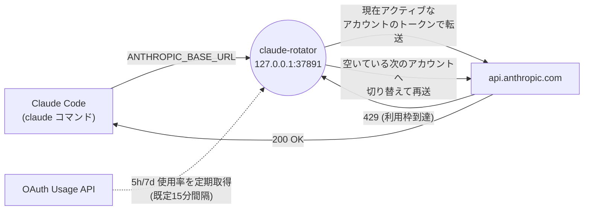

# claude-rotator

[](https://github.com/taskbrain/claude-rotator/actions/workflows/ci.yml)
[](./LICENSE)


Claude Code の複数アカウントをローカルで自動的に切り替える、ローカル動作専用の非公式プロキシツールです。macOS と Linux で動作します。

`claude-rotator` は `127.0.0.1` だけで待ち受ける Anthropic 互換の HTTP プロキシを起動し、Claude Code の `~/.claude/settings.json` の `ANTHROPIC_BASE_URL` をこのプロキシへ向けます。インストール後も、Claude Code は通常どおり `claude` コマンドで起動できます。

**依存パッケージはゼロです**（[package.json](./package.json) に `dependencies` はなく、Node.js 標準ライブラリのみで実装されています）。外部パッケージ経由のサプライチェーンリスクが無いため、コードを読んで監査するコストが低く抑えられています。

npm レジストリでは配布していません（`package.json` は `"private": true`）。使うにはこのリポジトリを clone して `npm install -g .` でローカルインストールします。

## 目次

- [なぜ作ったか](#なぜ作ったか)
- [できること](#できること)
- [しくみ](#しくみ)
- [利用上の注意](#利用上の注意)
- [動作環境](#動作環境)
- [セットアップ](#セットアップ)
- [アカウント登録](#アカウント登録)
- [モニター](#モニター)
- [設定ファイルと環境変数](#設定ファイルと環境変数)
- [ログと切り替え診断](#ログと切り替え診断)
- [主なコマンド](#主なコマンド)
- [アップデート](#アップデート)
- [アンインストール](#アンインストール)
- [トラブルシュート](#トラブルシュート)
- [安全設計](#安全設計)
- [開発](#開発)

## なぜ作ったか

Claude Code は、5時間ごとにリセットされる短期の利用枠（以下「5時間枠」）と、7日ごとにリセットされる長期の利用枠（以下「7日枠」）の2種類の上限で使用量を管理しています。どちらかが100%に達すると、そのアカウントでは応答が返らなくなります。

複数の Claude アカウントを契約していれば、枠に達したアカウントから別のアカウントへ切り替えることで作業を継続できます。しかし手作業での切り替えには次のような問題があります。

- 枠に達したことに気づかず、そのまま `claude` を実行し続けてエラーに遭遇する
- 気づいた後も、別アカウントで `claude auth login` をやり直す手間がかかる
- どのアカウントがいつリセットされるか、都度 Anthropic 側の情報を確認する必要がある

`claude-rotator` は、Claude Code と Anthropic API の間にローカルプロキシを挟むことでこれを解決します。プロキシは各アカウントの使用率を定期的に取得し、現在のアカウントが枠に達すると、別の空いているアカウントへ自動的に切り替えて同じリクエストを再送します。Claude Code 側の操作や設定は変わりません。

## できること

- 通常の `claude` コマンドを変えずに、裏側で `claude-rotator` proxy を使う
- 5時間枠 / 7日枠の使用率を見て、100% 到達時に最も空いている既知のアカウントへ切り替える
- 全アカウントが利用上限に達した場合、最短 reset のアカウントを再開候補として選び直す
- `claude-rotator monitor` で各アカウントの使用率を一覧表示する
- macOS では Keychain、Linux では private permission のファイルに認証情報を保存する
- `claude-rotator uninstall` で `~/.claude/settings.json` を元に戻す

## しくみ



1. `claude-rotator install` が Claude Code の設定ファイル（`~/.claude/settings.json`）を書き換え、`ANTHROPIC_BASE_URL` をこのプロキシ（既定 `http://127.0.0.1:37891`）へ向けます。
2. `claude` コマンドを実行すると、リクエストはまず自分の PC 内で待ち受けている `claude-rotator` プロキシへ届きます。プロキシは `127.0.0.1` 以外の `Host` ヘッダーやブラウザからの cross-site リクエストを拒否します。
3. プロキシは現在アクティブなアカウントの OAuth トークンを付けて `https://api.anthropic.com` へリクエストを転送します。
4. Anthropic 側が 429（利用枠到達）を返した場合、または定期的な Usage API 取得で現在のアカウントが100%に達したと分かった場合、プロキシは既知のアカウントの中から最も空いているものへ自動的に切り替え、同じリクエストを再送します。
5. 各アカウントの 5時間枠 / 7日枠の使用率は、既定で15分ごとにバックグラウンドで取得します（`claude-rotator refresh-usage` で即時取得も可能です）。

## 利用上の注意

- 本プロジェクトは Anthropic / Claude Code の**非公式**ツールです。Anthropic とは無関係であり、Anthropic による保証・サポートはありません。
- 利用者は、自身と Anthropic の契約、Anthropic の利用規約、および所属組織のポリシーの範囲内で使う責任を負います。規約・ポリシー違反が生じた場合の責任は利用者にあります。
- 本ツールは [MIT ライセンス](./LICENSE) の下で**無保証（AS IS）**で提供されます。
- 認証情報は各 PC のローカルにのみ保存され、リポジトリに保存・送信しない設計です。ただし共有 PC や暗号化されていないディスクでは、保存先（macOS: Keychain / Ubuntu: ローカルファイル）の保護に注意してください。

## 動作環境

- **複数の Claude アカウントが必要です。** このツールは「枠に達したアカウントから別のアカウントへ切り替える」ことが前提のため、契約しているアカウントが1つしか無い場合はローテーションできず、導入する意味がありません。
- Node.js 18.10 以上
- Claude Code 本体がインストール済みであること（`claude-rotator` は Claude Code の認証情報を読み取って中継するプロキシであり、Claude Code 自体の代替にはなりません）
- macOS: LaunchAgent を使用
- Ubuntu: systemd user service を使用

Claude Code の利用量は「5時間枠」（5時間ごとにリセットされる短期の上限）と「7日枠」（7日ごとにリセットされる長期の上限）の2種類で管理されています。詳細は [なぜ作ったか](#なぜ作ったか) を参照してください。

認証情報は PC ごとのローカル保存です。別の Mac / Ubuntu PC で使う場合、その PC でも各アカウントの `claude auth login` と `claude-rotator login` を実行してください。

## セットアップ

**重要**: `claude-rotator install` は Claude Code の設定を書き換え、以後のリクエストをすべてこのプロキシ経由にします。この時点でプロキシにアカウントが1件も登録されていないと、Claude Code が使えなくなります。**必ず `install` より先に、少なくとも1つのアカウントを `claude-rotator login` で登録してください。**

### macOS

このリポジトリを clone し、そのディレクトリ内で実行します。npm レジストリでは配布していないため（`package.json` は `private: true`）、`npm install -g claude-rotator` のような通常のグローバルインストールはできません。

```bash
git clone https://github.com/taskbrain/claude-rotator.git
cd claude-rotator
npm install -g .
```

まず Claude Code に普段どおりログインし、そのログインを `claude-rotator` へ登録します。

```bash
claude auth login
claude-rotator login
```

アカウントを登録できたら proxy をインストールします。

```bash
claude-rotator install
claude-rotator doctor
```

`install` は `~/.claude/settings.json` の `env.ANTHROPIC_BASE_URL` だけを更新し、変更前の状態を `~/.config/claude-rotator/install-state.json` に保存します。

macOS では次の LaunchAgent が作られます。

```text
~/Library/LaunchAgents/io.github.claude-rotator.plist
~/Library/LaunchAgents/io.github.claude-rotator.watchdog.plist
```

watchdog は15秒ごとに main LaunchAgent の登録を確認し、意図せず `bootout` された場合だけ再登録します。install／uninstall と同じ `lockf` を使うため、uninstall 中に main を復活させません。意図的に停止する場合は `claude-rotator uninstall` を使ってください。`install --no-start` は資産だけを配置し、**Claude Code の設定は変更せず**、両方の LaunchAgent と復旧 marker を無効のままにします。

インストール時に Claude Code の実行可能ファイルを絶対パスで解決し、macOS LaunchAgent と Ubuntu systemd user service の `CLAUDE_ROTATOR_CLAUDE_BIN` と安全な `PATH` に固定します。Homebrew、nvm、asdf、Volta、custom npm prefix などで管理された `claude` が対話 shell でだけ見つかり、常駐サービスでは見つからない状態を防ぎます。実行場所を明示する場合は、インストール前に `CLAUDE_ROTATOR_CLAUDE_BIN=/absolute/path/to/claude` を設定してください。

サービス操作:

```bash
launchctl print gui/$(id -u)/io.github.claude-rotator
launchctl kickstart -k gui/$(id -u)/io.github.claude-rotator
```

### Ubuntu

Ubuntu PC 上でこのリポジトリを clone し、そのディレクトリ内で実行します。npm レジストリでは配布していないため（`package.json` は `private: true`）、通常のグローバルインストールはできません。

```bash
git clone https://github.com/taskbrain/claude-rotator.git
cd claude-rotator
node --version
npm install -g .
```

`node --version` は `v18.10` 以上が必要です。

まず Claude Code に普段どおりログインし、そのログインを `claude-rotator` へ登録します。

```bash
claude auth login
claude-rotator login
```

アカウントを登録できたら proxy をインストールします。

```bash
claude-rotator install
claude-rotator doctor
```

Ubuntu では次の systemd user service が作られます。

```text
~/.config/systemd/user/claude-rotator.service
```

サービス操作:

```bash
systemctl --user status claude-rotator.service
systemctl --user restart claude-rotator.service
journalctl --user -u claude-rotator.service -f
```

`claude-rotator install` が `systemctl --user` の起動に失敗した場合は、表示されたコマンドを実行してください。headless / SSH セッションで user systemd bus がない場合は、次が必要になることがあります。

```bash
loginctl enable-linger $USER
systemctl --user daemon-reload
systemctl --user enable --now claude-rotator.service
```

注意: `install --no-start` は Linux では **`~/.claude/settings.json` を書き換えたうえで** systemd サービスの起動だけをスキップします（macOS の `install --no-start` とは異なり、Linux では設定ファイルが変更されます）。設定に触れず資産だけを配置したい場合は、`--no-start` 実行後に `claude-rotator uninstall` で設定を元に戻してください。

CLI と macOS / Ubuntu の service 定義では、Node.js が IPv6 を先に選んで blackhole する環境でも動作するように、DNS 解決を IPv4 優先にします。既存インストールで service 側の `NODE_OPTIONS=--dns-result-order=ipv4first` が入っていない場合は、リポジトリを更新してから `claude-rotator install --force` を実行するか、サービス定義を更新して再起動してください。

Ubuntu の installer は systemd サービス用に `~/.config/claude-rotator/runtime/claude-rotator` という Node.js launcher を作成します。これにより、`earlyoom --prefer` が広く `node` を優先終了する構成でも rotator proxy を通常の Node.js workload と区別できます。これはメモリを予約する仕組みではないため、`journalctl -u earlyoom` に終了記録が続く場合は、メモリ使用量と earlyoom の `--avoid` / `--ignore` 設定も確認してください。

## アカウント登録

[セットアップ](#セットアップ) で最初の1アカウントは登録済みです。複数アカウントを切り替えて使うには、他のアカウントも同様に登録します。

`claude-rotator login` は現在の Claude Code ログインを読み取り、可能であれば email を自動取得して登録します。

重要: `claude auth login` や `claude-rotator login` は、Claude Code 側の現在ログインを変更したり、そのログインを rotator の候補一覧へ取り込んだりする操作です。実際に API リクエストで使われるアカウントは `claude-rotator status` の `active` で決まります。別アカウントでログインして `claude-rotator login` しても、それだけでは active は切り替わりません。

複数アカウントを個別に保存して切り替える場合は、各アカウントで Claude Code にログインしてから `claude-rotator login` を実行します。

```bash
claude auth login
claude-rotator login

claude auth login
claude-rotator login
```

表示名や id を明示したい場合は、次のように指定できます。

```bash
claude-rotator login --id account1 --name your-email-1@example.com
```

登録確認:

```bash
claude-rotator accounts
claude-rotator status
claude-rotator doctor
```

`claude-rotator login --json ...` は、token JSON を直接渡す上級者向けコマンドです。通常運用では `claude-rotator login` を使ってください。使う場合は `claude-rotator login --id <id> --name <email> --json -` として標準入力から JSON をパイプしてください。`--json <token-json>` のように値をコマンドライン引数へ直接渡すと、Linux では `ps auxww` や `/proc/<pid>/cmdline` から他ユーザーに見え、シェル履歴にも残ります。

重複防止:

- `current` は live account 専用 ID です。`login --id current` や `import-current --id current` では使えません。
- `claude-rotator login` は profile から `accountUuid` を取得し、同じ Claude アカウントが既に登録済みなら既存 account を更新します。
- `claude-rotator login` は、現在の Claude Code 認証に refresh token がない場合や profile API で検証できない場合、`account1` のような仮 ID で登録せずにエラーで停止します。`claude auth status` が logged in を返しても API 用 OAuth token が失効している場合があるため、その場合は `claude auth login` をやり直してから再実行してください。
- 明示した `--id` が既存の `accountUuid` と衝突する場合は、重複登録せずにエラーを出します。既存 ID を使うか、先に `claude-rotator remove <account>` で整理してください。

認証情報の保存先:

- macOS: Keychain（サービス名は `claude-rotator:<id>`）
- Ubuntu/Linux: `~/.local/share/claude-rotator/accounts/*.json`、ディレクトリ `0700`、ファイル `0600`（`XDG_DATA_HOME` を設定している場合はその配下）

`login` は保存後に常駐 server へ reload を通知します。server が起動していない場合だけ、OS 別のサービス再起動コマンドを実行してください。

アカウントを追加した直後は、Usage API の状態も確認してください。

```bash
claude-rotator refresh-usage
claude-rotator status
```

追加したアカウントの 5時間枠または 7日枠が 100% の場合、そのアカウントは `exhausted` と表示され、自動切り替え先にはなりません。

### この PC の現在ログインだけを使う場合

複数アカウントを固定候補として登録するのではなく、この PC で現在ログイン中の Claude Code アカウントだけを使う場合は、保存済み token snapshot ではなく Claude Code の最新認証情報を毎回読む `current` アカウントとして登録できます。Claude Code 側で token が更新されても proxy が追従するため、Ubuntu の常用 PC ではこの方法が安全です。

```bash
claude auth login
claude-rotator use-current --only
```

`current` は Claude Code 側の現在ログインを毎回読む live account です。Claude Code で別アカウントへログインし直すと、`current` が指す実アカウントも変わります。そのため、複数アカウントを固定候補としてローテーションする構成では `current` を混ぜず、上の `claude-rotator login` で各アカウントを token snapshot として登録してください。`--only` は既存の rotator アカウント一覧を `current` だけに置き換えます。

### アカウントの削除

不要になったアカウントや、`doctor` で壊れていると表示された保存済みアカウントは削除できます。デフォルトでは保存済み認証情報も削除します。

```bash
claude-rotator remove old-account-id
```

設定だけ削除し、保存済み認証情報を残す場合:

```bash
claude-rotator remove old-account-id --keep-secret
```

`--keep-secret` を使うと、Keychain / ローカルファイル側には認証情報が孤児として残ります（[アンインストール](#アンインストール) を参照）。

## モニター

別ターミナルで起動します。

```bash
claude-rotator monitor
```

表示例（`claude-rotator monitor` / `claude-rotator status` 共通のレイアウトです。実際のアカウント名・数値・時刻は環境によって変わります）:

```text
Claude Rotator                         active: account1@example.com

account1@example.com       active
5h ███████░░░  76%  reset in 8h42m -> 06/07 18:00 JST
7d ███████░░░  76%  reset in 2d9h -> 06/09 19:00 JST
7d Fable █████░░░░░  50%  reset in 1d23h -> 06/09 09:00 JST
requests: 128

account2@example.com       exhausted
reason: 5h quota exhausted; reset -> 06/07 20:00 JST
5h ██████████ 100%  reset in 10h42m -> 06/07 20:00 JST
7d ████░░░░░░  40%  reset in 2d23h -> 06/10 09:00 JST
requests: 54

Events
06/07 12:43 JST request account1 POST /v1/messages -> 429 1203ms outcome=quota-retry req=req_xxx
06/07 12:43 JST switched account1 -> account2 reason=quota-threshold
```

各行の意味:

- 先頭行の `active:` は、現在 API リクエストに使われているアカウントです。
- アカウントごとに1ブロック表示され、`ready` / `active` / `exhausted` / `throttled` / `error` のいずれかの状態が付きます。利用不可の場合は `reason:` 行で理由を表示します。
- `5h` / `7d` 行は進捗バー（`█` / `░` を10文字）、使用率、reset までの残り時間と reset 時刻を表示します。使用率のデータが無い場合は ` --%`、reset 情報が無い場合は `no data yet` になります。
- Usage API がモデル別週次枠（`limits[]`）を返す場合は、`7d Fable` のような追加行がさらに表示されます。
- `requests:` はそのアカウントで proxy が転送した累計リクエスト数です。
- `Events` には直近の切り替え・リクエスト・エラーが最大8件表示されます。

`status` / `monitor` の reset 時刻と Events 時刻は、日本時間（JST）で表示します。未使用のアカウントでも、server 起動時・アカウント reload 時・初回 status 表示時・定期 polling で OAuth Usage API から 5時間枠 / 7日枠の状態を取得します。Usage API が取得できない場合だけ `unknown` と表示されます。`unknown` のアカウントは空いている確認が取れていないため、自動切り替え先には使いません。

TTY が無い環境（CI、`| cat` 経由など）で `claude-rotator monitor` を実行すると、自動的に1回だけ表示して終了します（`--once` を明示しても同じ挙動です）。

OAuth Usage API は 429 を返しやすいため、usage 取得はデフォルトで 15 分間隔、1アカウントずつ、各リクエストの開始間隔 1.5 秒で実行します。必要な場合だけ [設定ファイルと環境変数](#設定ファイルと環境変数) の `usagePolling.intervalMs`、`usagePolling.concurrency`、`usagePolling.requestSpacingMs` を変更してください。短すぎる間隔や高い concurrency は `claude-rotator refresh-usage` でも 429 の原因になります。

OAuth access token は期限の30分前から自動更新対象になります。保存時に Claude Code の OAuth scope と refresh token の期限を保持します。macOS / Ubuntu の保存アカウントは、通常の Claude Code ログインを変更しない隔離領域で Claude Code 本体へ更新を委譲するため、access token が数時間で切れても refresh token が有効な間は対話ログイン不要です。同じ refresh token に対する同時更新は1回へ集約し、異なるアカウントの更新も直列化します。新しい refresh token は、競合する再ログインを上書きしない原子的比較更新で、使用前に Keychain または Linux の credential file へ保存します。macOS / Ubuntu の native 更新が一時失敗した場合の再試行は5分固定で、失敗回数に応じて15分や60分へ増幅しません。provider が明示した `Retry-After` は増幅せず、異常値による永久停止を避ける24時間の安全上限内で尊重します。native 更新を使わない環境の direct token 更新だけは、明示値が無い一時失敗を refresh token 単位で1/2/4/8/15分まで backoff し、その後は指数を増やさず固定60分の疎通確認へ移ります。1アカウントの待機は他アカウントの更新を停止せず、実際に credential が変わった再リンクだけがそのアカウントの古い待機状態を解除します。現在の Claude Code ログインと `accountUuid` が一致する保存アカウントには、Claude Code が更新した最新 credential と OAuth metadata をミラーします。provider 側で明示的に revocation された token の期限自体を rotator から延長することはできません。

## 設定ファイルと環境変数

設定ファイルの場所は次の優先順位で決まります。

1. 環境変数 `CLAUDE_ROTATOR_CONFIG` にファイルパスを設定した場合は、そのパスを使います。
2. 設定していない場合は `$XDG_CONFIG_HOME/claude-rotator/config.json` を使います。
3. `XDG_CONFIG_HOME` も未設定の場合は `~/.config/claude-rotator/config.json` になります（macOS / Linux 共通）。

同様に、アカウント認証情報などのデータは `$XDG_DATA_HOME/claude-rotator`（未設定時は `~/.local/share/claude-rotator`）配下に保存されます（例: Linux のアカウント snapshot、macOS の secret-store lock ファイル）。

既定の `config.json` は次のとおりです（初回起動時に自動生成されます）。

```json
{
  "proxy": {
    "host": "127.0.0.1",
    "port": 37891,
    "upstreamIdleTimeoutMs": 180000,
    "upstreamConnectTimeoutMs": 10000,
    "upstreamConnectRetries": 3,
    "upstreamConnectRetryDelayMs": 250
  },
  "upstream": "https://api.anthropic.com",
  "switchThreshold": 1,
  "rotationPolicy": {
    "mode": "use-expiring-weekly",
    "weeklyResetPriorityWindowMs": 129600000
  },
  "usagePolling": {
    "enabled": true,
    "intervalMs": 900000,
    "concurrency": 1,
    "requestSpacingMs": 1500
  },
  "accounts": []
}
```

主なキーの意味:

| キー | 既定値 | 意味 |
|---|---|---|
| `proxy.host` / `proxy.port` | `127.0.0.1` / `37891` | プロキシの待受アドレスとポート。`host` は loopback (`127.0.0.1` / `::1` / `localhost`) 以外を指定するとエラーになります |
| `proxy.upstreamIdleTimeoutMs` | `180000`（3分） | upstream からの応答が止まったとみなすアイドルタイムアウト |
| `proxy.upstreamConnectTimeoutMs` | `10000`（10秒） | upstream への TCP 接続確立のタイムアウト |
| `proxy.upstreamConnectRetries` | `3` | 接続確立前の timeout / unreachable 時に同一アカウントで内部 retry する回数 |
| `proxy.upstreamConnectRetryDelayMs` | `250` | 上記 retry の間隔 |
| `upstream` | `https://api.anthropic.com` | 転送先の Anthropic API |
| `switchThreshold` | `1`（＝100%） | この使用率に達したアカウントを利用不可とみなす閾値 |
| `rotationPolicy.mode` | `use-expiring-weekly` | 切り替えアルゴリズムのモード |
| `rotationPolicy.weeklyResetPriorityWindowMs` | `129600000`（36時間） | 7日枠の reset がこの時間以内に迫っているアカウントを優先消化する猶予期間 |
| `usagePolling.enabled` | `true` | Usage API のバックグラウンド定期取得を行うか |
| `usagePolling.intervalMs` | `900000`（15分） | 定期取得の間隔 |
| `usagePolling.concurrency` | `1` | 同時に取得するアカウント数 |
| `usagePolling.requestSpacingMs` | `1500` | 各リクエスト開始の最小間隔（429対策） |
| `accounts` | `[]` | 登録済みアカウント。通常は `claude-rotator login` 等の CLI から追加し、直接編集は非推奨です |

## ログと切り替え診断

`status` / `monitor` の Events には、直近の proxy request が表示されます。

```text
06/07 12:43 JST request account-one POST /v1/messages -> 429 1203ms outcome=quota-retry req=req_xxx
06/07 12:43 JST switched account-one -> account-two reason=quota-threshold
```

常駐 server の file log の確認方法は [トラブルシュート](#トラブルシュート) を参照してください。

proxy request ログに出るのは `account`、`method`、`path`、`status`、`durationMs`、`outcome`、`requestId`、timeout/network error 時の `errorType` だけです。内部 proxy error は `proxy-error method=... path=... error=...` として短い原因を出します。token / Authorization header / API key / request body / response body は出しません。

自動切り替えは、現在のアカウントの 5時間枠、7日枠、または Fable などのモデル別週次枠が 100% に達した場合に行います。利用可能な候補がある場合は、通常は 5時間枠 / 7日枠の既知使用率から `max(5h, 7d)` が最も低いアカウントを選びます。ただし、7日枠の reset が近いアカウントがある場合は、reset 前に週次枠を使い切れるように、そのアカウントを優先します。この週次 reset 優先は、現在の active がまだ 100% ではない場合でも、Usage API の再取得後に proactive に active を更新できます。現在のアカウント自身が quota exhausted で、すべての候補も 100% の場合は、reset 時刻が最も近い exhausted アカウントを選び、Claude Code に最短で再開できる limit message を返します。OAuth refresh failure、authentication error、一時的な throttle では exhausted アカウントへ切り替えません。

Claude Code からの正確なモデル ID `claude-fable-5` の `POST /v1/messages` が、上限到達を確定できる quota ヘッダーを伴わない 429 を返した場合、OAuth アカウントでは同じ access token の Usage API を最大5秒だけ再確認します。5時間枠 / 7日枠、または要求した Fable の週次枠が100%で、将来の reset 時刻と既知の利用可能な切り替え先を確認できた場合に限り、その同じクライアント要求を次のアカウントへ再送します。この確認を根拠にした再送は1要求につき最大1回です。確認できない場合、別モデルの枠だけが exhausted の場合、Usage API が失敗・timeout した場合は、上流の元の429をそのまま返します。他モデルの曖昧な429では、この追加確認を行いません。

週次 reset 優先の対象期間は、デフォルトで reset まで 36 時間以内です。必要に応じて [設定ファイルと環境変数](#設定ファイルと環境変数) の `rotationPolicy.weeklyResetPriorityWindowMs` で変更できます。

切り替え可能なアカウントがなくローカルで 429 を返す場合も、Claude Code が 5時間枠は `session limit`、7日枠は `weekly limit` として扱える unified rate-limit ヘッダーを返します。rotator 独自の補足情報は JSON の `details.rotator_message` に入ります。

retryable な上流 5xx / 529 / `x-should-retry` 付きレスポンス、または上流アイドルタイムアウトが起きた場合も、アカウント切り替えは行いません。上流の error body または proxy の timeout error を可能な限りそのまま返します。

Usage API の再取得は、デフォルトでは 15 分ごとの定期 polling と、100% 到達済みの枠がリセットされる時刻の直後に実行されます。間隔は [設定ファイルと環境変数](#設定ファイルと環境変数) の `usagePolling.intervalMs` で変更できます。Claude Code 側の早期リセットや一時的な状態変化を確認したい場合は、次の手動コマンドで全登録アカウントを即時再確認します。

```bash
claude-rotator refresh-usage
claude-rotator status
```

`refresh-usage` 後は `claude-rotator status` で active を確認してください。Usage API の再取得で現在の active が 100% と判明した場合、または 7日枠の reset が近く週次枠を優先消化したい利用可能アカウントがある場合は、active が更新されることがあります。意図的に active を変更する場合は `claude-rotator switch <account>` を使います。

OAuth usage refresh は Node.js fetch の 10 秒 connect timeout に依存しないよう native HTTP client を使い、デフォルトでは登録アカウントを1件ずつ直列に取得します。各リクエストの idle timeout は 60 秒です。HTTPS 接続が確立する前の timeout / unreachable は、proxy と同じ `proxy.upstreamConnectTimeoutMs`、`proxy.upstreamConnectRetries`、`proxy.upstreamConnectRetryDelayMs` で短く retry します。

`usagePolling.concurrency` のデフォルトは `1` です。同一ネットワークから Anthropic 宛ての TCP 接続が安定しており、意図的に複数アカウントを同時取得したい場合だけ、この値を増やしてください。

直近の quota / usage / active account は `~/.config/claude-rotator/runtime-state.json` に保存されます。これにより、service 再起動直後に Usage API へ到達できない場合でも、最後に取得できた status を復元して切り替え判断に使えます。reset 時刻を過ぎた quota は、復元後の status 計算時に stale として消去されます。

`cc-auto-resume` などの外部再注入ツールからは、再注入前に次のコマンドを呼ぶと、rotator が最短で再開できるアカウントへ切り替え、再注入すべき時刻を返します。利用可能なアカウントがあれば `action=ready`、全候補が枯渇していれば最短 reset の `action=wait` になります。

```bash
claude-rotator prepare-resume --json
```

必要なときだけ Usage API を先に再取得する場合:

```bash
claude-rotator prepare-resume --refresh --json
```

## 主なコマンド

```bash
claude-rotator install [--no-start] [--force]
claude-rotator uninstall [--purge-secrets] [--force]
claude-rotator server
claude-rotator status
claude-rotator monitor
claude-rotator switch <account>
claude-rotator refresh-usage
claude-rotator prepare-resume [--json] [--refresh]
claude-rotator accounts
claude-rotator login [--id <id>] [--name <email>]
claude-rotator login --id <id> --name <email> --json -             (read token JSON from stdin; keeps it out of argv)
claude-rotator login --id <id> --name <email> --json <token-json>  (token appears in ps output and shell history)
claude-rotator use-current [--name <email>] [--only]
claude-rotator remove <account> [--keep-secret]
claude-rotator import-current --id <id> --name <email>
claude-rotator doctor
```

上記は `claude-rotator --help` の実際の出力です。加えて、ここには表示されませんが `claude-rotator monitor --once` も使えます（非TTY環境では自動的にこの動作になります）。

各コマンドの説明:

| コマンド | 説明 |
|---|---|
| `install [--no-start] [--force]` | proxy サービスを登録し、`~/.claude/settings.json` を書き換える。`--no-start` はサービスを起動せず資産だけを配置する（macOS では設定変更も省略、Linux では設定変更のみ実行される）。`--force` は `ANTHROPIC_BASE_URL` の不一致チェックを無視して上書きする |
| `uninstall [--purge-secrets] [--force]` | proxy サービスを止め、`~/.claude/settings.json` をインストール前の値に戻す。`--purge-secrets` は登録済みアカウントの保存済み認証情報も削除する |
| `server` | プロキシサーバー本体を起動する。LaunchAgent / systemd サービスもこのコマンドを実行しており、通常は `install` 経由で自動起動されるため、直接使うのはデバッグ用途 |
| `status` | 現在の active アカウントと各アカウントの使用率を1回表示する |
| `monitor [--once]` | `status` と同じ内容を1秒ごとに更新表示する。TTY が無い場合や `--once` 指定時は1回だけ表示して終了する |
| `switch <account>` | active アカウントを手動で切り替える |
| `refresh-usage` | 全登録アカウントの Usage API を即時に再取得する |
| `prepare-resume [--json] [--refresh]` | 外部の再注入ツール向けに、最短で再開できるアカウントへ切り替えて再開時刻を返す |
| `accounts` | 登録済みアカウントの id・名前・種別を一覧表示する |
| `login [--id <id>] [--name <email>]` | 現在の Claude Code ログインを読み取ってアカウントとして登録する |
| `use-current [--name <email>] [--only]` | 保存済み snapshot ではなく、Claude Code の現在ログインを毎回読む `current` アカウントとして登録する（`--only` は既存アカウント一覧を置き換える） |
| `remove <account> [--keep-secret]` | 登録済みアカウントを削除する。`--keep-secret` を付けない場合は保存済み認証情報も削除する |
| `import-current --id <id> --name <email>` | `login` と同様に現在ログインを取り込むが、id を必須指定する |
| `doctor` | server の疎通確認と、アカウント設定の不整合（重複 UUID、期限切れトークンなど）を診断する |

## アップデート

```bash
git pull
npm install -g .
claude-rotator install
```

`npm install -g .` を再実行すると、グローバルにインストール済みの `claude-rotator` コマンドが最新のリポジトリ内容で上書きされます。続けて `claude-rotator install` を実行すると、変更されたサービス定義（LaunchAgent / systemd unit）が再登録されます。`~/.claude/settings.json` の `ANTHROPIC_BASE_URL` が既にこのプロキシを指している通常のケースでは conflict になりません。手動で `ANTHROPIC_BASE_URL` を書き換えているなど、想定と異なる状態になっている場合だけ `claude-rotator install --force` が必要です。

サービスの再起動だけで良い場合は、OS 別のコマンドでも構いません。

```bash
# macOS
launchctl kickstart -k gui/$(id -u)/io.github.claude-rotator

# Ubuntu
systemctl --user restart claude-rotator.service
```

## アンインストール

proxy を無効化し、Claude Code の設定をインストール前の状態に戻します。

```bash
claude-rotator uninstall
```

保存済みのアカウント認証情報も削除する場合:

```bash
claude-rotator uninstall --purge-secrets
```

`ANTHROPIC_BASE_URL` がインストール後に別の値へ変更されていた場合、`uninstall` は安全のため自動上書きせず conflict を報告します。意図的に戻す場合のみ `--force` を使ってください。

`--purge-secrets` の削除範囲は macOS と Linux で異なります。

- **Linux**: `~/.local/share/claude-rotator/accounts/` ディレクトリを列挙し、保存されている認証情報ファイルをすべて削除します。
- **macOS**: Keychain は全件列挙できないため、その時点の `config.json` に登録されているアカウント id（＋ `current`）に対応する Keychain 項目だけを削除します。`claude-rotator remove <account> --keep-secret` で config から外した後に Keychain 側だけ残っている項目（孤児）は対象外で、`--purge-secrets` では削除されません。

### 完全に消す方法

`uninstall`（`--purge-secrets` 付きでも）は、次のファイルを残したままにします。

- `~/.config/claude-rotator/config.json`（登録アカウント一覧・設定）
- `~/.config/claude-rotator/runtime-state.json`（直近の使用率キャッシュ）
- `~/.config/claude-rotator/server.log` / `server.err`（ログ）
- `npm install -g .` でインストールしたグローバル npm パッケージ本体

すべて削除するには、`uninstall --purge-secrets` の後に次を実行してください（`XDG_CONFIG_HOME` / `XDG_DATA_HOME` を独自設定している場合はそちらのパスに読み替えてください）。

```bash
rm -rf ~/.config/claude-rotator
rm -rf ~/.local/share/claude-rotator
npm uninstall -g claude-rotator
```

macOS で `remove --keep-secret` によって残った Keychain の孤児項目がある場合は、キーチェーンアクセス.app で `claude-rotator:<account-id>` を検索して手動削除するか、次のコマンドで削除してください。

```bash
security delete-generic-password -a "<account-id>" -s "claude-rotator:<account-id>"
```

## トラブルシュート

まず `claude-rotator doctor` を実行してください。server の疎通に加え、次のような問題を secret を出さずに警告します。保存済み access token が期限切れの場合は refresh token で更新してから profile を確認します。

```bash
claude-rotator doctor
```

- 同じ Claude account UUID が複数登録されている
- `current` の表示名や UUID が現在の Claude Code ログインとずれている
- 保存済み OAuth 認証情報がない、または profile 取得で 401 などになる

### ログの確認

常駐 server の file log は macOS / Ubuntu ともに次で確認できます。

```bash
tail -f ~/.config/claude-rotator/server.log
tail -f ~/.config/claude-rotator/server.err
```

`server.log` は10MBを超えると、次のログ書込時に service 自身がローテーションし、直前1世代を `server.log.1` として保持します。非TTYで手動実行した場合も、request ログは標準出力ではなく `server.log` 自体へ直接書かれます。

### 接続タイムアウトの切り分け

`server.log` に次のような `ETIMEDOUT` が連続し、Claude Code 側に `Retrying in ...` や `inference gateway (127.0.0.1:37891)` が出る場合、Claude Code から rotator への接続ではなく、rotator から upstream API への接続が詰まっています。

```text
proxy account=... method=POST path=/v1/messages status=- durationMs=75000 outcome=upstream-error errorType=ETIMEDOUT
```

rotator は upstream への TCP 接続が確立する前の timeout / unreachable について、同じアカウントで短く内部 retry します。接続が確立した後、または upstream response が始まった後の失敗は、重複送信を避けるため自動 retry しません。retry は [設定ファイルと環境変数](#設定ファイルと環境変数) の `proxy.upstreamConnectTimeoutMs`、`proxy.upstreamConnectRetries`、`proxy.upstreamConnectRetryDelayMs` で調整できます。

`curl -I --connect-timeout 10 https://api.anthropic.com/` や Anthropic API への TCP 接続確認も timeout し、Google など他サイトは通る場合は、rotator ではなくローカルネットワーク、VPN、ファイアウォール、または ISP 経路の問題です。`nc` の timeout 指定はOSごとに違うため、Ubuntu では `nc -vz -w 3 160.79.104.10 443`、macOS では `nc -vz -G 3 160.79.104.10 443` を使ってください。特にホームルーターの DoS 防御で `TCP-SYN Flood` や `一台あたりの TCP-SYN 送信上限` が低い場合、Claude Code の並列 request / retry によって Anthropic 宛ての TCP SYN が一時的に drop されることがあります。切り分け時だけ DoS 防御の TCP-SYN 関連項目を無効化するか、上限を引き上げて、上記 `nc` の成功率が改善するか確認してください。恒久的に firewall 全体を無効化する運用は推奨しません。

`refresh-usage` が全アカウントで `fetch failed`、`OAuth connection timeout`、`OAuth request timeout` になる場合は、認証情報ではなく Usage API への HTTPS 接続確立で失敗している可能性があります。`warning` に `UND_ERR_CONNECT_TIMEOUT` や `ETIMEDOUT` などの cause が出ている場合は、次のように同じホストへ到達できるかを確認してください。`curl` も timeout する場合、rotator の設定ではなくローカルネットワーク、VPN、ファイアウォール、または ISP 側の経路を確認する必要があります。

```bash
curl -I --connect-timeout 10 --max-time 20 https://api.anthropic.com/api/oauth/usage
```

## 安全設計

- proxy は loopback のみに bind し、loopback 以外の `Host` と cross-site browser request を拒否します
- ローカルクライアント認証は行わないため、loopback へ接続できる同一ホスト上のすべての OS ユーザー / プロセスを信頼します。単一ユーザー、または同一ホスト上の全主体を信頼できる環境でのみ実行してください。専用 OS ユーザーだけでは loopback TCP を隔離できません
- token / Authorization header / API key はログに出しません
- request body / response body はデフォルトでログに出しません
- install 時に restore manifest と settings backup を作成します

脆弱性の報告方法や対応範囲は [SECURITY.md](./SECURITY.md) を参照してください。

## 開発

```bash
npm test
npm run lint
```

macOS では、実際の Keychain に書き込む一部のテストがデフォルトで skip されます。`CLAUDE_ROTATOR_REAL_KEYCHAIN=1 npm test` を付けると実行できますが、Keychain の認証ダイアログが表示される場合があります（CI の macOS ジョブでは自動的に有効化されます）。

ローカル Node は `v18.10` 以上で動作します。開発時に macOS / Ubuntu の差分を避けて確認したい場合は、下の Docker コマンドで Node 22 の検証も実行してください。

Docker での検証:

```bash
docker run --rm -v "$PWD":/app -w /app node:22-alpine npm run check
```

---

## English

Local Claude Code account rotator for macOS and Linux.

`claude-rotator` runs a localhost Anthropic-compatible proxy and configures Claude Code to use it through `~/.claude/settings.json`. After installation, you continue launching Claude Code with the normal `claude` command.

The credential-bearing proxy is restricted to loopback. Requests with a non-loopback `Host` or cross-site browser metadata are rejected before forwarding. The proxy does not authenticate local clients, so it trusts every OS user and process on the same host that can connect to loopback. Run it only on a single-user or otherwise fully trusted host; a dedicated OS user alone does not isolate loopback TCP.

### Important notes

- This project is an **unofficial** tool for Anthropic / Claude Code. It is not affiliated with, endorsed by, or supported by Anthropic.
- You are responsible for using it within your own agreement with Anthropic, the Anthropic Terms of Service, and any policies of your organization. You bear responsibility for any resulting violation.
- This tool is provided under the [MIT License](./LICENSE) **with no warranty** ("AS IS").
- Credentials are stored locally on each machine only, by design never saved to or sent from this repository. On shared machines or unencrypted disks, protect the storage location (macOS: Keychain / Ubuntu: local file) accordingly.

### Install

```bash
npm install -g .
claude-rotator install
```

`install` updates only `env.ANTHROPIC_BASE_URL` in `~/.claude/settings.json`, records the previous value in `~/.config/claude-rotator/install-state.json`, and writes a service definition:

- macOS: `~/Library/LaunchAgents/io.github.claude-rotator.plist` and `io.github.claude-rotator.watchdog.plist`
- Ubuntu/Linux: `~/.config/systemd/user/claude-rotator.service`

On macOS, WatchDock checks the main LaunchAgent registration every 15 seconds and restores it only after an unintended `bootout`. It shares the installer lock, so it cannot resurrect the main job during uninstall. Use `claude-rotator uninstall` for an intentional stop. `install --no-start` writes the service assets but leaves Claude Code settings unchanged, both jobs unregistered, and recovery disabled.

On macOS and Ubuntu/Linux, installation resolves Claude Code to an executable absolute path and records it as `CLAUDE_ROTATOR_CLAUDE_BIN`, together with the required service `PATH`. This keeps Homebrew, nvm, asdf, Volta, and custom npm-prefix installs available under launchd or systemd's minimal environment. Set `CLAUDE_ROTATOR_CLAUDE_BIN=/absolute/path/to/claude` before `claude-rotator install` to override discovery.

Ubuntu uses a systemd user service:

```bash
systemctl --user status claude-rotator.service
journalctl --user -u claude-rotator.service -f
```

If `systemctl --user` is unavailable in a headless session, enable linger and log in again:

```bash
loginctl enable-linger $USER
```

### Add Accounts

The easiest workflow is to reuse the currently logged-in Claude Code account:

```bash
claude auth login
claude-rotator login
```

`claude auth login` and `claude-rotator login` do not automatically switch the rotator's active account. They only change or import the Claude Code login. The account actually used for API requests is the `active` account shown by `claude-rotator status`.

Credentials are machine-local. Run `claude auth login` and `claude-rotator login` on each macOS or Ubuntu machine that should use the rotator.

You can still provide an explicit id/name:

```bash
claude-rotator login --id account1 --name your-email@example.com
```

`claude-rotator login --json ...` is an advanced command that passes the token JSON directly; use plain `claude-rotator login` for normal operation. When you do use it, pipe the JSON through stdin with `claude-rotator login --id <id> --name <email> --json -` instead of passing the value as a literal argument. Passing `--json <token-json>` directly leaves it visible to other users via `ps auxww` or `/proc/<pid>/cmdline` on Linux, and it also lands in your shell history.

### Monitor

```bash
claude-rotator monitor
```

### Diagnostics

Recent proxy requests are shown in `claude-rotator status` / `claude-rotator monitor`, and the service writes metadata-only request logs to `~/.config/claude-rotator/server.log`. Once `server.log` exceeds 10MB, the service rotates it on the next log write, keeping the previous generation as `server.log.1`. Even when run manually with a non-TTY stdout, request logs are written directly to `server.log` itself rather than to stdout. Internal proxy errors are logged as `proxy-error method=... path=... error=...` without tokens or bodies. Automatic rotation happens when the current account reaches the configured 5h, 7d, or model-scoped weekly usage threshold. If the OAuth Usage API reports scoped weekly limits in `limits[]`, they appear as extra status rows such as `7d Fable`, `7d Sonnet`, or `7d Opus`, including reset times. If an OAuth request for the exact model ID `claude-fable-5` sends `POST /v1/messages` and receives a 429 without conclusive quota headers, the proxy rechecks the Usage API with that same access token for at most five seconds. It replays that client request to a known available account only when the fresh usage confirms a future-reset 100% global bucket or the requested Fable bucket. Reactive confirmation can cause at most one replay per client request; an unconfirmed limit, another model's exhaustion, or a failed/timed-out Usage request preserves the original upstream 429. Ambiguous 429s for other model IDs do not trigger this extra check. If an available account exists, the proxy usually chooses the lowest known `max(5h, 7d)` usage. When an available account has a 7d reset within the weekly priority window, the proxy prefers that account so expiring weekly quota can be consumed before reset; usage refresh can proactively move the active account even when the current account is not yet exhausted. The weekly priority window defaults to 36 hours and can be adjusted with `rotationPolicy.weeklyResetPriorityWindowMs` in `~/.config/claude-rotator/config.json`. If every candidate is exhausted, the proxy switches to the exhausted account with the earliest known reset and returns a local 429 for that shortest resume target. OAuth refresh failures, authentication errors, and temporary throttles do not rotate to exhausted accounts. OAuth usage is refreshed at startup, reload, first status read, every 15 minutes by default, and at reported reset times for exhausted accounts. Requests run one account at a time with 1.5 seconds between starts to reduce Usage API throttling. Set the `usagePolling` fields in `~/.config/claude-rotator/config.json` to adjust this behavior. Use `claude-rotator refresh-usage` to force an immediate recheck of all registered accounts, or `claude-rotator prepare-resume --json` from external resume tooling to switch to the earliest resume target before reinjection. If `server.log` repeatedly shows `outcome=upstream-error errorType=ETIMEDOUT` around 75 seconds, the proxy is receiving Claude Code requests but cannot complete the upstream request. The CLI and generated macOS LaunchAgent / Ubuntu systemd service prefer IPv4 DNS results to avoid Node.js preferring a broken IPv6 route. On Ubuntu, the installer also runs the service through a launcher named `claude-rotator`, separating the proxy from broad earlyoom rules that prefer terminating every `node` process.

OAuth access tokens become refresh candidates 30 minutes before expiry. On macOS and Ubuntu, saved accounts are refreshed by Claude Code itself inside isolated credential storage, without changing the user's normal Claude Code login. Claude Code OAuth metadata is preserved, refreshes are coalesced and serialized, and a rotated credential is atomically persisted before use without overwriting a concurrent relink. A transient native-refresh failure uses a fixed five-minute retry and does not grow to 15 or 60 minutes. An explicit provider `Retry-After` is honored without amplification, up to a 24-hour safety ceiling. Only the direct token-refresh fallback used on other platforms backs off missing-deadline failures through 1/2/4/8/15 minutes and then moves to a fixed hourly probe. Only a relink that actually changes an account credential clears that account's stale cooldown. Provider-side revocation and maximum token lifetime remain controlled by the OAuth provider.

### Restore

```bash
claude-rotator uninstall
```

To also remove saved account credentials:

```bash
claude-rotator uninstall --purge-secrets
```
